# Simulation de la dynamique d'un bâtonnet brownien confiné

Ce dépôt contient le code C++ et l'analyse des distributions d'orientation et de position d'un bâtonnet brownien confiné, soumis à un écoulement de cisaillement uniforme ou à un demi-profil parabolique de Poiseuille.

Le cadre scientifique du projet est relié aux travaux de Balakrishnan sur la physique statistique hors équilibre, ainsi qu'aux travaux de Hijazi, Khater, Tannous et Atwi sur les distributions de probabilité de particules anisotropes en écoulement laminaire, dans le bulk, près des surfaces solides et à l'intérieur de mésopores.

Pour une lecture synthétique et approfondie des mécanismes physiques et cinétiques, voir le document complémentaire : [Interprétation physique et cinétique](interpretation_physique_cinetique.md).

Pour une lecture figure par figure des résultats à la lumière des références, voir : [Lecture des résultats selon les références](lecture_resultats_selon_references.md).

Pour distinguer les résultats directement simulés, les grandeurs dérivées et les relations analytiques utilisées comme repères physiques, voir : [Méthodologie, validation et lecture scientifique](METHODOLOGIE_VALIDATION.md).

Pour la continuité scientifique et technique du projet, voir : [Notes de continuité du projet](PROJECT_CONTEXT.md).

Pour une navigation structurée par étapes de recherche, voir : [Index scientifique du dépôt](PROJECT_INDEX.md).

## Organisation par sections

- [Section I - Modèle de référence](sections/section-I-modele-reference/README.md) : modèle \(D=L_B\), distributions \(P(\theta)\), \(P(\xi)\), volume, couche de déplétion et courbes \(\theta_{\max}(\alpha)\).
- [Section II - Influence du confinement](sections/section-II-confinement/README.md) : étude du rapport \(D/L_B\), angle limite géométrique, distributions angulaires et spatiales pour différents confinements. Une lecture détaillée est disponible dans [l'interprétation de la Section II](sections/section-II-confinement/INTERPRETATION_DETAILLEE.md).
- [Section III - Effet de la restitution](sections/section-III-restitution/README.md) : étude des coefficients de restitution aux parois et de leur effet sur \(P(\theta)\), \(P(\xi)\) et la fraction proche surface. Une lecture détaillée est disponible dans [l'interprétation de la Section III](sections/section-III-restitution/INTERPRETATION_DETAILLEE.md).
- [Références scientifiques](references/README.md) : rôle des références de Balakrishnan, Hijazi, Khater, Tannous et Atwi dans l'interprétation.

## Organisation et paramètres numériques

- `main.cpp` : simulation séquentielle des deux profils d'écoulement pour $\alpha=0$, $0.5$, $1$, $2$, $5$, $10$ et $100$.
- `Fig1.png` à `Fig20.png` : distributions $P(\theta)$ dans le volume et dans la couche de déplétion, comparaisons entre écoulements, distributions spatiales $P(\xi)$ et courbes $\theta_{\max}(\alpha)$.
- $L_B=D=880\,\mathrm{nm}$, $\Delta_B=0.03$ et $10^7$ itérations par cas.
- Région proche de la surface : $\xi\leq0.5$ ; volume : $\xi>0.5$, avec $\xi=z_c/L_B$.

Les histogrammes représentent des probabilités par classe, et non des densités continues : $\Delta\theta=1^\circ$ et $\Delta\xi=0.001$. Chaque histogramme est normalisé séparément dans la région considérée.

## Compilation et exécution

Dans Code::Blocks, créer un projet console C++, ajouter `main.cpp`, sélectionner une configuration optimisée puis lancer **Build and Run**. En ligne de commande, une compilation équivalente est :

```bash
g++ -O2 -std=c++11 main.cpp -o simulation
```

Le programme crée 56 fichiers dans le répertoire d'exécution : deux profils d'écoulement, sept valeurs de $\alpha$ et quatre familles de sorties statistiques. Les noms suivent les formes :

```text
teta_bulk_<profil>_alpha_<valeur>.txt
teta_surface_<profil>_alpha_<valeur>.txt
ksi_surface_<profil>_alpha_<valeur>.txt
ksi_full_<profil>_alpha_<valeur>.txt
```

où `<profil>` vaut `linear` ou `parabolic` et `<valeur>` vaut `0`, `0p5`, `1`, `2`, `5`, `10` ou `100`. Les graines pseudo-aléatoires sont fixes, de sorte que l'exécution est reproductible pour cette version du programme.

## Portée et limites numériques

Les résultats présentés correspondent exactement à la version publiée de `main.cpp`. Chaque cas repose sur une trajectoire de $10^7$ itérations, accumulée dès l'état initial, sans phase d'équilibration séparée. Le bruit brownien est représenté par des incréments dichotomiques $\pm\Delta_B$ ; cette marche aléatoire reproduit une diffusion continue dans la limite de petits pas et d'un grand nombre d'itérations.

Les mêmes graines fixes sont réinitialisées pour chaque condition. Ce choix facilite la comparaison entre valeurs de $\alpha$, mais ne remplace pas une étude fondée sur plusieurs réalisations indépendantes. Aucune barre d'incertitude n'est calculée dans cette version. Les maxima extraits de distributions larges et faiblement contrastées, notamment à faible $\alpha$, sont donc rapportés comme maxima numériques et ne doivent pas être interprétés automatiquement comme des orientations physiques privilégiées.

# I. Cadre théorique : physique statistique hors équilibre

## I.1. Positionnement du problème

Le système étudié appartient au domaine de la **physique statistique hors
équilibre**. Il est constitué d’un bâtonnet rigide immergé dans un fluide,
soumis simultanément aux fluctuations thermiques, au confinement géométrique
et à un écoulement de cisaillement imposé.

Balakrishnan explique qu’un système initialement à l’équilibre s’en éloigne
lorsqu’une sollicitation extérieure lui est appliquée. Il peut ensuite atteindre
un état stationnaire hors équilibre, dans lequel les grandeurs statistiques
deviennent indépendantes du temps sans que le système retrouve nécessairement
l’équilibre thermodynamique (Balakrishnan, p. 2).

Dans la présente simulation, le cisaillement constitue la sollicitation
extérieure. Il produit une rotation hydrodynamique déterministe, tandis que
les collisions microscopiques avec le fluide engendrent des fluctuations
browniennes aléatoires.

## I.2. Description stochastique de Langevin

Balakrishnan décompose la force agissant sur une particule en une force
dissipative, une force aléatoire et une éventuelle force extérieure :

$$m\dot{v}(t)=-m\gamma v(t)+\eta(t)+F_{\mathrm{ext}}(t).$$

Cette relation est l’équation de Langevin présentée à la page 18,
équation (2.18) du livre . Le terme $-m\gamma v$ représente
la dissipation visqueuse, $\eta(t)$ les fluctuations thermiques et
$F_{\mathrm{ext}}(t)$ l’action extérieure.

Dans la limite diffusive, l’algorithme utilisé dans notre simulation peut
être interprété comme une discrétisation d’une dynamique angulaire
sur-amortie de type Langevin :

$$d\theta=-\dot{\gamma}_{\mathrm{local}}(z_c)\sin^2\theta\,dt+\sqrt{2D_{\mathrm{rot}}}\,dW_\theta.$$

Le premier terme représente l’entraînement hydrodynamique par le cisaillement.
Le second décrit la diffusion rotationnelle brownienne. Cette équation continue
constitue une interprétation théorique de l’algorithme discret, et non une
équation intégrée explicitement par le code.

## I.3. Fluctuations browniennes

Balakrishnan caractérise le bruit blanc par :

$$\langle\eta(t)\rangle=0,\qquad\langle\eta(t)\eta(t')\rangle=\Gamma\delta(t-t').$$

La seconde relation apparaît à la page 27, équation (3.10), tandis que
l’intensité du bruit est reliée à la dissipation par :

$$\Gamma=2m\gamma k_BT.$$

Cette dernière relation, donnée à la page 28, équation (3.14), constitue
un exemple de relation fluctuation-dissipation.

Dans notre modèle rotationnel, la relation correspondante est :

$$\left\langle(\Delta\theta_B)^2\right\rangle=2D_{\mathrm{rot}}\Delta t.$$

Le programme représente cette diffusion par une marche aléatoire discrète :

$$\Delta\theta_B=\pm\Delta_B,\qquad\Delta_B^2=2D_{\mathrm{rot}}\Delta t.$$

Les deux signes sont choisis avec la même probabilité. La moyenne de
l’incrément est donc nulle, tandis que sa variance est $\Delta_B^2$.

Cette approximation est cohérente avec l’appendice E de Balakrishnan,
pages 269-273 , où le passage d’une marche aléatoire
discrète à une équation de diffusion est démontré dans la limite d’un
grand nombre de petits pas indépendants.

## I.4. Diffusion translationnelle

Le déplacement brownien transverse utilisé dans le programme est :

$$\Delta z_B=\pm\frac{L_B}{3}\Delta_B.$$

Il vérifie :

$$\langle\Delta z_B\rangle=0,\qquad\left\langle(\Delta z_B)^2\right\rangle=\frac{L_B^2}{9}\Delta_B^2.$$

Si l’on utilise $\Delta_B^2=2D_{\mathrm{rot}}\Delta t$, on peut définir
un coefficient de diffusion translationnelle effectif :

$$D_{\mathrm{tr}}=\frac{L_B^2}{9}D_{\mathrm{rot}}.$$

Cette relation appartient au modèle spécifique du bâtonnet utilisé dans
la simulation. Elle ne doit pas être attribuée directement à Balakrishnan.
De plus, le code ne calcule pas explicitement $D_{\mathrm{rot}}$ ni
$\Delta t$, mais utilise le pas réduit $\Delta_B$.

## I.5. Rotation hydrodynamique et nombre de Péclet

Le mouvement déterministe de l’orientation est décrit par :

$$\frac{d\theta}{dt}=-\dot{\gamma}_{\mathrm{local}}(z_c)\sin^2\theta.$$

Le paramètre sans dimension contrôlant la dynamique est :

$$\boxed{\alpha=\frac{\dot{\gamma}_0}{D_{\mathrm{rot}}}}$$

Il joue le rôle d’un nombre de Péclet rotationnel. Il compare le temps
caractéristique de diffusion rotationnelle au temps caractéristique du
cisaillement :

$$\alpha\ll1:\text{ régime principalement brownien},$$

$$\alpha\gg1:\text{ régime principalement hydrodynamique}.$$

En utilisant $\Delta_B^2=2D_{\mathrm{rot}}\Delta t$, l’incrément
hydrodynamique programmé devient :

$$\boxed{\Delta\theta_H=-\frac{\alpha_{\mathrm{local}}}{2}\sin^2\theta\,\Delta_B^2}$$

L’équation hydrodynamique de rotation du bâtonnet ne provient pas directement
du livre de Balakrishnan. Elle doit être justifiée à partir des articles
spécialisés sur la dynamique des particules anisotropes sous cisaillement.

## I.6. Cisaillement uniforme

Pour l’écoulement linéaire, le taux de cisaillement est uniforme :

$$\dot{\gamma}_{\mathrm{local}}=\dot{\gamma}_0.$$

Par conséquent :

$$\boxed{\alpha_{\mathrm{local}}=\alpha}$$

Tous les bâtonnets subissent alors la même intensité de cisaillement,
indépendamment de leur position transverse.

## I.7. Demi-profil parabolique

La simulation parabolique repose sur un demi-profil de Poiseuille :

$$u(z)=U_{\max}\left[2\frac{z}{D}-\left(\frac{z}{D}\right)^2\right].$$

Ce profil satisfait la condition de non-glissement $u(0)=0$ à la paroi,
ainsi que les conditions $u(D)=U_{\max}$ et $u'(D)=0$ au plan de symétrie.

Le taux de cisaillement local est la dérivée du profil de vitesse :

$$\dot{\gamma}(z)=\frac{du}{dz}=\frac{2U_{\max}}{D}\left(1-\frac{z}{D}\right).$$

En définissant le taux de cisaillement maximal à la paroi par :

$$\dot{\gamma}_0=\frac{2U_{\max}}{D},$$

on obtient :

$$\dot{\gamma}_{\mathrm{local}}(z)=\dot{\gamma}_0\left(1-\frac{z}{D}\right).$$

Ainsi, le profil de vitesse est parabolique, tandis que son gradient,
c’est-à-dire le taux de cisaillement, varie linéairement avec la position.

Le paramètre local devient :

$$\alpha_{\mathrm{local}}(z)=\alpha\left(1-\frac{z}{D}\right).$$

Comme $D=L_B$ et $\xi=z_c/L_B$ dans la simulation :

$$\boxed{\alpha_{\mathrm{local}}(\xi)=\alpha(1-\xi)}$$

Il s’agit exactement de la loi utilisée dans le programme ayant produit
les fichiers de résultats. Elle représente un demi-profil de Poiseuille,
où $D$ est interprété comme la distance entre la paroi étudiée et le
plan de symétrie de l’écoulement.

## I.8. Formulation de Fokker-Planck

Balakrishnan établit la correspondance entre une équation différentielle
stochastique et son équation de Fokker-Planck à la page 73,
équations (6.6)-(6.7) .

Dans notre système, la distribution conjointe $P(z_c,\theta,t)$ peut être
décrite approximativement par :

$$\frac{\partial P}{\partial t}=\frac{\partial}{\partial\theta}\left[\dot{\gamma}_{\mathrm{local}}(z_c)\sin^2\theta\,P\right]+D_{\mathrm{rot}}\frac{\partial^2P}{\partial\theta^2}+D_{\mathrm{tr}}\frac{\partial^2P}{\partial z_c^2}.$$

La généralisation aux processus à plusieurs variables est présentée par
Balakrishnan aux pages 158-159 et 169-170.

Cette équation peut également être écrite sous la forme :

$$\frac{\partial P}{\partial t}=-\frac{\partial J_\theta}{\partial\theta}-\frac{\partial J_z}{\partial z_c},$$

avec :

$$J_\theta=-\dot{\gamma}_{\mathrm{local}}(z_c)\sin^2\theta\,P-D_{\mathrm{rot}}\frac{\partial P}{\partial\theta},$$

$$J_z=-D_{\mathrm{tr}}\frac{\partial P}{\partial z_c}.$$

## I.9. Confinement et parois réfléchissantes

Balakrishnan traite la diffusion dans une région finie avec des frontières
réfléchissantes aux pages 97-98. Une frontière
imperméable impose l’annulation du flux normal :

$$\mathbf{J}\cdot\mathbf{n}=0.$$

Dans notre modèle, la géométrie du bâtonnet impose en plus :

$$z_c\geq\frac{L_B}{2}|\sin\theta|.$$

Lorsque le centre du bâtonnet s’approche de la paroi, les grandes valeurs
de $|\theta|$ deviennent géométriquement interdites. Le confinement crée
donc une corrélation entre la position $z_c$ et l’orientation $\theta$.

## I.10. État stationnaire hors équilibre

Balakrishnan définit une distribution stationnaire à la page 56 par :

$$\frac{\partial P_{\mathrm{st}}}{\partial t}=0.$$

Il distingue ensuite, à la page 57, stationnarité et équilibre détaillé.
À l’équilibre, la condition d’équilibre détaillé est associée à
l’invariance par renversement du temps.

Dans notre simulation, le cisaillement extérieur maintient la dynamique
orientée du bâtonnet. Le système peut donc satisfaire :

$$\frac{\partial P_{\mathrm{st}}}{\partial t}=0,$$

tout en conservant un courant de probabilité non nul :

$$\mathbf{J}_{\mathrm{st}}\neq0.$$

Il s’agit alors d’un état stationnaire hors équilibre et non d’un état
d’équilibre thermodynamique.

## I.11. Signification statistique des résultats

Les histogrammes numériques correspondent à des distributions
conditionnelles extraites de la distribution conjointe stationnaire :

$$P_{\mathrm{bulk}}(\theta)=P(\theta\mid\xi>0.5),$$

$$P_{\mathrm{surface}}(\theta)=P(\theta\mid\xi\leq0.5),$$

$$P_{\mathrm{surface}}(\xi)=P(\xi\mid\xi\leq0.5).$$

Ces distributions montrent comment l’orientation et la position du
bâtonnet résultent de la compétition entre diffusion brownienne,
cisaillement hydrodynamique et confinement stérique.

Une distribution indépendante du temps ne suffit cependant pas, à elle
seule, à démontrer l’équilibre. Une caractérisation plus complète du
caractère hors équilibre nécessiterait l’étude des courants de probabilité
ou de la production d’entropie.

## I.12. Références scientifiques utilisées

Le présent travail s'appuie sur deux niveaux de références. Le premier niveau fournit le cadre général de la physique statistique hors équilibre : bruit thermique, dynamique de Langevin, équation de Fokker-Planck, état stationnaire et rôle des frontières. Le second niveau concerne spécifiquement les particules anisotropes en solution, les distributions d'orientation, les mésopores et les interactions avec les parois.

Balakrishnan, V. (2021). *Elements of Nonequilibrium Statistical Mechanics*. Springer, Cham. DOI: 10.1007/978-3-030-62233-6.

Khater, A., Tannous, C., & Hijazi, A. (2001). *Exact solutions of the Boeder differential equation for macromolecular orientations in a flowing liquid*. arXiv:physics/0104035. https://arxiv.org/abs/physics/0104035

Hijazi, A. (2000). *Simulations numériques de densités de probabilité de macromolécules en solution sous écoulement laminaire*. Thèse de doctorat, Université du Maine, spécialité Physique des Matériaux et des Surfaces.

Hijazi, A., & Khater, A. (2008). *Boëder PDF Brownian simulations for macromolecular rod-like particles near uneven solid surfaces*. European Polymer Journal. DOI: 10.1016/j.eurpolymj.2008.08.007.

Atwi, A. (2012). *Theoretical and numerical calculations for the dynamics of colloidal suspensions of molecular particles in flowing solution inside mesopores*. Thèse de doctorat, Le Mans Université / Université Libanaise. NNT: 2012LEMA1004. HAL: https://theses.hal.science/tel-00718615v1

Atwi, A., Khater, A., & Hijazi, A. (2013). *Three-dimensional simulations for the dynamics of dilute colloidal suspensions of ellipsoidal-like particles flowing in the bulk and near solid boundaries*. Polymer, 54, 1555-1566. DOI: 10.1016/j.polymer.2013.01.018.

Atwi, A., Hijazi, A., & Khater, A. (2016). *Simulations of the PDF functions for dilute colloidal suspensions of molecular particles flowing in mesopores with rough surface boundaries*. Colloid Journal, 78(1), 15-29. DOI: 10.1134/S1061933X16010038.

## I.13. Rôle précis des références dans ce modèle

Le livre de Balakrishnan sert de base pour comprendre pourquoi notre simulation relève de la **physique statistique hors équilibre**. Le cisaillement imposé agit comme une sollicitation extérieure permanente, tandis que les fluctuations browniennes représentent l'effet thermique du fluide. Les notions de dynamique de Langevin, de bruit blanc, de diffusion, de Fokker-Planck et d'état stationnaire justifient donc l'interprétation statistique des histogrammes numériques.

Les travaux de Boeder, repris et approfondis par Khater, Tannous et Hijazi, constituent la base physique de la distribution angulaire $P(\theta)$ pour des macromolécules allongées soumises à un écoulement. Ils relient l'orientation du bâtonnet au cisaillement hydrodynamique et au nombre de Péclet rotationnel. C'est dans cette continuité que le paramètre $\alpha$ est interprété comme le rapport entre le cisaillement imposé et la diffusion rotationnelle brownienne.

La thèse de Hijazi (2000) est particulièrement proche du cœur historique du projet : elle traite des densités de probabilité de macromolécules en solution sous écoulement laminaire. Elle justifie l'utilisation de distributions statistiques plutôt que l'étude d'une seule trajectoire, car la grandeur pertinente n'est pas la position instantanée d'une particule isolée, mais la probabilité d'observer une orientation ou une position donnée après un grand nombre d'événements brownien-hydrodynamiques.

La thèse d'Atwi (2012) est la référence la plus directement liée aux extensions actuelles du projet. Elle traite explicitement de particules moléculaires dans des **mésopores**, de l'écoulement de Poiseuille, des régions de bulk et de couche de déplétion, des collisions diffusives avec les parois, ainsi que du coefficient de restitution et des interactions de Hamaker. Les pages 40-43 introduisent la compétition entre force hydrodynamique et diffusion brownienne rotationnelle pour des bâtonnets dans des pores. Les pages 52-54 discutent le passage du cisaillement de Couette au profil de Poiseuille. Les pages 119-120 relient directement les PDF angulaires au bulk et à la couche de déplétion. Le chapitre 5, à partir de la page 134, sera particulièrement utile pour la future étude du coefficient de restitution.

Les articles d'Atwi, Hijazi et Khater complètent cette base en montrant comment les distributions de probabilité $P(\theta)$ et les distributions spatiales dans les mésopores sont modifiées par les frontières solides, la rugosité de surface et la proximité de la paroi. Dans notre travail, la distinction entre le volume et la couche de déplétion, ainsi que l'analyse de $P(\xi)$, s'inscrivent directement dans cette ligne de recherche.

Ainsi, notre simulation ne se limite pas à produire des courbes numériques. Elle constitue une version simplifiée et reproductible d'un problème physique plus large : la dynamique statistique hors équilibre de particules anisotropes confinées, soumises simultanément à la diffusion brownienne, au cisaillement hydrodynamique et aux contraintes géométriques imposées par les surfaces solides.

# II. Dérivation et justification du profil parabolique de cisaillement


## II.1. Origine physique du profil
On considère un écoulement stationnaire d’un fluide newtonien suivant la direction $x$, tandis que $z$ représente la direction transverse. Dans l’approximation de Poiseuille, l’équation de Navier-Stokes se réduit à :

$$\eta \frac{d^2u}{dz^2} = \frac{dp}{dx}$$

où $\eta$ est la viscosité dynamique et $dp/dx$ est le gradient de pression, supposé constant dans cette configuration. 
Par conséquent, nous pouvons écrire :

$$\frac{d^2u}{dz^2} = \text{constante}$$

L’intégration successive de cette équation différentielle montre que la vitesse est nécessairement une fonction quadratique de la position transverse $z$ :

$$u(z) = az^2 + bz + c$$

C’est précisément cette dépendance quadratique qui justifie physiquement l’appellation de **profil parabolique**.

## II.2. Choix de la géométrie et conditions aux limites
La loi hydrodynamique implémentée dans le programme numérique correspond à la modélisation d'un demi-canal :
* $z = 0$ représente la paroi solide (surface inférieure) ;
* $z = D$ représente le plan de symétrie de l'écoulement, où la vitesse est maximale ;
* $D$ représente donc la distance physique entre la paroi et le plan central du canal.

Les conditions aux limites associées à cette géométrie sont définies par :

$$u(0) = 0$$

$$u(D) = U_{\max}$$

$$\left.\frac{du}{dz}\right|_{z=D} = 0$$

La première condition correspond à l’hypothèse classique de non-glissement du fluide à la paroi solide. La troisième condition exprime la symétrie parfaite du profil au centre du canal, où la vitesse atteint son extrémum et où son gradient spatial s’annule.

## II.3. Détermination analytique des coefficients
En repartant de la forme générale de la fonction quadratique :

$$u(z) = az^2 + bz + c$$

L'application de la condition de non-glissement $u(0) = 0$ donne immédiatement :

$$c = 0$$

La dérivée première de la vitesse par rapport à $z$ (représentant le taux de déformation) s'écrit :

$$\frac{du}{dz} = 2az + b$$

L'introduction de la condition de symétrie au centre du canal ($z = D$) conduit à :

$$2aD + b = 0 \implies b = -2aD$$

Enfin, en injectant la condition sur la vitesse maximale $u(D) = U_{\max}$, nous obtenons :

$$aD^2 + bD = U_{\max}$$

En substituant l'expression de $b = -2aD$ dans cette relation, il vient :

$$aD^2 - 2aD^2 = U_{\max} \implies -aD^2 = U_{\max}$$

D’où la détermination unique des coefficients couplés $a$ et $b$ :

$$a = -\frac{U_{\max}}{D^2} \qquad \text{et} \qquad b = \frac{2U_{\max}}{D}$$

Le profil de vitesse analytique de l'écoulement s’écrit donc sous sa forme finale explicite :

$$\boxed{u(z) = U_{\max} \left[ 2\frac{z}{D} - \left(\frac{z}{D}\right)^2 \right]}$$

Cette fonction mathématique confirme la nature parabolique de l'écoulement, caractérisée par une courbure négative et rigoureusement constante :

$$\frac{d^2u}{dz^2} = -\frac{2U_{\max}}{D^2}$$

## II.4. Expression du taux de cisaillement local
Dans le modèle numérique de simulation, le bâtonnet n’est pas directement mis en rotation par la valeur absolue de la vitesse locale $u(z)$, mais plutôt par son gradient spatial transverse, qui définit le taux de cisaillement local :

$$\dot{\gamma}(z) = \frac{du}{dz}$$

En dérivant analytiquement le profil parabolique obtenu au paragraphe précédent, nous trouvons :

$$\dot{\gamma}(z) = \frac{2U_{\max}}{D} \left(1 - \frac{z}{D}\right)$$

En introduisant le taux de cisaillement maximal, rigoureusement atteint au niveau de la paroi solide ($z = 0$), défini par $\dot{\gamma}_0 = \frac{2U_{\max}}{D}$, la relation se simplifie sous la forme :

$$\boxed{\dot{\gamma}_{\mathrm{local}}(z) = \dot{\gamma}_0 \left(1 - \frac{z}{D}\right)}$$

Ainsi, bien que le profil de vitesse fluide soit parabolique, le taux de cisaillement local associé varie de manière purement linéaire avec la position. Cette dérivation formelle lève toute ambiguïté : le cisaillement linéaire n'est que la dérivée directe du profil parabolique.

## II.5. Passage au paramètre adimensionnel $\alpha$
Le paramètre de Péclet rotationnel, qui quantifie la compétition entre le couplage hydrodynamique directionnel et la diffusion brownienne rotationnelle, est défini à la paroi par :

$$\alpha = \frac{\dot{\gamma}_0}{D_{\mathrm{rot}}}$$

Localement, l'intensité de ce paramètre varie en fonction de la position transverse $z$ selon la relation :

$$\alpha_{\mathrm{local}}(z) = \frac{\dot{\gamma}_{\mathrm{local}}(z)}{D_{\mathrm{rot}}} = \frac{\dot{\gamma}_0}{D_{\mathrm{rot}}} \left(1 - \frac{z}{D}\right)$$

Ce qui nous permet d'écrire l'expression intermédiaire :

$$\alpha_{\mathrm{local}}(z) = \alpha \left(1 - \frac{z}{D}\right)$$

Étant donné que dans notre algorithme de simulation, la distance caractéristique du système est fixée par la longueur propre du bâtonnet ($D = L_B$) et que la position adimensionnelle du centre de la particule est définie par $\xi = \frac{z_c}{L_B}$, le rapport spatial se réduit à $\frac{z_c}{D} = \xi$. La loi programmée prend alors la forme adimensionnelle remarquable :

$$\boxed{\alpha_{\mathrm{local}}(\xi) = \alpha(1 - \xi)}$$

## II.6. Conséquences sur la dynamique de rotation numérique
L’équation hydrodynamique fondamentale régissant l'évolution angulaire de l'orientation du bâtonnet est donnée par :

$$\frac{d\theta}{dt} = -\dot{\gamma}_{\mathrm{local}}(z_c) \sin^2\theta$$

En introduisant le pas de temps brownien adimensionnel de la simulation, défini par la relation $(\Delta_B)^2 = 2D_{\mathrm{rot}}\Delta t$, l’incrément de rotation hydrodynamique appliqué à chaque itération temporelle devient :

$$\boxed{\Delta\theta_H = -\frac{\alpha(1 - \xi)}{2} \sin^2\theta \, (\Delta_B)^2}$$

Cette formulation mathématique correspond exactement à la loi physique implémentée de manière itérative au sein de la fonction `DynRot` du code de simulation.

## II.7. Justification physique du choix du modèle
Cette formulation théorique avancée a été sélectionnée pour trois raisons majeures :
1. **Cohérence géométrique :** Elle modélise le profil de Poiseuille le plus direct et le plus robuste compatible avec la condition de non-glissement à la surface ($\xi = 0$) et la symétrie centrale ($\xi = 1$).
2. **Inhomogénéité spatiale du cisaillement :** Contrairement au cas du cisaillement linéaire où le paramètre reste uniformément constant dans tout l'espace ($\alpha_{\mathrm{local}} = \alpha$), ce modèle introduit un couplage hydrodynamique qui dépend explicitement de la position spatiale de la particule.
3. **Consistance des points de repère :** Elle préserve la même valeur physique de référence $\alpha$ entre les différentes configurations de simulation. Dans le cas parabolique, $\alpha$ caractérise l'intensité maximale subie à la paroi.

Nous pouvons aisément vérifier les limites physiques du modèle aux frontières du domaine :

$$\alpha_{\mathrm{local}}(0) = \alpha \qquad \text{et} \qquad \alpha_{\mathrm{local}}(1) = 0$$

Le cisaillement est donc maximal à proximité immédiate de la surface solide et s’annule de façon purement linéaire au plan de symétrie de l'écoulement.

***

## II.8. Remarque importante concernant la structure du code
Pour maintenir une rigueur scientifique absolue avec l'implémentation algorithmique, il est indispensable de préciser dans le manuscrit qu'il s'agit d'un **demi-profil parabolique de Poiseuille**, où la variable $D$ désigne exclusivement la distance séparant la paroi du plan de symétrie (et non la largeur totale du canal).

Si $D$ représentait la distance totale entre deux parois solides situées en $z = 0$ et $z = D$, le profil complet de l'écoulement prendrait la forme suivante :

$$u(z) = 4U_{\max} \frac{z}{D} \left(1 - \frac{z}{D}\right)$$

Ce qui générerait un taux de cisaillement associé égal à :

$$\dot{\gamma}(z) = \frac{4U_{\max}}{D} \left(1 - \frac{2z}{D}\right)$$

Cette dernière formulation n'est pas celle qui a été exploitée pour générer les fichiers de données `.txt` actuels. Les résultats numériques obtenus reposent fondamentalement sur la loi de réduction linéaire vérifiée dans le code :

$$\boxed{\alpha_{\mathrm{local}} = \alpha(1 - \xi)}$$


# III. Écoulement à profil de vitesse linéaire et cisaillement uniforme

## III.1. Distribution angulaire sous écoulement linéaire dans le volume


### Interprétation Physique détaillée


La **Figure 1** représente la distribution angulaire $P(\theta)$ d’un bâtonnet brownien dans le volume, défini ici par la condition $\xi > 0.5$, pour un cisaillement linéaire et pour trois valeurs du paramètre adimensionnel $\alpha$ : $\alpha = 0.5$, $\alpha = 2$ et $\alpha = 5$.

Le paramètre $\alpha$ mesure l’importance relative du cisaillement hydrodynamique par rapport à la diffusion rotationnelle brownienne. Il peut donc être interprété comme un nombre de Péclet rotationnel : lorsque $\alpha$ est faible, l’agitation brownienne domine ; lorsque $\alpha$ augmente, l’effet du cisaillement devient de plus en plus important dans la dynamique d’orientation du bâtonnet.

* **Pour $\alpha = 0.5$ :** La distribution angulaire est presque uniforme sur l’intervalle étudié. Cela signifie que le cisaillement est encore trop faible pour imposer une orientation préférentielle nette au bâtonnet. Dans ce régime, la diffusion rotationnelle brownienne domine la dynamique : le bâtonnet explore un large domaine d’angles sous l’effet des fluctuations thermiques. Les faibles ondulations visibles sur la courbe ne doivent pas être interprétées comme des maxima physiques significatifs, mais plutôt comme des fluctuations statistiques liées à la simulation numérique. Ainsi, pour $\alpha = 0.5$, aucun maximum physique bien défini ne peut être identifié.

* **Pour $\alpha = 2$ :** Lorsque $\alpha$ augmente à $\alpha = 2$, la distribution devient clairement anisotrope. Un maximum plus marqué apparaît autour de $\theta \approx 32.5^\circ$. Cette apparition d’une orientation préférentielle traduit la compétition entre deux mécanismes physiques : d’une part, la diffusion rotationnelle brownienne, qui tend à désordonner l’orientation du bâtonnet, et d’autre part, le couple hydrodynamique induit par le cisaillement, qui favorise certaines orientations par rapport à l’écoulement. Le système n’est donc plus isotrope : le bâtonnet passe davantage de temps dans une zone angulaire privilégiée.

* **Pour $\alpha = 5$ :** Pour $\alpha = 5$, l’effet du cisaillement devient encore plus dominant. La distribution présente un pic plus élevé et plus étroit, avec un maximum situé autour de $\theta \approx 25.5^\circ$. La diminution de la largeur du pic montre que les orientations du bâtonnet sont davantage concentrées autour d’un domaine angulaire restreint. Physiquement, cela signifie que le cisaillement contrôle plus fortement la dynamique rotationnelle et réduit l’effet désordonnant de l’agitation brownienne. Le déplacement du maximum vers des angles plus proches de la direction de l’écoulement traduit une tendance progressive à l’alignement du bâtonnet sous l’action du cisaillement.

---

> **Analyse de l'Asymétrie et Conclusion :**
> On observe également que les probabilités associées aux angles négatifs diminuent lorsque $\alpha$ augmente. Cette asymétrie est cohérente avec la dynamique hydrodynamique du modèle : le cisaillement entraîne une rotation orientée du bâtonnet, de sorte que certaines orientations sont traversées rapidement tandis que d’autres sont occupées plus longtemps. La distribution $P(\theta)$ reflète donc le temps moyen passé par le bâtonnet dans chaque intervalle angulaire.
>
> En conclusion, cette figure met en évidence la transition progressive entre un régime dominé par le mouvement brownien rotationnel, pour faible $\alpha$, et un régime dominé par le cisaillement hydrodynamique, pour des valeurs plus grandes de $\alpha$. 
> Les maxima physiquement significatifs sont observés autour de $\theta_{\max} \approx 32.5^\circ$ pour $\alpha = 2$ et $\theta_{\max} \approx 25.5^\circ$ pour $\alpha = 5$. Pour $\alpha = 0.5$, la distribution reste quasi uniforme et ne présente pas de maximum physique bien défini.
>
## III.2. Distribution angulaire près de la surface pour un cisaillement linéaire


### Interprétation physique

La **Figure 2** représente la distribution angulaire $P(\theta)$ du bâtonnet près de la surface, définie par la condition $\xi \leq 0.5$, pour un cisaillement linéaire et pour trois valeurs du paramètre $\alpha$ : $\alpha = 0.5$, $\alpha = 2$ et $\alpha = 5$.

Contrairement au cas du volume ($\xi > 0.5$), la distribution angulaire près de la surface n’est pas uniforme, même pour une faible valeur de $\alpha = 0.5$. Cela montre que la présence de la paroi joue un rôle physique essentiel dans l’orientation du bâtonnet. Lorsque le centre du bâtonnet est proche de la surface, certaines orientations deviennent géométriquement défavorables, car une inclinaison trop grande pourrait conduire à une intersection du bâtonnet avec la paroi. La surface impose donc une contrainte stérique qui favorise les orientations presque parallèles à la paroi, c’est-à-dire des angles proches de $\theta = 0^\circ$.

* **Pour $\alpha = 0.5$ :** La distribution présente déjà un maximum net au voisinage de $\theta \approx 0^\circ$. Ce maximum ne provient pas principalement du cisaillement, qui reste faible dans ce régime, mais de l’effet de confinement géométrique près de la surface. Le mouvement brownien permet encore au bâtonnet d’explorer un intervalle d’angles relativement large, mais les grandes inclinaisons, proches de $\pm 90^\circ$, sont fortement réduites par l’interaction stérique avec la paroi. Les très faibles différences entre les bins voisins autour de $\theta = 0^\circ$ ne doivent pas être interprétées comme un déplacement physique significatif du maximum, mais comme des fluctuations statistiques liées à l’échantillonnage numérique.

* **Pour $\alpha = 2$ :** Le maximum de la distribution se décale vers des angles positifs, autour de $\theta_{\max} \approx 5.5^\circ$. Ce déplacement indique que le cisaillement commence à influencer plus nettement l’orientation du bâtonnet près de la surface. La distribution résulte alors de la combinaison de deux effets : la contrainte géométrique imposée par la paroi, qui tend à maintenir le bâtonnet presque parallèle à la surface, et le couple hydrodynamique dû au cisaillement, qui introduit une orientation préférentielle positive.

* **Pour $\alpha = 5$ :** Le maximum devient plus marqué et se déplace davantage vers les angles positifs, autour de $\theta_{\max} \approx 11.5^\circ$. Cela montre que l’effet hydrodynamique devient plus important lorsque $\alpha$ augmente. Cependant, la distribution reste concentrée dans une zone angulaire proche de $\theta = 0^\circ$, ce qui indique que l’effet de la surface demeure dominant dans cette région. La paroi limite fortement les orientations accessibles et empêche le bâtonnet d’adopter librement de grandes inclinaisons.

Les faibles probabilités observées près de $\theta = \pm 90^\circ$ sont cohérentes avec la physique du problème. Près de la surface, une orientation presque perpendiculaire à la paroi est très défavorable, car elle augmente fortement le risque de contact géométrique avec la paroi. Le bâtonnet passe donc très peu de temps dans ces orientations extrêmes.

---

> **Comparaison Physique Majeure (Volume vs Surface) :**
> En volume ($\xi > 0.5$), le régime à $\alpha = 0.5$ est dominé par l'isotropie brownienne (courbe quasi-uniforme). Près de la surface ($\xi \leq 0.5$), un pic d'orientation très net apparaît immédiatement à $\alpha = 0.5$. Cela démontre l'impact crucial du confinement : la paroi brise la symétrie rotationnelle du système en imposant un alignement géométrique du bâtonnet parallèlement à elle.
> 
> En conclusion, près de la surface, l’orientation du bâtonnet est contrôlée conjointement par le confinement géométrique et par le cisaillement hydrodynamique. À faible $\alpha$, la paroi impose principalement un alignement quasi parallèle à la surface. Lorsque $\alpha$ augmente, le cisaillement déplace progressivement l’orientation préférentielle vers des angles positifs. Les positions des maxima physiques sont approximativement $\theta_{\max} \approx 0^\circ$ pour $\alpha = 0.5$, $\theta_{\max} \approx 5.5^\circ$ pour $\alpha = 2$, et $\theta_{\max} \approx 11.5^\circ$ pour $\alpha = 5$.
>
## III.3. Comparaison physique entre le volume et la région proche de la surface

Les **Figures 1 et 2** permettent de comparer la distribution angulaire $P(\theta)$ du bâtonnet dans deux régions physiquement distinctes : le volume, défini par $\xi > 0.5$, et la région proche de la surface, définie par $\xi \leq 0.5$. Cette comparaison met en évidence le rôle fondamental de la paroi dans la dynamique d’orientation du bâtonnet.

* **À faible cisaillement ($\alpha = 0.5$) :** Dans le volume, la distribution $P(\theta)$ est presque uniforme. Cela signifie que, loin de la surface, le mouvement brownien rotationnel domine la dynamique et permet au bâtonnet d’explorer presque librement les différentes orientations. Le cisaillement linéaire est alors trop faible pour imposer une orientation préférentielle claire. En revanche, près de la surface, pour la même valeur $\alpha = 0.5$, la distribution présente déjà un maximum marqué autour de $\theta \approx 0^\circ$. Cette différence majeure montre que la paroi brise l’isotropie rotationnelle du système. Même lorsque le cisaillement est faible, la contrainte géométrique imposée par la surface limite les grandes inclinaisons et favorise les orientations presque parallèles à la paroi.

* **Réponse à l'augmentation du paramètre $\alpha$ :** Lorsque $\alpha$ augmente, les deux régions réagissent selon des mécanismes différents. Dans le volume, l’augmentation de $\alpha$ transforme progressivement une distribution quasi uniforme en une distribution anisotrope, avec l’apparition d’un maximum significatif. Cela traduit la transition entre un régime dominé par la diffusion rotationnelle brownienne et un régime davantage contrôlé par le cisaillement hydrodynamique. Près de la surface, la distribution est déjà anisotrope même à faible $\alpha$. L’augmentation de $\alpha$ ne crée donc pas l’anisotropie à partir d’un état isotrope ; elle déplace plutôt l’orientation préférentielle vers des angles positifs et renforce légèrement l’effet du cisaillement. Autrement dit, dans cette région, le confinement géométrique fixe d’abord la structure générale de $P(\theta)$, tandis que le cisaillement modifie progressivement la position du maximum.

### Conclusion Générale
Cette comparaison démontre que le volume et la surface correspondent à deux régimes physiques différents. Dans le volume, l’orientation du bâtonnet est principalement gouvernée par la compétition entre diffusion rotationnelle brownienne et cisaillement. Près de la surface, cette compétition est fortement modifiée par les interactions stériques avec la paroi. La surface impose une sélection géométrique des orientations accessibles, ce qui réduit fortement la probabilité des angles proches de $\pm 90^\circ$ et favorise l’alignement parallèle à la paroi.

Le confinement près de la surface joue donc un rôle aussi important que le cisaillement dans la dynamique d’orientation. Le paramètre $\alpha$ contrôle l’intensité relative du cisaillement, mais la position du bâtonnet dans le pore, représentée par $\xi$, détermine également la forme de la distribution angulaire. Il est donc indispensable de séparer les statistiques en volume et près de la surface pour interpréter correctement la physique du système.

## III.4. Distribution angulaire dans le volume pour une plage élargie de $\alpha$


### Interprétation physique

La **Figure 3** représente la distribution angulaire $P(\theta)$ du bâtonnet dans le volume, défini par la condition $\xi > 0.5$, pour un cisaillement linéaire et pour des valeurs plus élevées du paramètre $\alpha$ : $\alpha = 1$, $\alpha = 5$, $\alpha = 10$ et $\alpha = 100$.

Cette figure prolonge l’analyse effectuée dans le cas du volume pour des valeurs modérées de $\alpha$. Elle permet d’observer plus clairement l’effet de l’augmentation du cisaillement hydrodynamique sur l’orientation du bâtonnet. Le paramètre $\alpha$ représente l’importance relative du cisaillement par rapport à la diffusion rotationnelle brownienne. Ainsi, lorsque $\alpha$ augmente, la dynamique devient de moins en moins dominée par l’agitation brownienne et de plus en plus contrôlée par le couple hydrodynamique.

* **Pour $\alpha = 1$ :** La distribution reste encore relativement large. Le maximum est peu marqué ($\theta_{\max} \approx 36.5^\circ$), ce qui indique que le bâtonnet conserve une liberté rotationnelle importante sous l’effet du mouvement brownien. On observe néanmoins une légère anisotropie par rapport au cas quasi uniforme, ce qui montre que le cisaillement commence déjà à influencer l’orientation.
* **Pour $\alpha = 5$ :** La distribution devient plus concentrée et présente un maximum plus clair autour de $\theta_{\max} \approx 25.5^\circ$. Cela montre que le cisaillement impose progressivement une orientation préférentielle au bâtonnet. La diffusion rotationnelle brownienne reste présente, mais elle ne suffit plus à rendre la distribution uniforme.
* **Pour $\alpha = 10$ :** Le pic devient plus élevé et plus étroit, avec un maximum autour de $\theta_{\max} \approx 20.5^\circ$. Cette évolution indique que le bâtonnet passe davantage de temps dans un domaine angulaire restreint. Le déplacement du maximum vers des angles plus faibles traduit une tendance progressive à l’alignement avec la direction de l’écoulement.
* **Pour $\alpha = 100$ :** La distribution est fortement concentrée, avec un maximum très marqué autour de $\theta_{\max} \approx 9.5^\circ$. Ce régime correspond à une domination nette du cisaillement hydrodynamique sur la diffusion rotationnelle brownienne. Le bâtonnet est alors fortement orienté par l’écoulement et explore beaucoup moins les orientations angulaires éloignées. La largeur réduite du pic traduit une diminution importante du désordre rotationnel.

---

> **Synthèse de l'effet de l'augmentation de $\alpha$ :**
> L’évolution observée montre que l’augmentation de $\alpha$ produit deux effets principaux : l’augmentation de la hauteur du pic de $P(\theta)$ et la diminution progressive de sa largeur. Ces deux signatures indiquent une orientation de plus en plus forte du bâtonnet sous l’action du cisaillement. En parallèle, la position du maximum se déplace vers des angles plus proches de $\theta = 0^\circ$, ce qui correspond à une tendance à l’alignement parfait avec l’écoulement.

Les positions des maxima physiques obtenus à partir des fichiers de simulation sont :
* $\theta_{\max} \approx 36.5^\circ$ pour $\alpha = 1$
* $\theta_{\max} \approx 25.5^\circ$ pour $\alpha = 5$
* $\theta_{\max} \approx 20.5^\circ$ pour $\alpha = 10$
* $\theta_{\max} \approx 9.5^\circ$ pour $\alpha = 100$

Il faut cependant noter que, pour $\alpha = 1$, la distribution reste encore assez large ; la position exacte du maximum doit donc être interprétée avec prudence. Pour les grandes valeurs de $\alpha$, en particulier $\alpha = 10$ et $\alpha = 100$, le maximum devient beaucoup plus significatif physiquement.

En conclusion, la Figure 3 met clairement en évidence le passage vers un régime fortement orienté par le cisaillement. Dans le volume, lorsque $\alpha$ augmente, le bâtonnet passe d’une dynamique largement brownienne à une dynamique dominée par le cisaillement hydrodynamique, ce qui se traduit par une distribution angulaire plus étroite, plus élevée et déplacée vers les faibles angles.

## III.5. Distribution angulaire près de la surface pour des valeurs intermédiaires et fortes de $\alpha$


### Interprétation physique

La Figure 4 représente la distribution angulaire $P(\theta)$ du bâtonnet près de la surface, définie par la condition $\xi \leq 0.5$, pour un cisaillement linéaire et pour des valeurs élevées du paramètre $\alpha$ : $\alpha = 1$, $\alpha = 5$, $\alpha = 10$ et $\alpha = 100$.

Dans cette région proche de la paroi, l’orientation du bâtonnet est fortement influencée par le confinement géométrique. La présence de la surface limite les orientations accessibles, en particulier les grandes inclinaisons proches de $\pm 90^\circ$, car celles-ci augmentent le risque de contact avec la paroi. Ainsi, même lorsque le cisaillement n’est pas extrêmement élevé, la distribution reste centrée autour de faibles angles, correspondant à une orientation presque parallèle à la surface.

Pour $\alpha = 1$, la distribution reste relativement large. Cela indique que la diffusion rotationnelle brownienne conserve encore une influence importante sur la dynamique d’orientation. Cependant, contrairement au cas du volume, la distribution n’est pas uniforme : la paroi impose déjà une sélection géométrique des orientations et favorise les angles proches de $\theta = 0^\circ$.

Pour $\alpha = 5$ et $\alpha = 10$, le pic devient plus marqué et la distribution se concentre davantage autour d’angles positifs. Cette évolution montre que le couple hydrodynamique dû au cisaillement devient plus important par rapport aux fluctuations browniennes. Le bâtonnet passe alors plus de temps dans une région angulaire préférentielle, résultant de l’effet combiné du cisaillement et de la contrainte imposée par la surface.

Pour $\alpha = 100$, la distribution devient beaucoup plus étroite et présente un pic très élevé autour de $\theta_{\max} \approx 7.5^\circ$. Ce comportement traduit une domination hydrodynamique très marquée. Dans ce régime, le bâtonnet est fortement orienté par l’écoulement, tandis que la paroi empêche l’exploration de grandes inclinaisons. L’effet combiné du cisaillement intense et du confinement conduit donc à une orientation très préférentielle.

### Remarque sur le comportement non monotone de $\theta_{\max}$

L’augmentation de $\alpha$ ne déplace pas simplement le maximum de manière monotone. Pour les valeurs intermédiaires, $\alpha = 5$ et $\alpha = 10$, le maximum se situe autour de $\theta_{\max} \approx 11.5^\circ$. En revanche, à très fort cisaillement, pour $\alpha = 100$, le maximum revient vers un angle plus faible, autour de $\theta_{\max} \approx 7.5^\circ$.

Ce comportement peut être interprété comme une tendance plus forte à l’alignement avec l’écoulement lorsque le cisaillement hydrodynamique devient largement dominant. Aux valeurs intermédiaires de $\alpha$, l’orientation préférentielle résulte encore d’un compromis entre le cisaillement, le confinement près de la paroi et les fluctuations browniennes. À très grand $\alpha$, le cisaillement impose plus fortement l’orientation du bâtonnet, ce qui ramène le maximum vers un angle plus proche de la direction de l’écoulement.

### Positions des maxima physiques de la simulation

$$\theta_{\max} \approx 1.5^\circ \quad \text{pour } \alpha = 1$$

$$\theta_{\max} \approx 11.5^\circ \quad \text{pour } \alpha = 5$$

$$\theta_{\max} \approx 11.5^\circ \quad \text{pour } \alpha = 10$$

$$\theta_{\max} \approx 7.5^\circ \quad \text{pour } \alpha = 100$$

En conclusion, la Figure 4 montre que près de la surface, la dynamique angulaire est gouvernée par deux mécanismes complémentaires : le confinement stérique imposé par la paroi et le couple hydrodynamique induit par le cisaillement linéaire. Lorsque $\alpha$ augmente, la distribution devient globalement plus étroite et plus élevée, ce qui indique une orientation de plus en plus forte du bâtonnet. À très grand $\alpha$, le système atteint un régime fortement orienté, où le bâtonnet reste confiné dans un domaine angulaire réduit proche de la direction de l’écoulement.

## III.6. Comparaison entre le volume et la surface pour des valeurs intermédiaires et fortes de $\alpha$

Les **Figures 3 et 4** permettent de comparer l’effet du cisaillement linéaire sur l’orientation du bâtonnet dans deux régions distinctes : le volume, défini par $\xi > 0.5$, et la région proche de la surface, définie par $\xi \leq 0.5$. Cette comparaison est essentielle, car elle met en évidence le rôle spécifique de la paroi dans la dynamique d’orientation.

Dans le volume, le bâtonnet n’est pas directement soumis à la contrainte géométrique de la paroi. Son orientation résulte principalement de la compétition entre la diffusion rotationnelle brownienne et le couple hydrodynamique dû au cisaillement. Lorsque $\alpha$ augmente, la distribution $P(\theta)$ devient progressivement plus étroite et plus élevée, ce qui traduit une orientation de plus en plus marquée par l’écoulement.

Près de la surface, la situation est différente. La paroi limite fortement les orientations accessibles, en particulier les grandes inclinaisons proches de $\pm 90^\circ$. Même lorsque le cisaillement n’est pas très fort, la distribution est déjà structurée autour de faibles angles. Ainsi, la surface introduit une sélection géométrique supplémentaire qui s’ajoute à l’effet du cisaillement.

Pour les grandes valeurs de $\alpha$, les deux régions montrent une concentration progressive de la distribution angulaire autour d’un domaine restreint. Cependant, cette concentration est plus fortement contrainte près de la surface, car le bâtonnet ne peut pas explorer librement les grandes orientations. Dans le volume, l’alignement est principalement imposé par le cisaillement ; près de la surface, il résulte de l’effet combiné du cisaillement et du confinement stérique.

Une différence importante concerne la position du maximum. Dans le volume, lorsque $\alpha$ augmente fortement, le maximum se déplace progressivement vers des angles plus faibles, traduisant une tendance à l’alignement avec l’écoulement. Près de la surface, le maximum reste également situé dans une région de faibles angles, mais son évolution n’est pas strictement monotone. Cela indique que la paroi modifie la réponse angulaire du bâtonnet au cisaillement.

Ainsi, les Figures 3 et 4 montrent que l’augmentation de $\alpha$ favorise l’orientation du bâtonnet dans les deux régions, mais selon des mécanismes légèrement différents. Dans le volume, l’effet dominant est hydrodynamique. Près de la surface, l’orientation est gouvernée par une combinaison entre hydrodynamique et confinement géométrique.

En conclusion, cette comparaison confirme qu’il est nécessaire de séparer les statistiques en deux domaines, $\xi > 0.5$ et $\xi \leq 0.5$. Sans cette séparation, l’effet propre de la surface serait mélangé avec le comportement du volume, ce qui rendrait l’interprétation physique de $P(\theta)$ moins précise.

# IV. Écoulement à demi-profil parabolique de Poiseuille

## IV.1. Distribution angulaire $P(\theta)$ dans le volume ($\xi>0.5$)


La **Figure 5** présente la distribution angulaire $P(\theta)$ du bâtonnet dans la région du volume, définie par $\xi > 0.5$, pour un cisaillement parabolique et pour trois valeurs du paramètre $\alpha$ : $\alpha = 0.5$, $\alpha = 2$ et $\alpha = 5$.

Dans cette simulation, le cisaillement parabolique est introduit à travers un taux de cisaillement local dépendant de la position transverse du bâtonnet. Contrairement au cisaillement linéaire, où $\alpha$ reste constant, le cisaillement effectif varie avec $\xi$. Dans le code utilisé ici, cette dépendance est de la forme :
$$\alpha_{\text{local}} = \alpha(1-\xi)$$

Ainsi, dans la région du volume ($\xi > 0.5$), le bâtonnet ressent un cisaillement effectif plus faible et spatialement variable.

* **Pour $\alpha = 0.5$ :** La distribution reste presque uniforme. Le mouvement brownien rotationnel domine largement la dynamique d’orientation, et le cisaillement effectif est trop faible pour imposer une orientation préférentielle nette. Les faibles variations observées doivent donc être interprétées avec prudence, car elles sont principalement liées aux fluctuations statistiques de la simulation.
* **Pour $\alpha = 2$ :** Une anisotropie commence à apparaître. La distribution devient légèrement asymétrique, avec une augmentation de la probabilité dans la région des angles positifs et une diminution relative dans certaines régions d’angles négatifs. Cela traduit le début de l’influence du couple hydrodynamique sur l’orientation du bâtonnet.
* **Pour $\alpha = 5$ :** L’effet du cisaillement devient plus visible. La distribution présente un maximum plus marqué autour de $\theta_{\max} \approx 36.5^\circ$. Cette évolution montre que le cisaillement parabolique commence à orienter préférentiellement le bâtonnet, même si la distribution reste moins concentrée que dans le cas du cisaillement linéaire.

Cette différence avec le cisaillement linéaire est importante. Dans le cas linéaire, le bâtonnet subit un taux de cisaillement constant, ce qui conduit à une orientation plus nette lorsque $\alpha$ augmente. Dans le cas parabolique, le cisaillement ressenti dépend de la position du bâtonnet. La distribution finale $P(\theta)$ résulte donc d’une moyenne sur plusieurs valeurs locales du cisaillement, ce qui élargit le profil angulaire et rend les pics moins marqués.

Les maxima numériques obtenus sont approximativement :
$$\theta_{\max} \approx 60.5^\circ \quad \text{pour } \alpha = 0.5$$
$$\theta_{\max} \approx 57.5^\circ \quad \text{pour } \alpha = 2$$
$$\theta_{\max} \approx 36.5^\circ \quad \text{pour } \alpha = 5$$

Cependant, pour $\alpha = 0.5$ et $\alpha = 2$, les distributions restent faiblement contrastées. Les maxima numériques ne doivent donc pas être considérés comme des orientations physiques fortement définies. Le maximum observé pour $\alpha = 5$ est plus significatif, car l’anisotropie de la distribution devient plus visible.

En conclusion, la Figure 5 montre que le cisaillement parabolique induit progressivement une anisotropie de la distribution angulaire dans le volume lorsque $\alpha$ augmente. Toutefois, cette anisotropie reste moins marquée que dans le cas du cisaillement linéaire, car le cisaillement local ressenti par le bâtonnet dépend de sa position. Cette figure met donc en évidence l’importance de la dépendance spatiale du cisaillement dans la dynamique d’orientation.


## IV.2. Distribution angulaire $P(\theta)$ près de la surface ($\xi\leq0.5$)


*Figure 6 : Distribution angulaire $P(\theta)$ près de la surface ($\xi \leq 0.5$) pour un cisaillement parabolique*

La **Figure 6** représente la distribution angulaire $P(\theta)$ du bâtonnet près de la surface, définie par la condition $\xi \leq 0.5$, pour un cisaillement parabolique et pour trois valeurs du paramètre $\alpha$ : $\alpha = 0.5$, $\alpha = 2$ et $\alpha = 5$.

Dans cette région proche de la paroi, l’orientation du bâtonnet est fortement influencée par le confinement géométrique. La surface limite drastiquement les orientations accessibles, en particulier les grandes inclinaisons proches de $\pm 90^\circ$, car celles-ci provoqueraient une intersection stérique interdite avec la paroi. Ainsi, même dans le cas d’un cisaillement parabolique, la distribution reste étroitement structurée et centrée autour de faibles angles, correspondant à une orientation préférentiellement parallèle à la surface.

* **Pour $\alpha = 0.5$ :** La distribution présente déjà un maximum très net au voisinage de $\theta \approx 0^\circ$. Ce pic ne provient pas principalement du cisaillement, qui reste ici très faible, mais de l’effet stérique exclusif de la paroi. Le mouvement brownien permet encore une exploration thermique des orientations intermédiaires, mais les angles extrêmes sont totalement coupés par la présence de la surface.
* **Pour $\alpha = 2$ :** La forme globale de la distribution reste très proche de celle observée à $\alpha = 0.5$, avec un maximum toujours situé près de $\theta = 0^\circ$. On observe cependant un très léger biais asymétrique vers les angles positifs, ce qui indique que le couple hydrodynamique du cisaillement parabolique commence à rivaliser avec le confinement, bien que l'effet de la paroi reste largement dominant.
* **Pour $\alpha = 5$ :** Le déplacement vers les angles positifs devient un peu plus visible, traduisant l'action cumulative de l'écoulement. Le maximum numérique migrate légèrement vers $\theta_{\max} \approx 3.5^\circ$, tandis que la base de la distribution reste contrainte par la géométrie du canal. Cela montre que le cisaillement parabolique modifie l’orientation préférentielle sans pour autant détruire la symétrie imposée par le confinement stérique.

Les maxima numériques obtenus à partir des données de simulation sont approximativement :
$$\theta_{\max} \approx 1.5^\circ \quad \text{pour } \alpha = 0.5$$
$$\theta_{\max} \approx 0.5^\circ \quad \text{pour } \alpha = 2$$
$$\theta_{\max} \approx 3.5^\circ \quad \text{pour } \alpha = 5$$

Les écarts entre ces positions étant extrêmement faibles, il convient d'interpréter ces profils comme une distribution globalement ancrée autour de $\theta \approx 0^\circ$. Les légères fluctuations au sommet du pic reflètent la largeur importante de la distribution et le bruit statistique inhérent à la méthode numérique.

En conclusion, la Figure 6 confirme que près de la surface, le confinement géométrique joue un rôle de sélection dominant sous cisaillement parabolique. La paroi impose un alignement parallèlement aux frontières stériques, tandis que l’augmentation de $\alpha$ n'introduit qu'une perturbation modérée (un léger décalage vers les angles positifs). L'effet de l'écoulement parabolique est donc présent, mais sa signature reste secondaire par rapport à l'effet d'exclusion de la surface.

## IV.3. Comparaison entre le volume et la région proche de la surface

Les **Figures 5 et 6** permettent de comparer la distribution angulaire $P(\theta)$ du bâtonnet dans deux régions différentes du système, dans le cas d’un cisaillement parabolique : le volume, défini par $\xi > 0.5$, et la région proche de la surface, définie par $\xi \leq 0.5$.

Dans le volume, la distribution angulaire est relativement peu contrainte par la paroi. Le bâtonnet peut explorer un domaine angulaire plus large sous l’effet du mouvement brownien rotationnel. Lorsque $\alpha$ augmente, le cisaillement parabolique introduit progressivement une anisotropie dans la distribution. Cette anisotropie se manifeste par une augmentation de la probabilité dans la région des angles positifs et par une diminution relative dans certaines régions d’angles négatifs.

Près de la surface, la situation est différente. La distribution est fortement influencée par la contrainte géométrique imposée par la paroi. Même pour une faible valeur de $\alpha$, la distribution présente un maximum autour de $\theta \approx 0^\circ$, ce qui traduit une orientation préférentielle presque parallèle à la surface. Les grandes inclinaisons sont fortement défavorisées, car elles augmentent le risque de contact du bâtonnet avec la paroi.

Ainsi, dans le volume, l’évolution de $P(\theta)$ reflète principalement l’effet progressif du cisaillement parabolique sur une dynamique encore largement brownienne. En revanche, près de la surface, la forme de $P(\theta)$ est d’abord imposée par le confinement stérique. Le cisaillement parabolique ne fait que déplacer légèrement la distribution vers les angles positifs lorsque $\alpha$ augmente.

Une différence importante concerne la position du maximum. Dans le volume, les maxima numériques apparaissent à des angles relativement élevés pour les faibles et moyennes valeurs de $\alpha$, bien que ces maxima doivent être interprétés avec prudence lorsque la distribution est peu contrastée. Près de la surface, les maxima restent proches de $\theta = 0^\circ$, ce qui montre que la paroi impose fortement une orientation quasi parallèle à la surface.

Cette comparaison montre que le cisaillement parabolique n’agit pas de la même manière dans les deux régions. Dans le volume, son effet dépend fortement de la position du bâtonnet et conduit à une anisotropie plus diffuse. Près de la surface, la paroi réduit fortement l’espace angulaire accessible, ce qui domine la forme générale de la distribution.

En conclusion, les Figures 5 et 6 montrent que, pour un cisaillement parabolique, l’orientation du bâtonnet résulte d’un équilibre entre trois effets : la diffusion rotationnelle brownienne, le cisaillement hydrodynamique local et le confinement géométrique. Dans le volume, la diffusion brownienne et la variation spatiale du cisaillement élargissent la distribution. Près de la surface, le confinement stérique impose une orientation proche de $\theta = 0^\circ$, tandis que l’augmentation de $\alpha$ introduit seulement un biais modéré vers les angles positifs.

## IV.4. Distributions angulaires pour $\alpha=1$, $5$, $10$ et $100$

Maintenant, nous passons aux distributions angulaires pour le cisaillement parabolique et une plage élargie de $\alpha$ : $\alpha = 1, 5, 10$ et $100$.

### IV.4.1. Distribution angulaire $P(\theta)$ dans le volume


La **Figure 7** représente la distribution angulaire $P(\theta)$ du bâtonnet dans le volume, défini par $\xi > 0.5$, pour un cisaillement parabolique et pour des valeurs élevées du paramètre de Peclet rotationnel : $\alpha = 1$, $\alpha = 5$, $\alpha = 10$ et $\alpha = 100$.

Dans le cas du cisaillement parabolique utilisé dans cette simulation, le cisaillement local dépend de la position transverse du bâtonnet selon la loi $\alpha_{\text{local}} = \alpha(1-\xi)$. Ainsi, contrairement au cisaillement linéaire, le bâtonnet ne subit pas une intensité de cisaillement constante. Dans le volume, la distribution $P(\theta)$ résulte d’une moyenne sur différentes valeurs locales du cisaillement, ce qui tend à élargir les profils angulaires par rapport au cas linéaire.

* **Pour $\alpha = 1$ :** La distribution reste presque uniforme. Cela indique que la diffusion rotationnelle brownienne domine encore largement la dynamique d’orientation. Le cisaillement effectif ressenti par le bâtonnet dans le volume reste trop faible pour imposer une orientation préférentielle marquée.
* **Pour $\alpha = 5$ :** Une anisotropie devient plus visible. La distribution présente une augmentation de probabilité dans la région des angles positifs et une diminution relative dans la région des angles négatifs. Cela traduit le début d’un alignement préférentiel induit par le couplage hydrodynamique.
* **Pour $\alpha = 10$ :** Le pic devient plus marqué, avec un maximum autour de $\theta_{\max} \approx 34.5^\circ$. Le couple hydrodynamique prend ici une importance croissante face à l’agitation thermique. Toutefois, la distribution demeure étalée en raison de la dépendance spatiale du taux de cisaillement.
* **Pour $\alpha = 100$ :** La distribution change clairement de régime : elle devient plus concentrée, plus étroite et présente un maximum élevé au voisinage de $\theta_{\max} \approx 14.5^\circ$. Ce comportement traduit une domination très marquée du couplage hydrodynamique, correspondant à un régime de grand Peclet rotationnel. Le déplacement du pic vers des angles plus faibles montre une tendance forte à l’alignement avec l’écoulement.

Les maxima numériques obtenus à partir des fichiers de simulation sont approximativement :
$$\theta_{\max} \approx 31.5^\circ \quad \text{pour } \alpha = 1$$
$$\theta_{\max} \approx 36.5^\circ \quad \text{pour } \alpha = 5$$
$$\theta_{\max} \approx 34.5^\circ \quad \text{pour } \alpha = 10$$
$$\theta_{\max} \approx 14.5^\circ \quad \text{pour } \alpha = 100$$

Il faut cependant interpréter les maxima pour $\alpha = 1$ et $\alpha = 5$ avec prudence, car les distributions restent larges et faiblement contrastées. Le maximum devient beaucoup plus significatif pour $\alpha = 10$ et surtout pour $\alpha = 100$, où l’anisotropie est clairement marquée.

En conclusion, la Figure 7 montre que, dans le volume, le cisaillement parabolique NY produit une orientation progressive du bâtonnet lorsque $\alpha$ augmente. Cependant, en raison de la dépendance spatiale du cisaillement local, l’orientation reste plus diffuse que dans le cas du cisaillement linéaire. À très grand $\alpha$, le couplage hydrodynamique devient dominant et la distribution se resserre autour d’un angle plus proche de la direction de l’écoulement.

### IV.4.2. Distribution angulaire $P(\theta)$ près de la surface


La Figure 8 représente la distribution angulaire $P(\theta)$ du bâtonnet près de la surface, définie par la condition $\xi \leq 0.5$, pour un cisaillement parabolique et pour des valeurs élevées du paramètre de Peclet rotationnel : $\alpha = 1$, $\alpha = 5$, $\alpha = 10$ et $\alpha = 100$.

Dans cette région proche de la paroi, la distribution angulaire est fortement influencée par le confinement géométrique. La surface limite fortement les orientations accessibles, en particulier les grandes inclinaisons proches de $\pm 90^\circ$, car celles-ci augmenteraient le risque de contact stérique avec la paroi. Ainsi, même dans le cas d’un cisaillement parabolique intense, les distributions restent centrées autour de faibles angles, proches d’une orientation parallèle à la surface.

Pour $\alpha = 1$, la distribution est encore relativement large et présente un maximum autour de $\theta_{\max} \approx 3.5^\circ$. Cela indique que le mouvement brownien rotationnel conserve une influence importante, tandis que la paroi impose déjà une sélection géométrique des orientations accessibles.

Pour $\alpha = 5$, la forme générale de la distribution reste proche de celle observée pour $\alpha = 1$, avec un maximum également situé autour de $\theta_{\max} \approx 3.5^\circ$. Cependant, le centre moyen de la distribution commence à se décaler plus nettement vers les angles positifs, ce qui montre que le couplage hydrodynamique commence à influencer l’orientation globale du bâtonnet.

Pour $\alpha = 10$, le maximum se déplace vers $\theta_{\max} \approx 9.5^\circ$ et le pic devient plus marqué. Cette évolution montre que le couplage hydrodynamique devient plus important par rapport aux fluctuations browniennes, tout en restant modulé par la contrainte géométrique de la surface.

Pour $\alpha = 100$, la distribution change nettement de régime : elle devient beaucoup plus étroite et présente un maximum élevé proche de $0.027$ au voisinage de $\theta_{\max} \approx 10.5^\circ$. Ce comportement traduit une domination hydrodynamique très marquée, correspondant à un régime de grand Peclet rotationnel. Le bâtonnet passe alors une grande partie de son temps dans un domaine angulaire restreint, ce qui démontre une orientation préférentielle forte sous l’effet combiné du cisaillement intense et du confinement pariétal.

Les maxima numériques obtenus à partir des fichiers de simulation sont approximativement :

$$\theta_{\max} \approx 3.5^\circ \quad \text{pour } \alpha = 1$$

$$\theta_{\max} \approx 3.5^\circ \quad \text{pour } \alpha = 5$$

$$\theta_{\max} \approx 9.5^\circ \quad \text{pour } \alpha = 10$$

$$\theta_{\max} \approx 10.5^\circ \quad \text{pour } \alpha = 100$$

Il faut noter que, pour $\alpha = 1$ et $\alpha = 5$, les distributions restent larges et les positions exactes des maxima doivent être interprétées avec prudence. En revanche, pour $\alpha = 10$ et surtout pour $\alpha = 100$, la concentration du profil rend le maximum beaucoup plus significatif d’un point de vue physique.

En conclusion, la Figure 8 montre que près de la surface, le cisaillement parabolique renforce progressivement l’orientation préférentielle du bâtonnet lorsque $\alpha$ augmente. Toutefois, la paroi conserve un rôle essentiel : elle réduit les fortes inclinaisons et maintient la distribution dans une région de faibles angles. À très grand $\alpha$, l’effet hydrodynamique devient dominant et la distribution se resserre fortement autour d’une orientation proche de la direction de l’écoulement, tout en restant guidée par le confinement stérique.

### IV.4.3. Comparaison entre le volume et la région proche de la surface

Les **Figures 7 et 8** permettent de comparer la distribution angulaire $P(\theta)$ du bâtonnet dans deux régions différentes du système, dans le cas d’un cisaillement parabolique et pour des valeurs intermédiaires et fortes de $\alpha$ : le volume, défini par $\xi > 0.5$, et la région proche de la surface, définie par $\xi \leq 0.5$.

Dans le volume, le bâtonnet peut explorer un domaine angulaire plus large, car il est moins directement contraint par la paroi. La distribution $P(\theta)$ reflète alors principalement la compétition entre la diffusion rotationnelle brownienne et le cisaillement hydrodynamique local. Comme le cisaillement parabolique dépend de la position, la distribution résulte d’une moyenne sur plusieurs intensités locales du cisaillement, ce qui rend les profils angulaires relativement larges, surtout pour les valeurs intermédiaires de $\alpha$.

Près de la surface, la situation est différente. La paroi impose une contrainte géométrique supplémentaire qui limite les grandes inclinaisons et favorise les orientations proches de la direction parallèle à la surface. Ainsi, même lorsque le cisaillement est parabolique, la distribution près de la surface est fortement influencée par le confinement stérique.

Pour les valeurs modérées, comme $\alpha = 1$ et $\alpha = 5$, les distributions restent relativement larges dans les deux régions, mais leur signification physique diffère :
* **Dans le volume :** cette largeur traduit principalement la persistance du mouvement brownien et la variation spatiale du taux de cisaillement.
* **Près de la surface :** elle traduit également l’effet de la paroi, qui impose une sélection géométrique sans supprimer totalement les fluctuations angulaires.

Lorsque $\alpha$ augmente vers $\alpha = 10$ puis $\alpha = 100$, les deux régions montrent une concentration plus nette de la distribution angulaire. Toutefois, cette concentration est plus fortement structurée près de la surface, car l’effet hydrodynamique s’ajoute au confinement géométrique. Dans le volume, la distribution pour $\alpha = 100$ présente un maximum autour de $\theta_{\max} \approx 14.5^\circ$, tandis que près de la surface le maximum se situe autour de $\theta_{\max} \approx 10.5^\circ$. Ce déplacement vers un angle plus faible près de la surface indique une orientation plus proche de la direction de l’écoulement, renforcée par la contrainte pariétale.

Cette comparaison montre donc que le cisaillement parabolique oriente progressivement le bâtonnet dans les deux régions lorsque $\alpha$ augmente, mais que la surface modifie fortement la réponse angulaire. Dans le volume, l’orientation est principalement contrôlée par le cisaillement hydrodynamique local et par la diffusion brownienne. Près de la surface, l’orientation résulte d’un effet combiné : le cisaillement tend à aligner le bâtonnet avec l’écoulement, tandis que la paroi limite les orientations accessibles.

**En conclusion**, les Figures 7 et 8 montrent que, pour un cisaillement parabolique et des valeurs intermédiaires et fortes de $\alpha$, l’orientation du bâtonnet devient de plus en plus marquée, mais selon des mécanismes différents dans le volume et près de la surface. Dans le volume, la dépendance spatiale du cisaillement élargit encore la distribution. Près de la surface, le confinement stérique renforce la sélection angulaire et conduit à une distribution plus fortement localisée autour de faibles angles.

# V. Étude comparative entre le cisaillement uniforme et le demi-profil parabolique

## V.1. Comparaison de $P(\theta)$ dans le volume pour $\alpha=0.5$


La Figure 9 compare la distribution angulaire $P(\theta)$ du bâtonnet dans le volume, défini par $\xi > 0.5$, pour deux profils de cisaillement : un cisaillement linéaire et un cisaillement parabolique, à la même valeur du paramètre $\alpha = 0.5$.

Pour cette faible valeur de $\alpha$, les deux distributions restent proches d’un régime quasi uniforme. Cela signifie que la diffusion rotationnelle brownienne domine largement la dynamique d’orientation du bâtonnet. Le cisaillement hydrodynamique, qu’il soit linéaire ou parabolique, reste trop faible pour imposer une orientation préférentielle bien définie.

Dans le cas du cisaillement linéaire, on observe une légère modulation de la distribution, avec un maximum numérique autour de $\theta_{\max} \approx 32.5^\circ$. Cependant, ce maximum doit être interprété avec prudence, car la distribution reste large et faiblement contrastée. Il ne s’agit pas d’un pic physique fortement significatif, mais plutôt d’une faible anisotropie superposée aux fluctuations statistiques.

Dans le cas du cisaillement parabolique, la distribution est encore plus proche d’un profil uniforme. Le maximum numérique apparaît autour de $\theta_{\max} \approx 60.5^\circ$, mais la différence entre les valeurs maximales et minimales reste faible. Ce maximum ne doit donc pas être considéré comme une orientation préférentielle réelle. Il reflète surtout le caractère faiblement orienté du système lorsque le cisaillement effectif est faible.

Les valeurs numériques extraites des fichiers de simulation sont approximativement :

$$\theta_{\max} \approx 32.5^\circ \quad \text{pour le cisaillement linéaire}$$

$$\theta_{\max} \approx 60.5^\circ \quad \text{pour le cisaillement parabolique}$$

Cependant, pour $\alpha = 0.5$, ces maxima numériques ne sont pas physiquement très significatifs, car les distributions sont presque plates. La comparaison doit donc être interprétée principalement en termes de quasi-isotropie brownienne.

En conclusion, la Figure 9 montre que, dans le volume et pour $\alpha = 0.5$, le profil du cisaillement a peu d’effet sur l’orientation du bâtonnet. Le système reste dominé par le mouvement brownien rotationnel, et aucune orientation préférentielle nette ne peut être attribuée au cisaillement linéaire ou parabolique.

## V.2. Comparaison de $P(\theta)$ près de la surface pour $\alpha=0.5$

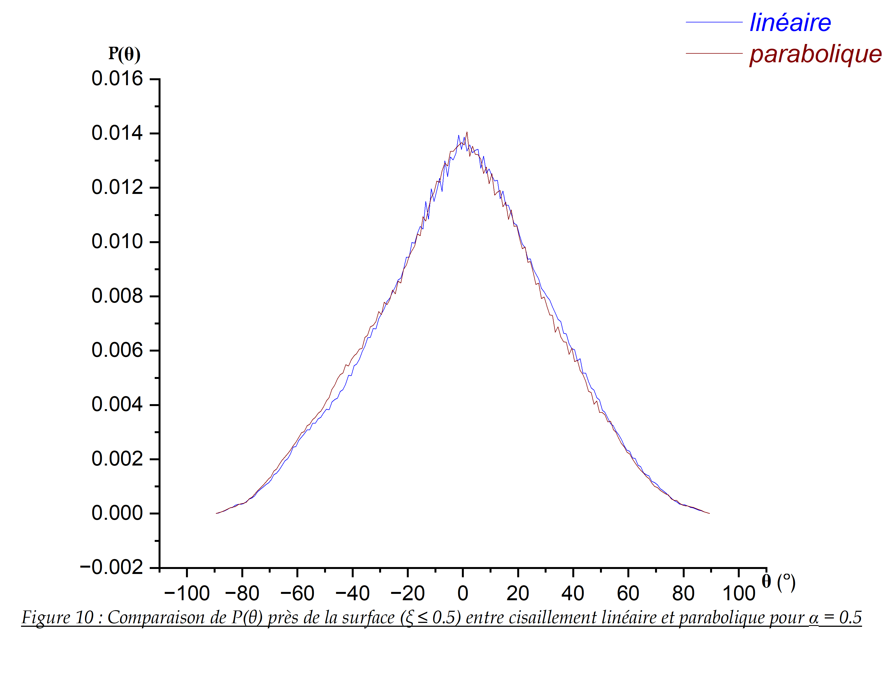


La Figure 10 compare la distribution angulaire $P(\theta)$ du bâtonnet près de la surface, définie par $\xi \leq 0.5$, pour deux profils de cisaillement : un cisaillement linéaire et un cisaillement parabolique, à la même valeur du paramètre $\alpha = 0.5$.

Pour cette faible valeur de $\alpha$, les deux distributions sont presque superposées. Elles présentent toutes deux un maximum au voisinage de $\theta \approx 0^\circ$ et une forte diminution de la probabilité aux grands angles. Cela montre que, près de la surface, la dynamique d’orientation est principalement contrôlée par le confinement géométrique imposé par la paroi.

Dans le cas du cisaillement linéaire, le maximum numérique apparaît autour de $\theta_{\max} \approx -1.5^\circ$, tandis que dans le cas du cisaillement parabolique il apparaît autour de $\theta_{\max} \approx 1.5^\circ$. Cependant, cette différence est très faible et ne doit pas être interprétée comme un déplacement physique significatif. Les deux maxima correspondent en pratique à une orientation centrée autour de $\theta \approx 0^\circ$.

La proximité des deux courbes indique que, pour $\alpha = 0.5$, le profil du cisaillement joue un rôle secondaire près de la surface. Le cisaillement hydrodynamique est trop faible pour différencier nettement les cas linéaire et parabolique. En revanche, la paroi impose une contrainte stérique importante, qui favorise les orientations presque parallèles à la surface et réduit fortement les orientations proches de $\pm 90^\circ$.

Les maxima numériques sont approximativement :

$$\theta_{\max} \approx -1.5^\circ \quad \text{pour le cisaillement linéaire}$$

$$\theta_{\max} \approx 1.5^\circ \quad \text{pour le cisaillement parabolique}$$

Cependant, pour cette valeur faible de $\alpha$, il est plus rigoureux de considérer que les deux distributions sont centrées autour de $\theta \approx 0^\circ$. Les petites différences entre les positions des maxima relèvent principalement de fluctuations statistiques et de la largeur du pic.

En conclusion, la Figure 10 montre que près de la surface et pour $\alpha = 0.5$, le confinement géométrique domine la dynamique angulaire. Les deux profils d’écoulement conduisent pratiquement au même comportement : une orientation préférentielle proche de l’alignement parallèle à la surface, avec une faible influence du type de cisaillement.

## V.3. Comparaison entre les Figures 9 et 10 : effet de la surface pour $\alpha=0.5$

Les Figures 9 et 10 permettent de comparer la distribution angulaire $P(\theta)$ du bâtonnet pour une même valeur faible du paramètre $\alpha = 0.5$, dans deux régions différentes du système : le volume, défini par $\xi > 0.5$, et la région proche de la surface, définie par $\xi \leq 0.5$.

Dans le volume, les distributions obtenues pour les cisaillements linéaire et parabolique restent proches d’un comportement quasi uniforme. Cela indique que, pour $\alpha = 0.5$, la diffusion rotationnelle brownienne domine largement la dynamique d’orientation. Le cisaillement hydrodynamique est trop faible pour imposer une orientation préférentielle claire, quel que soit le profil d’écoulement considéré.

Près de la surface, la situation est différente. Même pour cette faible valeur de $\alpha$, les distributions présentent un maximum marqué autour de $\theta \approx 0^\circ$. Cette différence montre que la paroi joue un rôle déterminant dans l’orientation du bâtonnet. Le confinement stérique limite les grandes inclinaisons et favorise les orientations presque parallèles à la surface.

La comparaison entre les deux figures montre donc que, à faible cisaillement, la surface influence davantage la distribution angulaire que le profil du cisaillement lui-même. Dans le volume, le bâtonnet reste principalement gouverné par le mouvement brownien et conserve une orientation presque isotrope. Près de la surface, la symétrie rotationnelle est brisée par la contrainte géométrique imposée par la paroi.

Il est également important de noter que la différence entre cisaillement linéaire et parabolique reste faible dans les deux régions pour $\alpha = 0.5$. Dans le volume, cette différence est masquée par la diffusion brownienne. Près de la surface, elle est masquée par l’effet dominant du confinement géométrique.

En conclusion, les Figures 9 et 10 montrent que, pour $\alpha = 0.5$, l’orientation du bâtonnet n’est pas principalement contrôlée par le cisaillement, mais par la région dans laquelle il se trouve. Dans le volume, le comportement est quasi brownien et faiblement orienté. Près de la surface, la paroi impose une orientation préférentielle proche de $\theta = 0^\circ$, indépendamment du caractère linéaire ou parabolique du cisaillement.

## V.4. Comparaison de $P(\theta)$ dans le volume pour $\alpha=1$


La **Figure 11** compare la distribution angulaire $P(\theta)$ du bâtonnet dans le volume, défini par $\xi > 0.5$, pour deux profils de cisaillement : un cisaillement linéaire et un cisaillement parabolique, à la même valeur du paramètre $\alpha = 1$.

Pour cette valeur modérée de $\alpha$, la diffusion rotationnelle brownienne joue encore un rôle dominant dans la dynamique d’orientation. Les deux distributions restent donc relativement larges et faiblement contrastées. Cela signifie que le bâtonnet continue à explorer un grand domaine d’angles sous l’effet des fluctuations browniennes.

Dans le cas du cisaillement linéaire, la distribution présente une anisotropie légèrement plus visible. Le maximum numérique se situe autour de $\theta_{\max} \approx 36.5^\circ$, avec une probabilité maximale d’environ $P_{\max} \approx 0.0069$. Cette légère structuration indique que le cisaillement constant commence à influencer l’orientation du bâtonnet, mais sans imposer encore une orientation fortement définie.

Dans le cas du cisaillement parabolique, la distribution est plus proche d’un profil uniforme. Le maximum numérique est plus faible, autour de $P_{\max} \approx 0.0060$, et se situe vers $\theta_{\max} \approx 31.5^\circ$. Cependant, comme le contraste de la courbe reste faible, ce maximum doit être interprété avec prudence. Il traduit davantage une anisotropie faible qu’une orientation préférentielle fortement établie.

La différence entre les deux profils d’écoulement vient du fait que, dans le cas linéaire, le bâtonnet ressent un cisaillement constant, tandis que dans le cas parabolique le cisaillement local dépend de la position selon $\alpha_{\text{local}} = \alpha(1-\xi)$. Dans le volume, cette dépendance spatiale réduit l’effet moyen du cisaillement par rapport au cas linéaire et conduit à une distribution plus diffuse.

Les maxima numériques sont approximativement :
$$\theta_{\max} \approx 36.5^\circ \quad \text{pour le cisaillement linéaire}$$
$$\theta_{\max} \approx 31.5^\circ \quad \text{pour le cisaillement parabolique}$$

**En conclusion**, pour $\alpha = 1$ dans le volume, les deux profils de cisaillement produisent encore des distributions larges, proches d’un régime dominé par le mouvement brownien. Le cisaillement linéaire introduit une anisotropie légèrement plus marquée, tandis que le cisaillement parabolique donne une réponse plus diffuse en raison de la variation spatiale du cisaillement local.


## V.5. Comparaison de $P(\theta)$ près de la surface pour $\alpha=1$


La Figure 12 compare la distribution angulaire $P(\theta)$ du bâtonnet près de la surface, définie par $\xi \leq 0.5$, pour deux profils de cisaillement : le cisaillement linéaire et le cisaillement parabolique, à la même valeur du paramètre $\alpha = 1$.

Pour cette valeur de $\alpha$, les deux distributions sont très proches. Elles présentent toutes les deux un maximum au voisinage de $\theta \approx 0^\circ$ et une forte diminution de la probabilité aux grands angles. Cela montre que, près de la surface, la dynamique angulaire est principalement contrôlée par le confinement géométrique imposé par la paroi.

Dans le cas du cisaillement linéaire, le maximum numérique est situé autour de $\theta_{\max} \approx 1.5^\circ$, avec une distribution centrée sur de faibles angles. Dans le cas du cisaillement parabolique, le maximum numérique se situe autour de $\theta_{\max} \approx 3.5^\circ$. Cependant, la différence entre ces deux positions reste faible et ne doit pas être surinterprétée, car les deux courbes ont une forme globale très similaire.

La proximité des deux distributions indique que, pour $\alpha = 1$, le profil précis du cisaillement joue un rôle secondaire près de la surface. L’effet dominant est celui de la paroi, qui limite les orientations accessibles et favorise une orientation presque parallèle à la surface. Le cisaillement hydrodynamique reste suffisamment faible pour ne pas créer une différence marquée entre les cas linéaire et parabolique.

Les maxima numériques sont approximativement :

$$\theta_{\max} \approx 1.5^\circ \quad \text{pour le cisaillement linéaire}$$

$$\theta_{\max} \approx 3.5^\circ \quad \text{pour le cisaillement parabolique}$$

En conclusion, pour $\alpha = 1$ près de la surface, les distributions angulaires obtenues avec les deux profils d’écoulement sont presque superposées. Cela montre que le confinement stérique domine la dynamique d’orientation, tandis que la différence entre cisaillement linéaire et parabolique reste faible dans ce régime.

## V.6. Comparaison entre les Figures 11 et 12 : effet de la surface pour $\alpha=1$

Les Figures 11 et 12 comparent l’effet du profil de cisaillement, linéaire ou parabolique, sur la distribution angulaire $P(\theta)$ pour une même valeur du paramètre $\alpha = 1$. La Figure 11 correspond au volume ($\xi > 0.5$), tandis que la Figure 12 correspond à la région proche de la surface ($\xi \leq 0.5$).

Dans le volume, les distributions restent larges et faiblement contrastées. Cela indique que, pour $\alpha = 1$, la diffusion rotationnelle brownienne conserve une influence importante sur l’orientation du bâtonnet. La différence entre le cisaillement linéaire et le cisaillement parabolique est visible, mais elle reste modérée. Le cisaillement linéaire produit une anisotropie légèrement plus marquée, avec un maximum numérique autour de $\theta_{\max} \approx 36.5^\circ$, tandis que le cisaillement parabolique présente un maximum plus faible autour de $\theta_{\max} \approx 31.5^\circ$. Ces maxima doivent cependant être interprétés avec prudence, car les deux courbes restent proches d’un régime faiblement orienté.

Près de la surface, la situation change nettement. Les deux distributions, linéaire et parabolique, deviennent presque superposées et présentent un maximum au voisinage de $\theta \approx 0^\circ$. Cela montre que la paroi domine la dynamique angulaire dans cette région. Le confinement stérique limite fortement les grandes inclinaisons et favorise les orientations presque parallèles à la surface. Ainsi, pour $\alpha = 1$, le profil exact du cisaillement joue un rôle secondaire près de la paroi.

Cette comparaison montre que la position du bâtonnet dans le pore modifie fortement la sensibilité au profil d’écoulement. Dans le volume, où l’effet de la paroi est faible, la différence entre cisaillement linéaire et parabolique reste observable. Près de la surface, cette différence est largement masquée par la contrainte géométrique imposée par la paroi.

En conclusion, les Figures 11 et 12 montrent que, pour $\alpha = 1$, le système reste globalement dominé par la diffusion brownienne dans le volume, tandis que près de la surface il est dominé par le confinement géométrique. Le cisaillement commence seulement à influencer l’orientation, mais son effet reste faible par rapport à celui de la paroi dans la région $\xi \leq 0.5$.

## V.7. Comparaison de $P(\theta)$ dans le volume pour $\alpha=5$

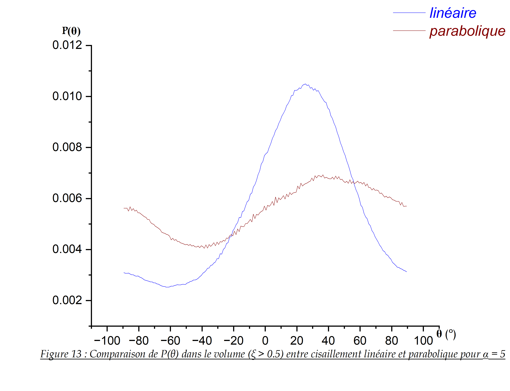

La **Figure 13** compare la distribution angulaire $P(\theta)$ du bâtonnet dans le volume, défini par $\xi > 0.5$, pour deux profils de cisaillement : un cisaillement linéaire et un cisaillement parabolique, à la même valeur du paramètre $\alpha = 5$.

Dans le cas du cisaillement linéaire, le bâtonnet subit un taux de cisaillement constant. L’effet hydrodynamique agit donc de manière plus homogène sur la dynamique rotationnelle. La distribution présente un pic plus élevé et plus marqué, avec un maximum situé autour de $\theta_{\max} \approx 25.5^\circ$. Cela indique que le cisaillement linéaire impose une orientation préférentielle plus nette au bâtonnet.

Dans le cas du cisaillement parabolique, le cisaillement local dépend de la position transverse du bâtonnet. Dans la simulation utilisée ici, cette dépendance est décrite par $\alpha_{\text{local}} = \alpha(1-\xi)$. Le bâtonnet ne ressent donc pas une intensité de cisaillement constante dans le volume. La distribution obtenue est plus large et moins élevée, avec un maximum autour de $\theta_{\max} \approx 36.5^\circ$. Cela signifie que l’orientation préférentielle est moins fortement sélectionnée que dans le cas linéaire.

La différence entre les deux courbes montre que le profil spatial du cisaillement influence directement l’orientation du bâtonnet. Le cisaillement linéaire concentre davantage la probabilité autour d’un domaine angulaire restreint, tandis que le cisaillement parabolique produit une distribution plus diffuse. Cette diffusion provient du fait que les bâtonnets situés à différentes positions ressentent des intensités locales de cisaillement différentes.

Les maxima numériques sont approximativement :
$$\theta_{\max} \approx 25.5^\circ \quad \text{pour le cisaillement linéaire}$$
$$\theta_{\max} \approx 36.5^\circ \quad \text{pour le cisaillement parabolique}$$

**En conclusion**, pour $\alpha = 5$ dans le volume, le cisaillement linéaire produit une orientation plus forte et plus concentrée du bâtonnet, tandis que le cisaillement parabolique conduit à une distribution plus large en raison de la variation spatiale du cisaillement local. Cette comparaison montre que la forme du profil d’écoulement joue un rôle essentiel dans la dynamique d’orientation.

## V.8. Comparaison de $P(\theta)$ près de la surface pour $\alpha=5$

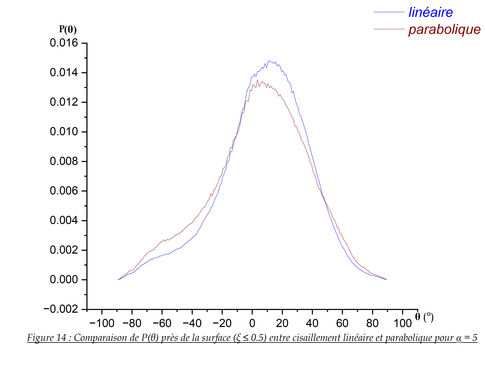

La Figure 14 compare la distribution angulaire $P(\theta)$ du bâtonnet près de la surface, définie par $\xi \leq 0.5$, pour deux profils d’écoulement : le cisaillement linéaire et le cisaillement parabolique, à la même valeur du paramètre $\alpha = 5$.

Dans les deux cas, les distributions sont fortement concentrées autour des faibles angles. Cela traduit l’effet dominant de la paroi, qui limite les grandes inclinaisons du bâtonnet et favorise les orientations presque parallèles à la surface. Ainsi, contrairement au cas du volume, la présence de la paroi impose déjà une structure angulaire très marquée.

Pour le cisaillement linéaire, la distribution présente un maximum plus élevé et situé autour de $\theta_{\max} \approx 11.5^\circ$. Cela montre que le cisaillement constant exerce un effet hydrodynamique mais plus homogène et plus marqué sur l’orientation du bâtonnet. Le profil linéaire tend donc à déplacer davantage l’orientation préférentielle vers des angles positifs.

Pour le cisaillement parabolique, le maximum est situé plus près de $\theta = 0^\circ$, autour de $\theta_{\max} \approx 3.5^\circ$, et la distribution est légèrement plus large. Cette différence s’explique par le fait que, dans le modèle utilisé, le cisaillement local dépend de la position selon $\alpha_{\text{local}} = \alpha(1-\xi)$. Le bâtonnet ne ressent donc pas une intensité de cisaillement constante, ce qui réduit l’effet d’orientation hydrodynamique par rapport au cas linéaire.

Les maxima numériques sont approximativement :
$$\theta_{\max} \approx 11.5^\circ \quad \text{pour le cisaillement linéaire}$$
$$\theta_{\max} \approx 3.5^\circ \quad \text{pour le cisaillement parabolique}$$

Cette comparaison montre que, près de la surface, le confinement géométrique reste le facteur principal qui structure la distribution angulaire. Cependant, la forme du profil de cisaillement modifie la position du maximum et la largeur de la distribution. Le cisaillement linéaire produit une orientation plus décalée vers les angles positifs, tandis que le cisaillement parabolique maintient davantage la distribution autour de l’orientation parallèle à la surface.

En conclusion, pour $\alpha = 5$ près de la surface, les deux profils d’écoulement conduisent à une orientation préférentielle du bâtonnet. Toutefois, cette orientation est plus fortement décalée dans le cas linéaire, alors qu’elle reste plus proche de $\theta = 0^\circ$ dans le cas parabolique. Cela confirme que la dépendance spatiale du cisaillement joue un rôle important dans la réponse angulaire du bâtonnet, même en présence de la contrainte imposée par la paroi.

## V.9. Comparaison entre les Figures 13 et 14 : effet du profil d'écoulement

Les **Figures 13 et 14** permettent de comparer l’effet du profil de cisaillement sur la distribution angulaire $P(\theta)$ pour une même valeur du paramètre $\alpha = 5$. La Figure 13 correspond au volume, défini par $\xi > 0.5$, tandis que la Figure 14 correspond à la région proche de la surface, définie par $\xi \leq 0.5$.

Dans le volume, la différence entre le cisaillement linéaire et le cisaillement parabolique est très visible. Le cisaillement linéaire produit une distribution plus concentrée, avec un maximum plus élevé autour de $\theta_{\max} \approx 25.5^\circ$. En revanche, le cisaillement parabolique conduit à une distribution plus large et moins élevée, avec un maximum autour de $\theta_{\max} \approx 36.5^\circ$. Cette différence montre que, dans le volume, la forme du profil d’écoulement influence fortement la dynamique d’orientation du bâtonnet.

Près de la surface, les deux distributions sont plus proches l’une de l’autre en forme générale, car la paroi impose une contrainte géométrique forte. Les grandes inclinaisons sont fortement défavorisées, ce qui concentre les distributions autour des faibles angles. Cependant, le profil de cisaillement conserve un effet important sur la position du maximum : pour le cisaillement linéaire, le maximum se situe autour de $\theta_{\max} \approx 11.5^\circ$, tandis que pour le cisaillement parabolique, il reste plus proche de $\theta = 0^\circ$, autour de $\theta_{\max} \approx 3.5^\circ$.

Cette comparaison montre que l’effet du profil de cisaillement dépend fortement de la position du bâtonnet dans le pore. Dans le volume, où la contrainte de surface est faible, la différence entre les deux profils d’écoulement apparaît surtout dans la largeur et la hauteur du pic. Près de la surface, la paroi domine la forme générale de la distribution, mais le type de cisaillement continue à influencer la position de l’orientation préférentielle.

**En conclusion**, les Figures 13 et 14 montrent que la dynamique angulaire ne dépend pas uniquement de la valeur de $\alpha$, mais aussi du profil spatial du cisaillement et de la position du bâtonnet par rapport à la surface. Le cisaillement linéaire tend à produire une orientation plus nette et plus décalée vers les angles positifs, tandis que le cisaillement parabolique donne une réponse plus diffuse dans le volume et plus proche de l’alignement parallèle à la surface près de la paroi.

# VI. Résultats complémentaires : distribution spatiale et angle préférentiel

Dans cette partie, nous présentons les corrections et les résultats complémentaires ajoutés après la discussion avec le superviseur. Les Figures 15 à 18 correspondent aux distributions spatiales normalisées corrigées, tandis que les Figures 19 et 20 présentent l'évolution de l'angle préférentiel $\theta_{\max}$ en fonction du paramètre $\alpha$.

Les distributions spatiales sont maintenant représentées sur tout l'intervalle $0 \leq \xi \leq 1$. Les oscillations statistiques visibles dans les anciennes versions ont été réduites par un regroupement des données avec un pas $\Delta \xi = 0.005$. Cette opération améliore la lisibilité des résultats sans modifier la physique du modèle.

---

## VI.1. Figure 15 : distribution normalisée $\rho(\xi)/\rho_{\mathrm{bulk}}$ sous cisaillement linéaire pour faibles valeurs de $\alpha$

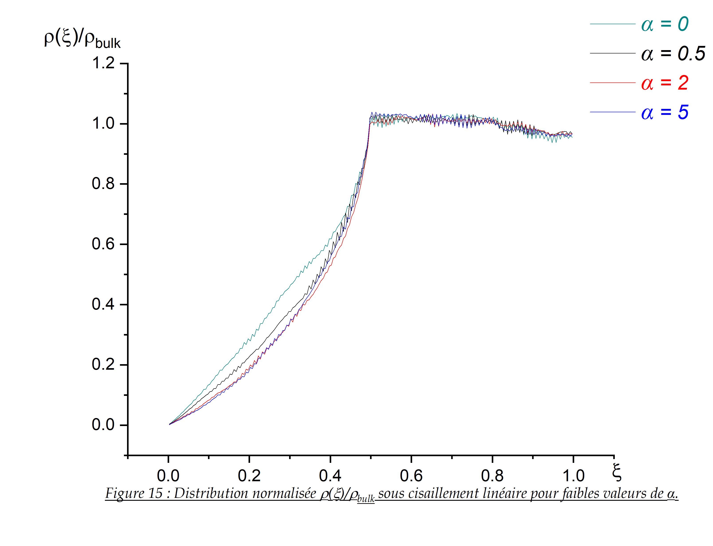

La Figure 15 représente la distribution spatiale normalisée $\rho(\xi)/\rho_{\mathrm{bulk}}$ dans le cas d'un cisaillement linéaire, pour les faibles valeurs de $\alpha$ : $\alpha = 0$, $0.5$, $2$ et $5$.

On observe clairement que la densité normalisée est très faible près de la surface, c'est-à-dire pour $\xi$ proche de 0. Cette région correspond à une couche de déplétion. Physiquement, le centre de masse du bâtonnet ne peut pas explorer librement cette zone, car une partie de l'espace géométrique est interdite par la présence de la paroi. Si le centre de masse est trop proche de la surface, certaines orientations du bâtonnet provoqueraient un contact avec la paroi.

Lorsque $\xi$ augmente, la densité augmente progressivement jusqu'à atteindre une valeur proche de 1. À partir de $\xi \approx 0.5$, la distribution devient presque constante : cette zone correspond au bulk, où l'influence directe de la paroi devient faible.

Le cas $\alpha = 0$ joue ici le rôle de référence sans cisaillement hydrodynamique. La proximité des courbes montre que, pour les faibles valeurs de $\alpha$, la structure spatiale de $\rho(\xi)$ est dominée principalement par le confinement stérique plutôt que par le cisaillement.

---

## VI.2. Figure 16 : distribution normalisée $\rho(\xi)/\rho_{\mathrm{bulk}}$ sous cisaillement linéaire pour fortes valeurs de $\alpha$

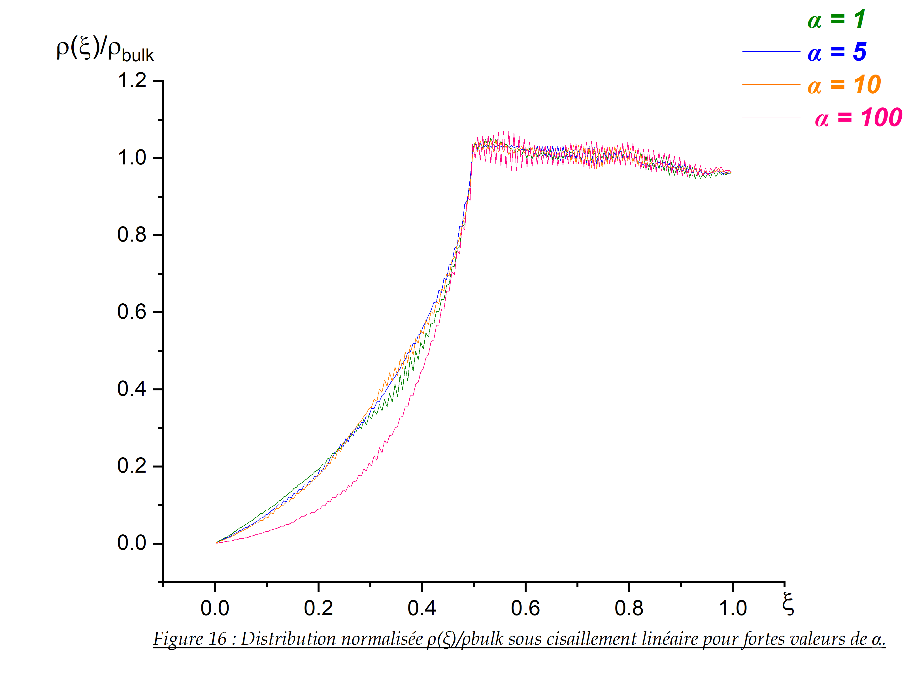

La Figure 16 présente la même distribution spatiale normalisée $\rho(\xi)/\rho_{\mathrm{bulk}}$, mais pour des valeurs plus élevées de $\alpha$ : $\alpha = 1$, $5$, $10$ et $100$.

Même lorsque le cisaillement devient plus intense, la forme générale de la distribution reste gouvernée par la présence de la paroi. La couche de déplétion près de $\xi = 0$ reste visible, ce qui confirme son origine géométrique. Elle ne disparaît pas lorsque $\alpha$ augmente, car elle résulte d'une contrainte d'accessibilité spatiale imposée au centre de masse du bâtonnet.

Pour les grandes valeurs de $\alpha$, le cisaillement hydrodynamique influence davantage l'orientation du bâtonnet, mais son effet sur la distribution spatiale reste secondaire par rapport au confinement. La densité atteint toujours un plateau proche de 1 dans la région du bulk.

Ainsi, cette figure montre que le cisaillement peut modifier légèrement la répartition spatiale, mais que la couche de déplétion est une propriété robuste du système confiné.

---

## VI.3. Figure 17 : distribution normalisée $\rho(\xi)/\rho_{\mathrm{bulk}}$ sous demi-profil parabolique pour faibles valeurs de $\alpha$

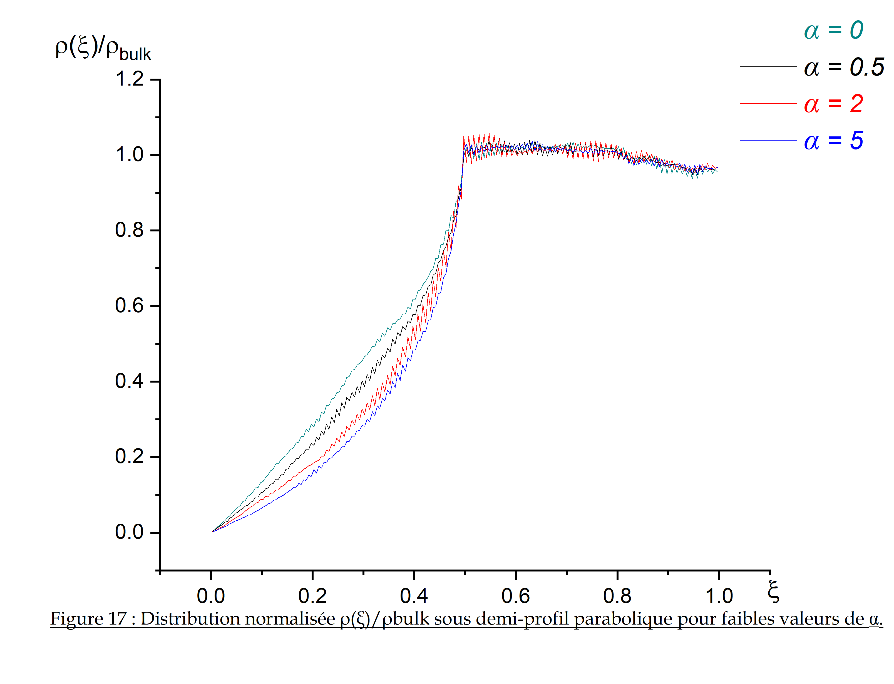

La Figure 17 correspond au cas du demi-profil parabolique pour les faibles valeurs de $\alpha$ : $\alpha = 0$, $0.5$, $2$ et $5$.

Contrairement au cisaillement linéaire, le cisaillement local n'est pas constant. Dans le modèle utilisé, il dépend de la position selon la relation :

$$
\alpha_{\mathrm{local}}(\xi) = \alpha(1-\xi)
$$

Cela signifie que le bâtonnet ne ressent pas la même intensité de cisaillement selon sa position dans le mésopore. Le cisaillement est plus important près de la surface et diminue lorsqu'on se rapproche du bulk.

Malgré cette variation spatiale du cisaillement, la distribution $\rho(\xi)/\rho_{\mathrm{bulk}}$ conserve la même structure générale : une couche de déplétion près de la surface, suivie d'une montée progressive vers un plateau proche de 1. Cela montre que, pour les faibles valeurs de $\alpha$, le confinement stérique reste le mécanisme dominant dans la formation de la distribution spatiale.

---

## VI.4. Figure 18 : distribution normalisée $\rho(\xi)/\rho_{\mathrm{bulk}}$ sous demi-profil parabolique pour fortes valeurs de $\alpha$

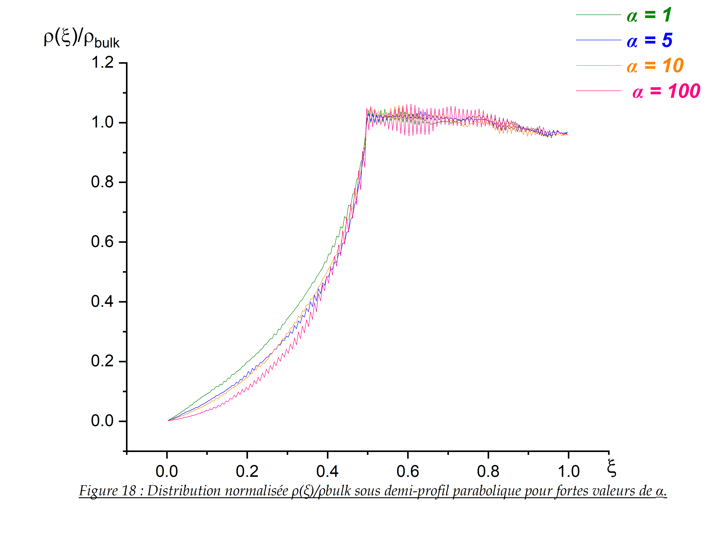

La Figure 18 présente la distribution spatiale normalisée dans le cas du demi-profil parabolique pour les fortes valeurs de $\alpha$ : $\alpha = 1$, $5$, $10$ et $100$.

À forte valeur de $\alpha$, le cisaillement hydrodynamique devient important, mais il reste spatialement non uniforme. Le bâtonnet subit donc un cisaillement local dépendant de $\xi$. Cette inhomogénéité peut modifier légèrement la forme des courbes, mais la structure principale demeure inchangée : la densité est faible près de la surface et atteint un plateau dans le bulk.

La comparaison avec la Figure 16 montre que le profil parabolique ne supprime pas la couche de déplétion. Celle-ci est donc une conséquence fondamentale de la géométrie confinée du système, et non un effet spécifique du type de cisaillement.

---

## VI.5. Figure 19 : variation de $\theta_{\max}$ en fonction de $\alpha$ dans le bulk

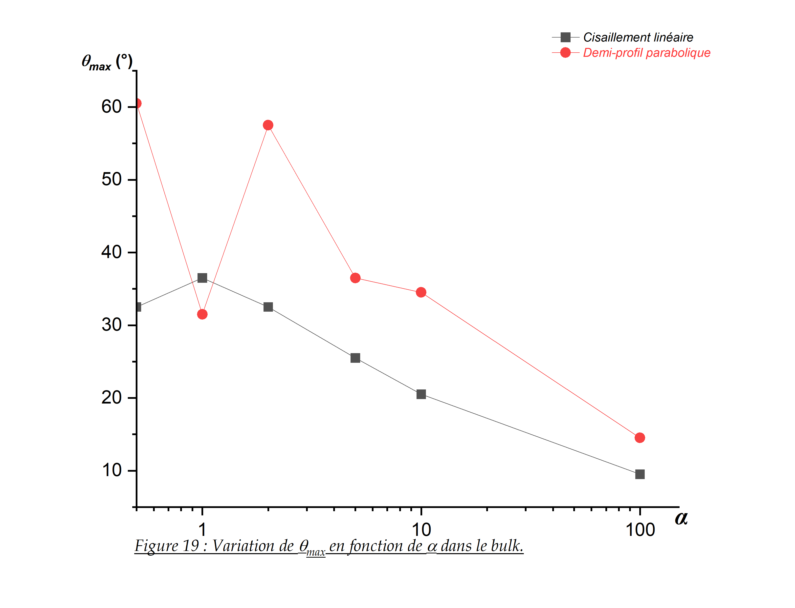

La Figure 19 représente l'évolution de l'angle préférentiel $\theta_{\max}$ en fonction de $\alpha$ dans le bulk, pour deux types d'écoulement : le cisaillement linéaire et le demi-profil parabolique.

Dans le bulk, le bâtonnet est moins contraint par la paroi. Son orientation résulte donc principalement de la compétition entre deux effets : la diffusion rotationnelle brownienne, qui tend à désordonner l'orientation, et le couple hydrodynamique dû au cisaillement, qui tend à aligner le bâtonnet avec l'écoulement.

Lorsque $\alpha$ augmente, $\theta_{\max}$ diminue globalement. Cela signifie que le maximum de probabilité se déplace vers des angles plus proches de la direction de l'écoulement. Physiquement, plus $\alpha$ est grand, plus le cisaillement domine la diffusion brownienne rotationnelle. Le bâtonnet passe alors davantage de temps dans des orientations proches de l'axe de l'écoulement.

Le cisaillement linéaire produit une diminution plus régulière de $\theta_{\max}$. Dans le cas du demi-profil parabolique, les valeurs sont plus dispersées, car le cisaillement local dépend de la position $\xi$. La distribution angulaire mesurée dans le bulk résulte donc d'une moyenne sur plusieurs intensités locales de cisaillement.

Le cas $\alpha = 0$ n'est pas représenté sur cette figure lorsque l'axe des abscisses est logarithmique, car $\log(0)$ n'est pas défini. De plus, dans le bulk sans cisaillement, la distribution angulaire est quasi isotrope ; il n'existe donc pas de $\theta_{\max}$ physiquement significatif.

---

## VI.6. Figure 20 : variation de $\theta_{\max}$ en fonction de $\alpha$ dans la couche de déplétion

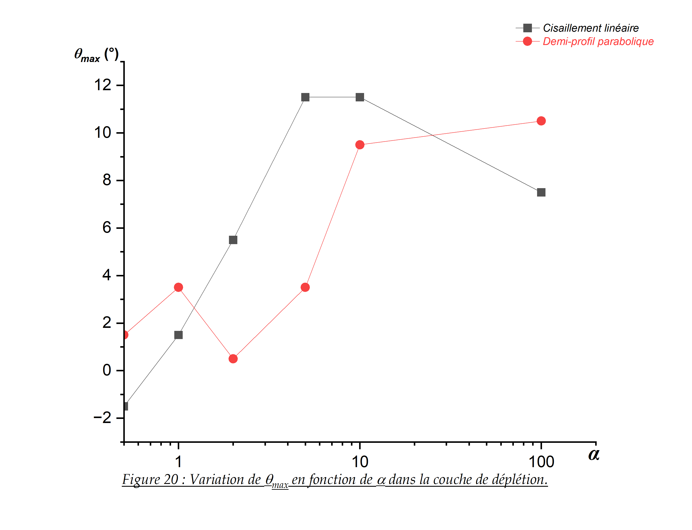

La Figure 20 montre l'évolution de $\theta_{\max}$ en fonction de $\alpha$ dans la couche de déplétion, c'est-à-dire près de la surface.

Dans cette région, l'orientation du bâtonnet n'est pas gouvernée uniquement par le cisaillement. La paroi impose une contrainte géométrique forte : les grandes inclinaisons sont défavorisées car elles augmentent la probabilité de contact entre le bâtonnet et la surface. Ainsi, même lorsque le cisaillement est faible, le bâtonnet tend déjà à adopter des orientations proches de la surface.

C'est pourquoi $\theta_{\max}$ reste globalement proche des petits angles. Contrairement au bulk, où $\theta_{\max}$ peut varier fortement avec $\alpha$, la couche de déplétion impose une sélection géométrique des orientations accessibles. Le cisaillement modifie cette orientation préférentielle, mais il agit sur un espace angulaire déjà restreint par le confinement.

La comparaison entre cisaillement linéaire et demi-profil parabolique montre que la réponse près de la surface est plus complexe que dans le bulk. Elle résulte d'un couplage entre l'effet hydrodynamique local et la contrainte stérique imposée par la paroi.

Ainsi, la Figure 20 confirme que la couche de déplétion n'est pas seulement une zone de faible densité spatiale ; c'est aussi une région où la dynamique orientationnelle du bâtonnet est profondément modifiée par la présence de la surface.

---

## VI.7. Conclusion de cette partie

Les Figures 15 à 18 montrent que la distribution spatiale normalisée $\rho(\xi)/\rho_{\mathrm{bulk}}$ est dominée par le confinement stérique. La couche de déplétion apparaît près de la surface pour tous les profils d'écoulement et pour toutes les valeurs de $\alpha$. Le cisaillement modifie légèrement les profils, mais il ne supprime pas cette structure géométrique fondamentale.

Les Figures 19 et 20 complètent cette analyse en montrant l'évolution de l'angle préférentiel $\theta_{\max}$ avec $\alpha$. Dans le bulk, l'augmentation de $\alpha$ favorise l'alignement du bâtonnet avec l'écoulement. Près de la surface, la paroi impose une contrainte supplémentaire qui limite les orientations accessibles et maintient $\theta_{\max}$ dans une région de petits angles.

Ces résultats montrent que la dynamique du bâtonnet confiné résulte d'un équilibre entre diffusion brownienne rotationnelle, cisaillement hydrodynamique et confinement stérique.

---

# Partie complémentaire : résultats ajoutés après les remarques du superviseur

Cette partie est ajoutée à la suite du rapport initial afin de conserver l'ancien travail complet tout en présentant les nouveaux résultats demandés : introduction de $\alpha=0$, correction de la distribution spatiale $P(\xi)$ jusqu'à $\xi=1$, représentation brute et binnée de $P(\xi)$, et évolution de $\theta_{\max}(\alpha)$ dans le volume et dans la couche de déplétion.

# Simulation numérique d'un bâtonnet brownien confiné

Ce dépôt présente une simulation numérique en C++ de la dynamique d'un bâtonnet brownien rigide confiné dans un mésopore. Le but physique est d'étudier comment un écoulement de cisaillement, le mouvement brownien et la proximité d'une surface modifient l'orientation et la position transverse de la particule.

La version actuelle compare deux profils d'écoulement :

- un cisaillement linéaire uniforme ;
- un demi-profil parabolique de type Poiseuille.

Les simulations sont effectuées pour les valeurs suivantes du paramètre de contrôle :

$$
\alpha = 0,\ 0.5,\ 1,\ 2,\ 5,\ 10,\ 100.
$$

La valeur $\alpha = 0$ sert de référence sans cisaillement hydrodynamique. Elle permet de distinguer ce qui vient uniquement du confinement géométrique et de la diffusion brownienne de ce qui est réellement produit par l'écoulement.

---

## 1. Modèle physique

Le système étudié est un bâtonnet rigide de longueur $L_B$ confiné près d'une surface. Dans le code utilisé ici :

$$
L_B = D = 880\ \mathrm{nm}.
$$

La position transverse du centre de masse est notée $z_c$. On introduit la position réduite :

$$
\xi = \frac{z_c}{L_B}.
$$

Comme $D = L_B$, la variable $\xi$ varie entre 0 et 1 dans la géométrie actuelle. La surface inférieure correspond à $\xi = 0$, tandis que la zone éloignée de la surface correspond à $\xi > 0.5$.

Deux régions statistiques sont séparées :

$$
\xi \leq 0.5 \quad \text{: couche de déplétion, proche de la surface},
$$

$$
\xi > 0.5 \quad \text{: volume}.
$$

L'angle d'orientation du bâtonnet est noté $\theta$. Il est mesuré par rapport à la direction de l'écoulement, avec :

$$
-90^\circ \leq \theta < 90^\circ.
$$

Lorsque $\theta$ est proche de $0^\circ$, le bâtonnet est presque parallèle aux lignes de courant et à la surface. Lorsque $|\theta|$ augmente, le bâtonnet devient plus incliné et risque davantage d'interagir avec la paroi.

---

## 2. Dynamique simulée

La dynamique résulte de trois contributions principales.

La première est la diffusion rotationnelle brownienne. Elle modélise les fluctuations thermiques du fluide et tend à désordonner l'orientation du bâtonnet :

$$
\Delta \theta_B = \pm \Delta_B.
$$

La deuxième est la diffusion translationnelle brownienne suivant $z_c$. Elle déplace le centre de masse dans la direction transverse :

$$
\Delta z_B = \pm \frac{L_B}{3}\Delta_B.
$$

La troisième est la rotation hydrodynamique induite par le cisaillement :

$$
\Delta \theta_H =
-\frac{\alpha_{\mathrm{local}}}{2}\sin^2(\theta)\Delta_B^2.
$$

Cette relation exprime le fait que le cisaillement n'agit pas comme un bruit aléatoire, mais comme un terme déterministe qui favorise certaines orientations.

Le paramètre $\alpha$ joue le rôle d'un nombre de Péclet rotationnel :

$$
\alpha \sim \frac{\dot{\gamma}_0}{D_{\mathrm{rot}}}.
$$

Il compare l'effet du cisaillement hydrodynamique à la diffusion rotationnelle brownienne. Lorsque $\alpha$ est petit, le mouvement brownien domine. Lorsque $\alpha$ est grand, l'écoulement impose progressivement une orientation préférentielle.

---

## 3. Profils de cisaillement

### 3.1 Cisaillement linéaire

Dans le cas linéaire, le cisaillement est supposé uniforme dans la zone étudiée :

$$
\alpha_{\mathrm{local}} = \alpha.
$$

Chaque position transverse ressent donc la même intensité de cisaillement.

### 3.2 Demi-profil parabolique

Dans le cas parabolique, la simulation utilise un cisaillement local dépendant de la position :

$$
\alpha_{\mathrm{local}}(\xi) = \alpha(1-\xi).
$$

Ce choix correspond à un demi-profil de Poiseuille. Dans un écoulement de Poiseuille entre deux parois, la vitesse est parabolique et le taux de cisaillement est proportionnel à la dérivée de cette vitesse. Sur une moitié du canal, le cisaillement local décroît linéairement lorsqu'on s'éloigne de la paroi.

Ainsi, près de la surface, le cisaillement local est plus fort. Vers la région $\xi \simeq 1$, il devient plus faible. Cela explique pourquoi les distributions obtenues sous demi-profil parabolique sont souvent plus larges ou plus irrégulières : elles résultent d'une moyenne sur plusieurs valeurs locales de cisaillement.

---

## 4. Grandeurs statistiques calculées

La simulation produit trois familles principales de grandeurs.

La première est la distribution angulaire dans le volume :

$$
P(\theta)\quad \text{pour}\quad \xi > 0.5.
$$

La deuxième est la distribution angulaire dans la couche de déplétion :

$$
P(\theta)\quad \text{pour}\quad \xi \leq 0.5.
$$

La troisième est la distribution spatiale transverse :

$$
P(\xi)\quad \text{pour}\quad 0 \leq \xi \leq 1.
$$

Pour les distributions spatiales, une représentation normalisée est aussi utilisée :

$$
\frac{\rho(\xi)}{\rho_{\mathrm{bulk}}}.
$$

Cette normalisation compare la densité locale à la densité moyenne dans le volume. Elle permet de visualiser clairement la couche de déplétion : si $\rho(\xi)/\rho_{\mathrm{bulk}} < 1$, la région est statistiquement appauvrie en centres de masse.

---

## 5. Distributions angulaires sous cisaillement linéaire

### Figure 1 : distribution angulaire dans le volume

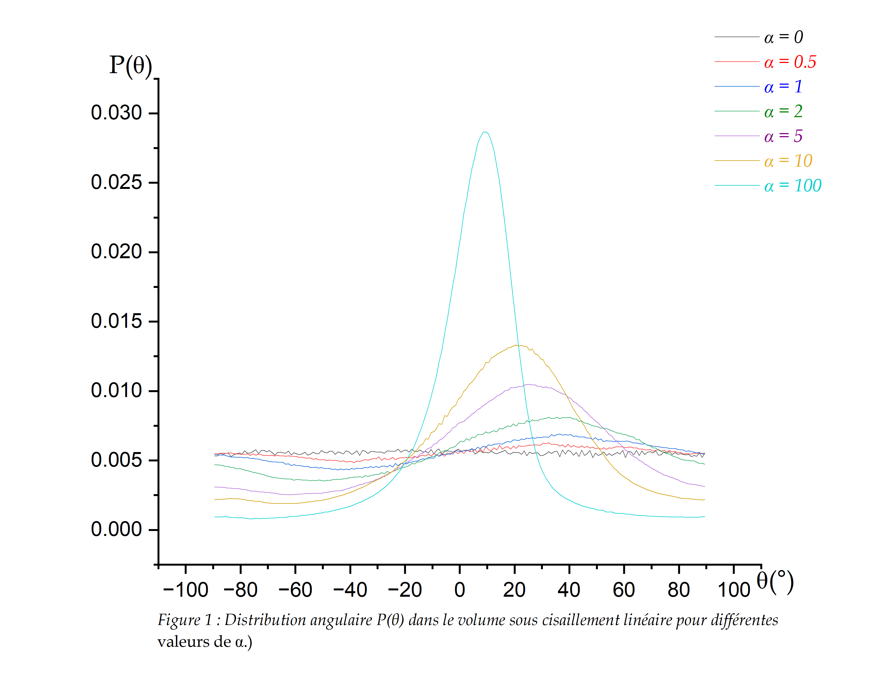

La Figure 1 montre $P(\theta)$ dans le volume pour un cisaillement linéaire. Dans cette région, le bâtonnet est moins contraint par la surface et peut explorer un domaine angulaire plus large.

Pour $\alpha = 0$, il n'y a pas de rotation hydrodynamique. La distribution constitue donc une référence brownienne. En volume, aucun alignement imposé par le cisaillement ne doit être attendu.

Lorsque $\alpha$ augmente, la distribution devient progressivement anisotrope. Les faibles valeurs de $\alpha$ correspondent à une compétition entre la diffusion rotationnelle brownienne et le couple hydrodynamique. Aux grandes valeurs, en particulier $\alpha = 10$ et $\alpha = 100$, l'effet de l'écoulement devient dominant : la probabilité se concentre autour d'un intervalle angulaire plus étroit.

Le déplacement du maximum vers des angles plus proches de $0^\circ$ indique que le bâtonnet tend à s'aligner avec les lignes de courant lorsque le nombre de Péclet rotationnel augmente.

### Figure 2 : distribution angulaire dans la couche de déplétion

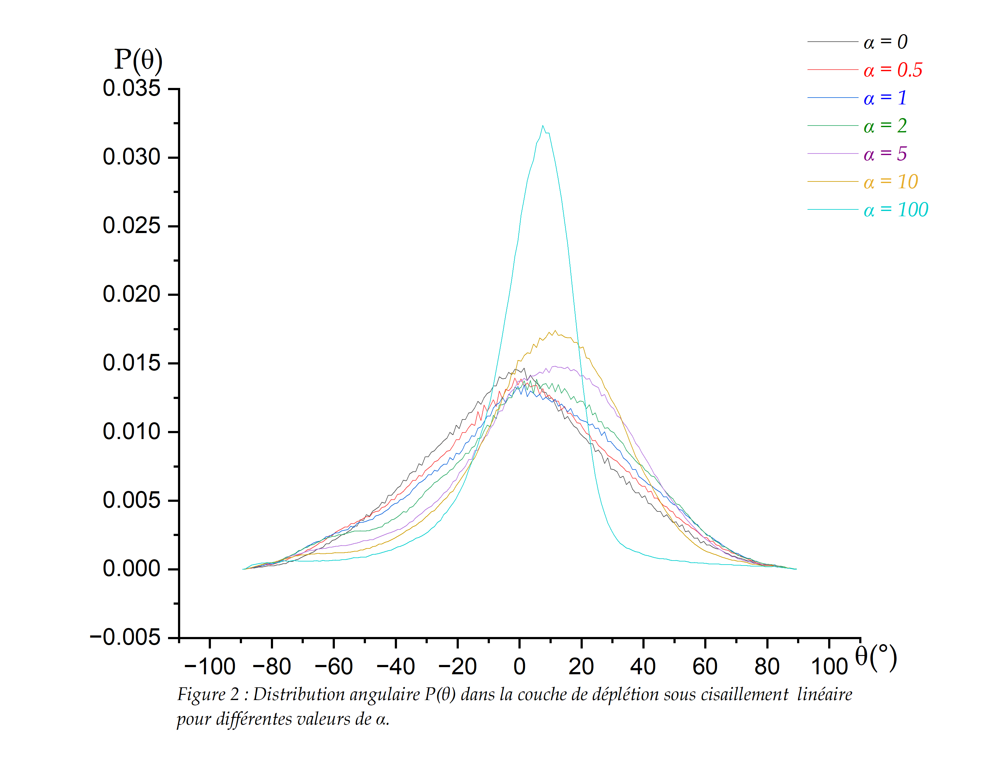

La Figure 2 présente $P(\theta)$ près de la surface. La différence essentielle avec le volume est la présence de la contrainte stérique imposée par la paroi.

Même lorsque $\alpha = 0$, le bâtonnet ne peut pas adopter librement toutes les orientations. Les grandes inclinaisons augmentent le risque d'intersection avec la surface. La géométrie favorise donc naturellement les orientations presque parallèles à la paroi, c'est-à-dire proches de $\theta = 0^\circ$.

Lorsque $\alpha$ augmente, le cisaillement renforce cette orientation préférentielle. Cependant, dans la couche de déplétion, l'effet dominant n'est pas seulement hydrodynamique : il est aussi géométrique. La paroi réduit l'espace des orientations accessibles avant même que le cisaillement n'agisse fortement.

Cette figure montre donc une compétition entre deux mécanismes : le confinement stérique, qui existe même à $\alpha = 0$, et le cisaillement linéaire, qui devient plus visible lorsque $\alpha$ augmente.

---

## 6. Distributions angulaires sous demi-profil parabolique

### Figure 3 : distribution angulaire dans le volume

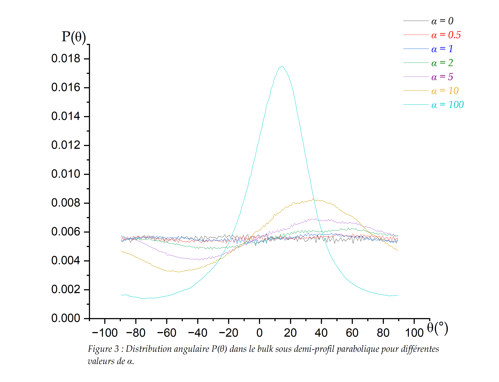

La Figure 3 montre $P(\theta)$ dans le volume pour le demi-profil parabolique. Contrairement au cisaillement linéaire, le taux de cisaillement local n'est pas constant :

$$
\alpha_{\mathrm{local}}(\xi) = \alpha(1-\xi).
$$

Le volume contient donc des particules situées à différentes positions $\xi$, chacune ressentant une intensité hydrodynamique différente. La distribution globale est une superposition de sous-populations soumises à des cisaillements locaux distincts.

Cette inhomogénéité explique pourquoi les pics sont généralement moins simples à interpréter que dans le cas linéaire. Aux faibles valeurs de $\alpha$, les maxima numériques peuvent être influencés par le bruit statistique et par la largeur des distributions. Aux fortes valeurs, l'orientation devient plus nette, mais elle reste marquée par la variation spatiale du cisaillement.

La figure met donc en évidence une dynamique hors équilibre plus complexe : le bâtonnet ne subit pas seulement une compétition entre diffusion brownienne et cisaillement, mais aussi une variation de l'intensité du cisaillement selon sa position.

### Figure 4 : distribution angulaire dans la couche de déplétion

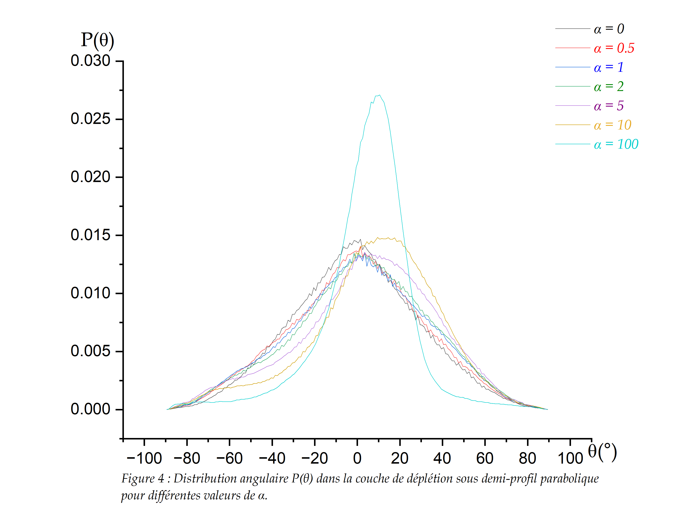

La Figure 4 correspond à la couche de déplétion sous demi-profil parabolique. Cette région est physiquement importante parce qu'elle combine deux effets forts : la proximité de la surface et un cisaillement local élevé.

La surface impose une sélection géométrique des orientations. Le demi-profil parabolique ajoute ensuite une rotation hydrodynamique dépendante de la position. Le résultat est une distribution centrée près des faibles angles, avec une évolution progressive lorsque $\alpha$ augmente.

Comparée au volume, la couche de déplétion présente des orientations beaucoup plus contraintes. Le bâtonnet ne peut pas explorer librement les grands angles, car ceux-ci le rapprochent mécaniquement de la paroi. La paroi agit donc comme un filtre géométrique sur l'espace angulaire accessible.

---

## 7. Distributions spatiales : données brutes et traitement statistique

Les Figures 5a et 6a présentent les distributions spatiales brutes $P(\xi)$. Elles montrent directement le résultat du comptage dans des bins fins. Les oscillations visibles, surtout pour les grandes valeurs de $\alpha$, proviennent du nombre fini d'échantillons et de la finesse du pas en $\xi$.

Pour faire apparaître la tendance physique robuste, les Figures 5b et 6b utilisent un regroupement statistique de cinq bins successifs :

$$
\Delta \xi = 0.005.
$$

Ce traitement ne modifie pas la dynamique simulée. Il agit uniquement comme un post-traitement statistique destiné à réduire les oscillations de comptage et à rendre la couche de déplétion plus lisible.

### Figure 5a : distribution spatiale brute sous cisaillement linéaire

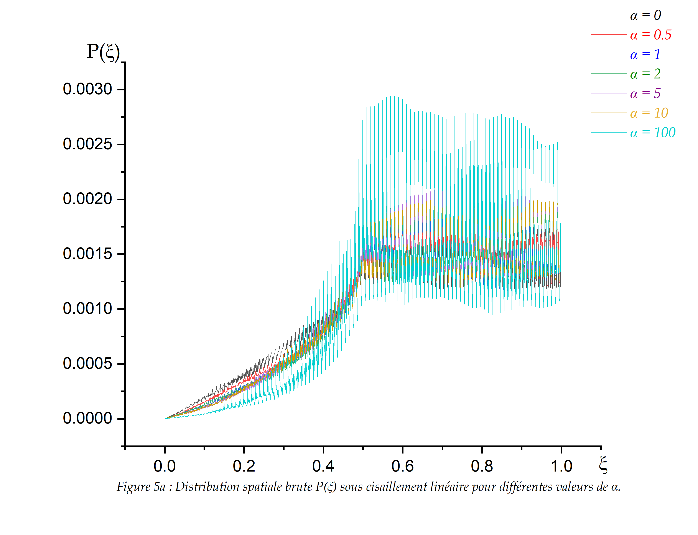

La Figure 5a montre la distribution spatiale brute $P(\xi)$ pour le cisaillement linéaire. Le profil croît depuis la surface jusqu'à la région du volume. Cette croissance traduit l'existence d'une couche de déplétion : près de la paroi, une partie des positions du centre de masse est géométriquement moins accessible à cause de la longueur finie du bâtonnet.

Le saut autour de $\xi \simeq 0.5$ correspond au passage entre la région proche de la surface et le volume. Dans le volume, la densité devient beaucoup plus proche d'un plateau.

### Figure 5b : distribution spatiale normalisée sous cisaillement linéaire

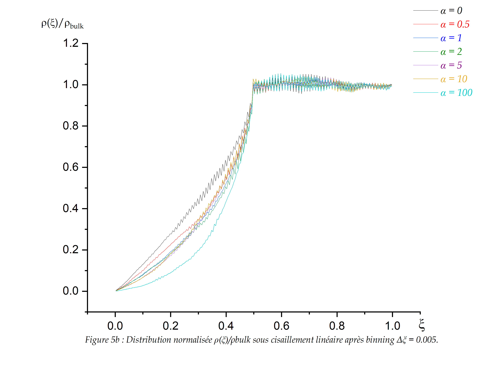

La Figure 5b montre la même information après regroupement statistique et normalisation par $\rho_{\mathrm{bulk}}$.

La lecture physique devient plus claire : la quantité $\rho(\xi)/\rho_{\mathrm{bulk}}$ est faible près de la surface, puis augmente progressivement jusqu'à atteindre une valeur proche de 1 dans le volume. Cela signifie que la densité locale rejoint la densité moyenne du volume lorsque le centre de masse est suffisamment éloigné de la paroi.

Cette figure confirme que l'effet principal sur $P(\xi)$ est géométrique. Le cisaillement modifie légèrement les profils, mais la forme générale de la couche de déplétion est imposée par l'exclusion stérique du bâtonnet près de la surface.

### Figure 6a : distribution spatiale brute sous demi-profil parabolique


La Figure 6a présente la distribution spatiale brute $P(\xi)$ pour le demi-profil parabolique. Comme dans le cas linéaire, la densité est faible près de la surface et augmente vers le volume.

Les oscillations brutes sont visibles parce que la statistique est collectée avec un pas fin en $\xi$. Elles ne doivent pas être interprétées comme des structures physiques périodiques. Elles sont liées à la discrétisation de l'histogramme et au caractère aléatoire de la dynamique brownienne.

### Figure 6b : distribution spatiale normalisée sous demi-profil parabolique


La Figure 6b montre la distribution spatiale normalisée après regroupement statistique. Comme dans le cas linéaire, la courbe révèle clairement une région appauvrie près de la surface et un plateau dans le volume.

La différence physique avec le cisaillement linéaire vient du fait que le cisaillement local dépend de $\xi$. Le bâtonnet proche de la surface ressent un cisaillement plus fort que celui situé plus loin. Malgré cela, la forme globale de $\rho(\xi)/\rho_{\mathrm{bulk}}$ reste dominée par le confinement stérique.

---

## 8. Évolution de l'angle le plus probable

L'angle $\theta_{\max}$ est défini comme le centre du bin angulaire où la probabilité $P(\theta)$ est maximale.

Il faut cependant distinguer deux situations :

- si la distribution est fortement piquée, $\theta_{\max}$ correspond à une orientation préférentielle physiquement significative ;
- si la distribution est large ou presque uniforme, $\theta_{\max}$ est seulement un maximum numérique, parfois produit par de faibles fluctuations statistiques.

Pour cette raison, les courbes $\theta_{\max}(\alpha)$ sont tracées uniquement pour les valeurs positives de $\alpha$. La valeur $\alpha = 0$ est une référence sans cisaillement, mais elle ne définit pas un maximum hydrodynamique pertinent dans le volume.

### Figure 7 : variation de $\theta_{\max}$ dans le volume


La Figure 7 montre la variation de $\theta_{\max}$ en fonction de $\alpha$ dans le volume.

Dans le cas du cisaillement linéaire, la tendance générale est une diminution de $\theta_{\max}$ lorsque $\alpha$ augmente. Physiquement, cela signifie que le bâtonnet s'oriente de plus en plus près de la direction de l'écoulement. À grand $\alpha$, le couple hydrodynamique domine la diffusion brownienne rotationnelle et impose un alignement plus marqué.

Dans le cas du demi-profil parabolique, l'évolution est moins monotone aux faibles et moyennes valeurs de $\alpha$. Cette irrégularité n'est pas surprenante : le volume mélange des particules soumises à différents cisaillements locaux. De plus, lorsque les distributions sont larges, le maximum numérique peut se déplacer sans correspondre à une orientation physique très nette.

À grande valeur de $\alpha$, la tendance redevient plus claire : le maximum se rapproche de faibles angles, ce qui traduit l'orientation progressive du bâtonnet par l'écoulement.

### Figure 8 : variation de $\theta_{\max}$ dans la couche de déplétion


La Figure 8 montre l'évolution de $\theta_{\max}$ dans la couche de déplétion.

Contrairement au volume, les valeurs de $\theta_{\max}$ restent proches de faibles angles. Cela confirme que la surface impose une orientation presque parallèle à la paroi. Le cisaillement peut déplacer légèrement le maximum, mais il agit dans un espace angulaire déjà fortement contraint.

Cette figure montre donc que la couche de déplétion n'est pas simplement une version plus dense ou moins dense du volume. Elle correspond à un régime physique différent, dominé par l'interaction entre confinement stérique, diffusion brownienne et cisaillement local.

---

## 9. Valeurs numériques de $\theta_{\max}$

Les valeurs suivantes ont été extraites des histogrammes angulaires. Elles doivent être lues comme des maxima numériques. Leur signification physique est forte lorsque la distribution est étroite et contrastée, et plus faible lorsque la distribution est large.

### Volume

| $\alpha$ | Cisaillement linéaire | Demi-profil parabolique |
|---:|---:|---:|
| 0.5 | 32.5° | 60.5° |
| 1 | 36.5° | 31.5° |
| 2 | 32.5° | 57.5° |
| 5 | 25.5° | 36.5° |
| 10 | 20.5° | 34.5° |
| 100 | 9.5° | 14.5° |

### Couche de déplétion

| $\alpha$ | Cisaillement linéaire | Demi-profil parabolique |
|---:|---:|---:|
| 0.5 | -1.5° | 1.5° |
| 1 | 1.5° | 3.5° |
| 2 | 5.5° | 0.5° |
| 5 | 11.5° | 3.5° |
| 10 | 11.5° | 9.5° |
| 100 | 7.5° | 10.5° |

---

## 10. Conclusion physique

Les résultats montrent que l'orientation du bâtonnet est gouvernée par trois mécanismes :

- la diffusion rotationnelle brownienne, qui tend à désordonner l'orientation ;
- le cisaillement hydrodynamique, qui favorise une orientation préférentielle ;
- le confinement stérique, qui limite les orientations possibles près de la surface.

Dans le volume, l'augmentation de $\alpha$ conduit progressivement à une orientation plus marquée du bâtonnet par l'écoulement. Cette tendance est plus directe dans le cas linéaire, car le cisaillement est uniforme.

Dans la couche de déplétion, la paroi joue un rôle dominant. Même sans cisaillement, elle favorise les orientations presque parallèles à la surface. Le cisaillement modifie ensuite cette organisation, mais ne remplace pas la contrainte géométrique.

Les distributions spatiales $P(\xi)$ confirment l'existence d'une couche appauvrie près de la surface. Cette couche n'est pas une séparation de phase : elle correspond à une exclusion géométrique due à la taille finie du bâtonnet et à l'impossibilité d'occuper certaines configurations proches de la paroi.

La comparaison entre les données brutes et les profils regroupés montre enfin l'importance du post-traitement statistique. Le regroupement des bins réduit les oscillations numériques sans modifier le modèle physique, ce qui permet de mieux distinguer les tendances robustes.

---

## 11. Fichiers principaux

- `main.cpp` : code C++ complet de la simulation.
- `figures/` : figures finales utilisées pour l'interprétation physique.
- `data/` : fichiers numériques post-traités pour les figures $\theta_{\max}(\alpha)$ et $\rho(\xi)/\rho_{\mathrm{bulk}}$.

Le programme écrit ses résultats dans le dossier :

```text
results_alpha0_full
```

Les principaux fichiers générés suivent les formes :

```text
teta_bulk_<profil>_alpha_<valeur>.txt
teta_surface_<profil>_alpha_<valeur>.txt
ksi_surface_<profil>_alpha_<valeur>.txt
ksi_full_<profil>_alpha_<valeur>.txt
```

où `<profil>` vaut `linear` ou `parabolic`, et `<valeur>` vaut `0`, `0p5`, `1`, `2`, `5`, `10` ou `100`.

---

## 12. Note méthodologique

Les résultats présentés ici correspondent à une simulation stochastique à graines pseudo-aléatoires fixes. Ce choix rend les comparaisons reproductibles. Pour une étude statistique plus complète, il serait utile de répéter les simulations avec plusieurs jeux de graines indépendantes et d'ajouter des barres d'incertitude sur les histogrammes et sur $\theta_{\max}$.

Une amélioration future importante serait également d'étudier d'autres rapports entre le diamètre du mésopore et la longueur du bâtonnet, notamment le cas où le diamètre du mésopore devient inférieur à la longueur du bâtonnet.

---

## 13. Section II : influence du rapport de confinement D/L<sub>B</sub>

Cette section correspond à l'extension demandée par le superviseur : étudier l'effet du confinement lorsque le diamètre effectif du mésopore devient comparable ou inférieur à la longueur du bâtonnet. Dans la première partie du travail, la géométrie de référence était :

$$
D=L_B.
$$

Ici, on conserve la même dynamique brownienne et hydrodynamique, mais on fait varier le rapport de confinement :

$$
\frac{D}{L_B}=1,\ 0.75,\ 0.5,\ 0.25.
$$

La valeur D/L<sub>B</sub> = 1 correspond à la géométrie initiale. Lorsque D/L<sub>B</sub> diminue, le canal devient plus étroit relativement à la longueur du bâtonnet. Le confinement stérique devient alors plus sévère : certaines orientations qui étaient possibles dans un canal large deviennent géométriquement interdites.

Pour isoler clairement cet effet, les figures de cette section sont construites à α = 100. Ce choix place le système dans un régime où le cisaillement hydrodynamique est fort, ce qui permet de voir comment l'alignement imposé par l'écoulement est modifié par la restriction géométrique.

### Figure II-1 : angle limite géométrique

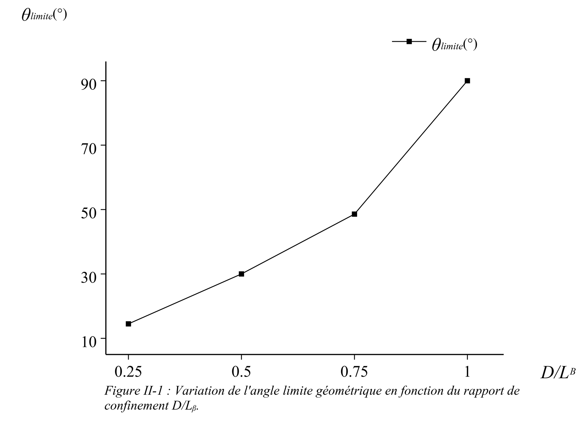

Cette figure représente l'angle limite géométrique θ<sub>limite</sub> en fonction du rapport D/L<sub>B</sub>. Cet angle n'est pas un résultat dynamique de la simulation : il provient directement de la géométrie du bâtonnet dans le canal.

Si le bâtonnet de longueur L<sub>B</sub> est incliné d'un angle θ, sa projection transverse est proportionnelle à L<sub>B</sub> sin|θ|. Pour que le bâtonnet puisse rester dans un canal de diamètre D, il faut que cette projection ne dépasse pas D. On obtient donc :

$$
\theta_{\mathrm{limite}}=\arcsin\left(\frac{D}{L_B}\right).
$$

Lorsque D/L<sub>B</sub> = 1, toutes les orientations entre -90° et +90° sont géométriquement possibles. Lorsque D/L<sub>B</sub> diminue, l'espace angulaire accessible se rétrécit fortement. Cela explique pourquoi le confinement n'agit pas seulement sur la position du centre de masse, mais aussi directement sur l'orientation du bâtonnet.

### Figure II-2 : θ<sub>max</sub> dans le volume


La Figure II-2 montre la variation de θ<sub>max</sub> dans le volume pour α = 100. Le maximum angulaire est extrait des histogrammes P(θ). Il doit être interprété avec prudence : lorsque le confinement devient fort, la position du maximum est influencée à la fois par le cisaillement hydrodynamique et par la réduction de l'espace angulaire autorisé.

Pour D/L<sub>B</sub> proche de 1, le bâtonnet dispose encore d'un domaine angulaire large. Le cisaillement peut donc sélectionner une orientation préférentielle à l'intérieur d'un espace relativement ouvert. Pour D/L<sub>B</sub> plus petit, la géométrie impose déjà une restriction forte ; θ<sub>max</sub> ne mesure plus seulement l'alignement hydrodynamique, mais aussi la sélection stérique imposée par le canal.

### Figure II-3 : θ<sub>max</sub> dans la couche de déplétion


Près de la surface, la contrainte stérique est encore plus importante que dans le volume. La Figure II-3 montre que θ<sub>max</sub> reste fortement contrôlé par la proximité de la paroi.

Dans cette région, les grandes inclinaisons augmentent la probabilité de contact avec la surface. Le bâtonnet est donc naturellement favorisé dans des orientations presque parallèles à la paroi. Le cisaillement peut déplacer légèrement le maximum, mais il agit sur un espace angulaire déjà fortement réduit par la géométrie.

### Figure II-4 : θ<sub>max</sub> au centre du canal

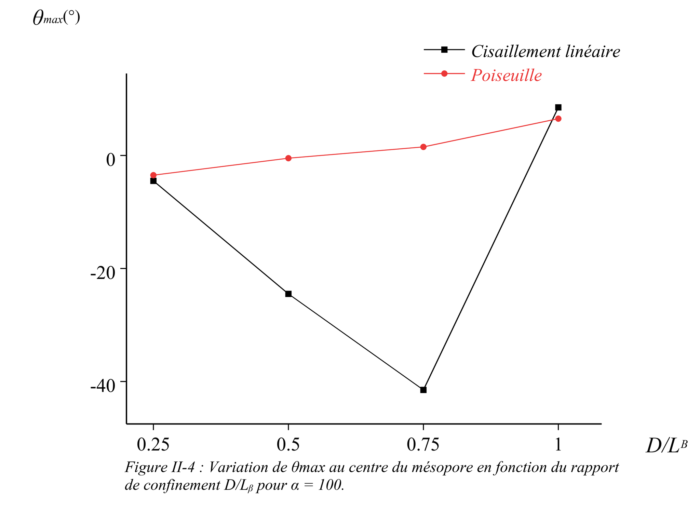

Cette figure complète les deux précédentes en considérant la région centrale du canal. Elle permet de séparer partiellement l'effet de la paroi de l'effet global du confinement.

Même loin de la surface immédiate, la réduction de D/L<sub>B</sub> limite les orientations possibles. Cela montre que le confinement n'est pas seulement un effet local de paroi : lorsque le canal devient suffisamment étroit, toute la dynamique orientationnelle du bâtonnet est modifiée.

### Figure II-5 : fraction de particules près de la surface


La Figure II-5 représente la fraction de statistiques collectées dans la couche proche de la surface. Cette grandeur indique combien de temps, statistiquement, le centre de masse du bâtonnet passe dans la région de déplétion.

Lorsque D/L<sub>B</sub> diminue, l'espace transverse accessible devient plus contraint. La séparation entre volume et couche de déplétion devient donc plus sensible à la géométrie. Cette figure relie directement la distribution spatiale P(ξ) à la question de confinement : ce n'est pas uniquement l'orientation qui change, mais aussi la manière dont le bâtonnet explore l'espace transverse.

### Figure II-6 : P(θ) dans le volume sous cisaillement linéaire


La Figure II-6 montre la distribution angulaire P(θ) dans le volume, sous cisaillement linéaire, pour différents rapports D/L<sub>B</sub>. Lorsque D/L<sub>B</sub> diminue, la distribution se concentre dans un domaine angulaire plus restreint.

Ce comportement est attendu physiquement : le cisaillement tend à aligner le bâtonnet, tandis que le confinement supprime progressivement les orientations trop inclinées. La distribution observée est donc le résultat d'une double sélection : une sélection hydrodynamique due au cisaillement et une sélection géométrique due à la taille finie du canal.

### Figure II-7 : P(θ) dans le volume sous profil de Poiseuille

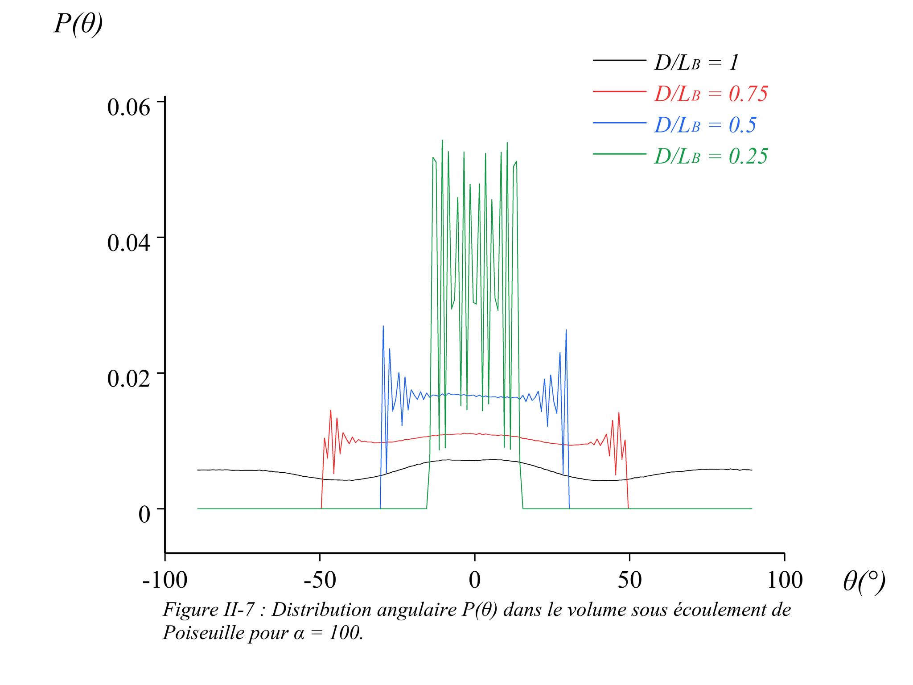

Sous profil de Poiseuille, le cisaillement local dépend de la position transverse. La Figure II-7 montre donc une distribution qui combine deux effets : l'inhomogénéité du cisaillement et la restriction géométrique liée à D/L<sub>B</sub>.

Par rapport au cas linéaire, les distributions peuvent être plus complexes, car différentes positions ξ correspondent à différentes intensités locales de cisaillement. Cependant, la tendance fondamentale reste la même : lorsque D/L<sub>B</sub> diminue, l'espace angulaire accessible se réduit et les orientations compatibles avec la géométrie deviennent dominantes.

### Figure II-8 : P(θ) près de la surface sous cisaillement linéaire

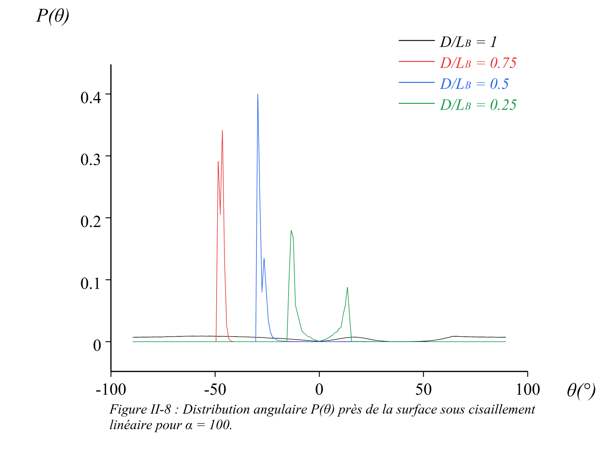

La Figure II-8 présente P(θ) dans la couche de déplétion pour le cisaillement linéaire. Cette région est la plus sensible à la paroi.

La distribution devient fortement localisée autour des orientations autorisées par la géométrie. Les grandes inclinaisons sont défavorisées, non pas parce que le cisaillement les interdit directement, mais parce qu'elles provoqueraient une intersection géométrique avec la surface. Cette figure illustre donc très clairement le rôle du confinement stérique.

### Figure II-9 : P(θ) près de la surface sous profil de Poiseuille


Dans le cas du profil de Poiseuille, la couche de déplétion subit à la fois une contrainte de paroi et un cisaillement local dépendant de ξ. La Figure II-9 montre que l'orientation près de la surface est dominée par cette combinaison.

Le confinement fixe d'abord les orientations possibles. Le cisaillement agit ensuite à l'intérieur de cet espace réduit. C'est pourquoi l'effet hydrodynamique ne doit pas être interprété indépendamment de la géométrie : près de la surface, les deux mécanismes sont intrinsèquement couplés.

### Figure II-10 : P(ξ) sous cisaillement linéaire

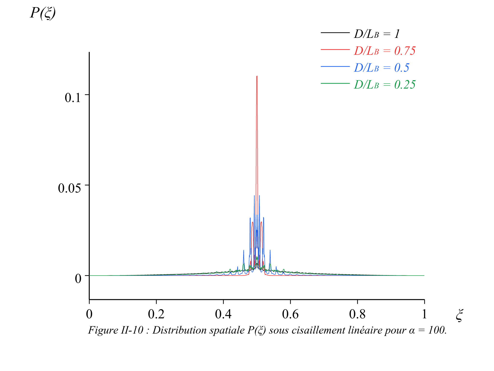

La Figure II-10 montre la distribution spatiale P(ξ) sous cisaillement linéaire. Elle renseigne sur la probabilité de présence du centre de masse selon la position transverse.

Lorsque le confinement devient fort, la distribution spatiale est profondément modifiée. Les zones accessibles au centre de masse se réduisent, et certaines positions deviennent beaucoup plus probables que d'autres. Les pics observés traduisent donc la réduction de l'espace disponible, et non une séparation de phase : il s'agit d'un effet d'exclusion géométrique.

### Figure II-11 : P(ξ) sous profil de Poiseuille

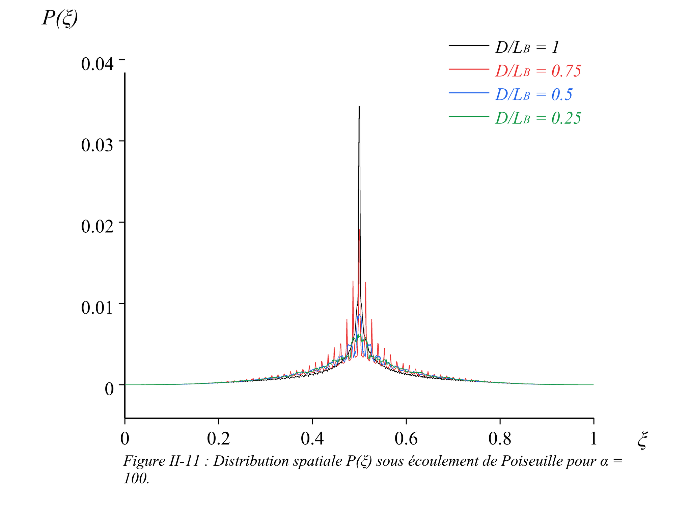

La Figure II-11 présente la même analyse spatiale pour le profil de Poiseuille. La différence avec le cisaillement linéaire vient du fait que l'intensité locale du cisaillement varie avec ξ.

Malgré cette différence hydrodynamique, la signature principale reste géométrique : lorsque D/L<sub>B</sub> diminue, le bâtonnet explore un espace transverse plus restreint. Le profil P(ξ) reflète alors la compétition entre diffusion translationnelle brownienne, interactions avec les parois et cisaillement local.

### Conclusion de la Section II

Cette deuxième extension montre que le rapport D/L<sub>B</sub> est un paramètre géométrique central du problème. Le paramètre α contrôle la compétition entre cisaillement et diffusion rotationnelle, tandis que D/L<sub>B</sub> contrôle l'espace des configurations accessibles.

Lorsque D/L<sub>B</sub> diminue, le système n'est plus seulement un bâtonnet brownien orienté par l'écoulement : il devient un système fortement contraint, où la géométrie du mésopore impose une sélection préalable des positions et des orientations possibles.

Cette conclusion est cohérente avec l'esprit des travaux de Hijazi et d'Atwi sur les macromolécules en solution sous écoulement laminaire : les distributions de probabilité ne dépendent pas uniquement de la dynamique brownienne et hydrodynamique, mais aussi de l'espace géométrique dans lequel les configurations de la macromolécule sont autorisées.

---

## Section III : Effet des coefficients de restitution aux parois

Cette troisième extension introduit une question plus cinétique : que devient la distribution statistique lorsque la règle de contact avec les parois est modifiée ? Les sections précédentes étudiaient principalement l'effet de l'intensité du cisaillement et du confinement géométrique. Ici, on conserve une géométrie fortement confinée, avec D/L<sub>B</sub> = 0.5, et on fixe α = 100 afin de travailler dans un régime où le cisaillement hydrodynamique est suffisamment intense pour rendre visibles les effets des conditions aux limites.

Les deux coefficients e et e' décrivent la réponse numérique du bâtonnet lorsqu'il rencontre respectivement les deux parois du mésopore. Dans cette étude, ils sont pris égaux, e = e', avec les valeurs 0, 0.25, 0.5, 0.75 et 1. Une valeur faible correspond à une interaction fortement dissipative avec la paroi, tandis qu'une valeur proche de 1 représente une interaction plus réfléchissante. Cette modification ne change ni la diffusion brownienne, ni le profil hydrodynamique, ni la méthode de construction des histogrammes ; elle agit uniquement sur la manière dont le bâtonnet est réinjecté dans le domaine géométriquement admissible après interaction avec la surface.

### Figure III-1 : Variation de θ<sub>max</sub> avec e = e'


La Figure III-1 compare la position du maximum angulaire θ<sub>max</sub> lorsque les coefficients de restitution sont modifiés. Pour le cisaillement linéaire, les maxima restent principalement localisés autour d'un angle négatif imposé par le confinement fort. Cela indique que, dans cette configuration, l'orientation dominante est contrôlée avant tout par la contrainte géométrique et par le cisaillement.

Pour le profil de Poiseuille, la réponse devient plus sensible lorsque e = e' tend vers 1. Cette différence vient du fait que le cisaillement local dépend de la position transverse. Le mécanisme de réinjection par la paroi modifie donc plus fortement les régions effectivement explorées par le centre de masse.

### Figure III-2 : Fraction de présence près de la surface

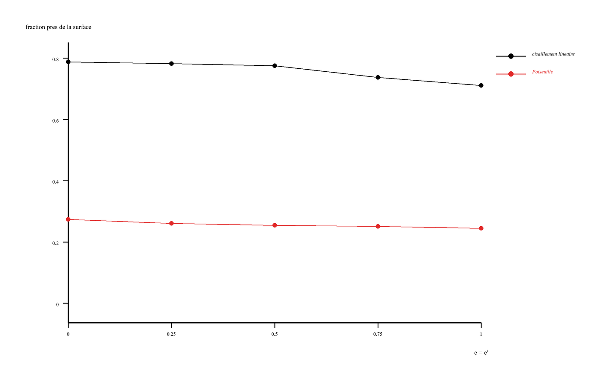

La Figure III-2 montre la fraction statistique du temps passé près de la surface. Lorsque e = e' augmente, cette fraction diminue pour les deux écoulements. Physiquement, une paroi plus réfléchissante renvoie plus efficacement le centre de masse vers l'intérieur du mésopore ; le bâtonnet reste donc moins longtemps dans la couche de déplétion.

La diminution est plus marquée sous cisaillement linéaire. Cela montre que la combinaison d'un entraînement uniforme et d'une restitution plus forte favorise un éloignement plus net de la surface. Sous Poiseuille, la variation spatiale du cisaillement rend la réponse plus progressive.

### Figure III-3 : P(θ) dans tout le domaine sous cisaillement linéaire


La Figure III-3 présente P(θ) dans l'ensemble du domaine sous cisaillement linéaire. Les distributions restent très concentrées dans la fenêtre angulaire autorisée par D/L<sub>B</sub> = 0.5. Le coefficient de restitution modifie surtout l'intensité et la finesse du pic, mais il ne supprime pas la sélection géométrique principale.

Ce comportement est attendu dans un mésopore fortement confiné : même si la dynamique pariétale change, les orientations accessibles restent d'abord limitées par la géométrie. Le rôle de e = e' est donc cinétique, tandis que la borne angulaire reste principalement stérique.

### Figure III-4 : P(θ) dans tout le domaine sous profil de Poiseuille

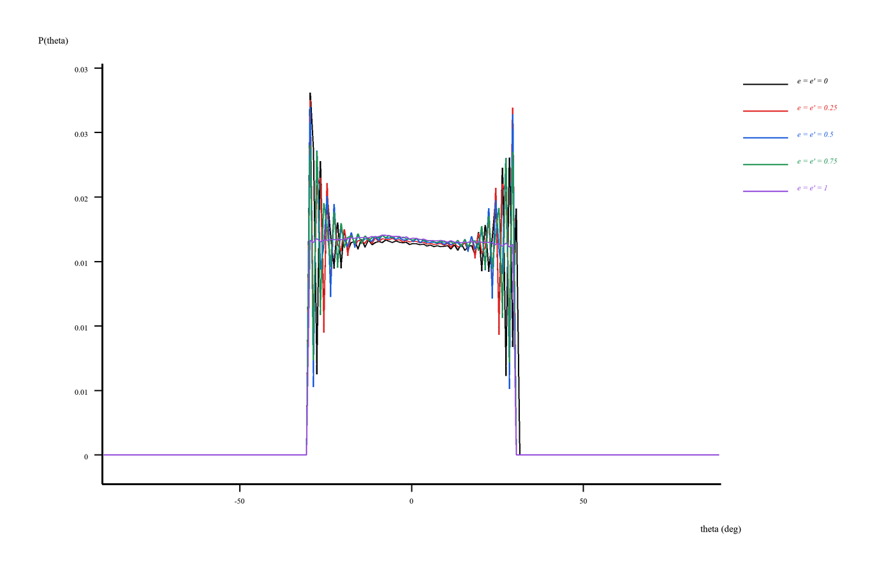

La Figure III-4 montre le même observable sous profil de Poiseuille. Le profil non uniforme rend la réponse plus sensible aux changements de position transverse. L'effet de restitution se superpose donc à l'inhomogénéité du cisaillement local.

Dans cette situation, une modification du contact avec la paroi ne modifie pas seulement la fréquence des collisions ; elle modifie aussi les régions de ξ dans lesquelles le bâtonnet passe le plus de temps. Comme le cisaillement dépend de la position, cette redistribution spatiale influence indirectement l'orientation.

### Figure III-5 : P(θ) près de la surface sous cisaillement linéaire


Près de la surface, la Figure III-5 montre que la distribution angulaire est fortement imposée par la paroi. Les grandes inclinaisons sont géométriquement interdites ou très défavorisées. Le coefficient e = e' agit alors comme un paramètre cinétique de contact : il modifie la fréquence de retour vers la surface et la durée de résidence dans la couche de déplétion.

Cette figure est importante car elle sépare clairement deux mécanismes : la paroi fixe les orientations possibles, tandis que la restitution contrôle la manière dont la particule quitte ou rejoint cette zone.

### Figure III-6 : P(θ) près de la surface sous profil de Poiseuille


La Figure III-6 indique que, sous Poiseuille, l'effet près de la surface reste contraint par la géométrie, mais la dépendance spatiale du cisaillement rend la forme de P(θ) moins directement comparable au cas linéaire.

La couche de déplétion n'est donc pas seulement une région de contact avec la paroi. C'est aussi une région où le cisaillement local peut différer fortement de celui ressenti plus au centre du pore. Cette double contrainte explique la sensibilité de la distribution à la fois à e = e' et au type d'écoulement.

### Figure III-7 : P(θ) au centre sous cisaillement linéaire


La Figure III-7 isole la région centrale du mésopore sous cisaillement linéaire. Cette zone est moins dominée par les contacts directs avec la paroi. Elle permet donc de distinguer plus clairement ce qui relève de l'alignement hydrodynamique de ce qui relève du mécanisme de restitution.

Lorsque le bâtonnet se trouve loin de la surface, l'effet de e = e' devient indirect : il apparaît surtout par la manière dont les interactions précédentes avec les parois ont redistribué les positions et les orientations.

### Figure III-8 : P(θ) au centre sous profil de Poiseuille


La Figure III-8 présente la même analyse au centre pour le profil de Poiseuille. Le cisaillement local y est différent de celui près des parois, ce qui rend l'interprétation plus délicate que dans le cas linéaire.

Cette figure montre que la restitution n'agit pas de manière isolée. Elle modifie la statistique de résidence dans les différentes zones du pore, et cette redistribution interagit ensuite avec le profil hydrodynamique local.

### Figure III-9 : Distribution spatiale P(ξ) sous cisaillement linéaire

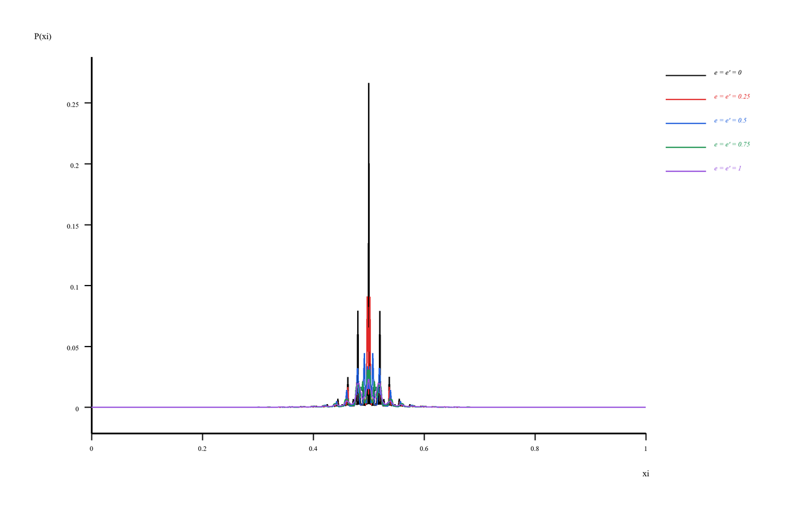

La Figure III-9 représente la distribution spatiale P(ξ) sous cisaillement linéaire. Elle montre que les coefficients de restitution ne sont pas de simples paramètres numériques : ils contrôlent la statistique de résidence près des surfaces.

Lorsque la restitution augmente, le contact pariétal devient plus efficace pour renvoyer la particule vers l'intérieur. Cela modifie directement la densité de probabilité transverse, donc la fréquence avec laquelle le bâtonnet visite la couche de déplétion.

### Figure III-10 : Distribution spatiale P(ξ) sous profil de Poiseuille


La Figure III-10 montre P(ξ) sous profil de Poiseuille. Comme le cisaillement dépend de ξ, une modification de la distribution spatiale entraîne aussi une modification de l'histoire hydrodynamique moyenne vécue par le bâtonnet.

Cette figure relie donc directement la dynamique pariétale à la dynamique d'orientation : changer e = e' modifie la probabilité de présence dans chaque région du pore, et donc le cisaillement local effectivement échantillonné.

### Conclusion de la Section III

Le résultat principal de cette section est que les coefficients de restitution agissent sur la dynamique pariétale, tandis que α contrôle le rapport entre entraînement hydrodynamique et diffusion brownienne rotationnelle, et que D/L<sub>B</sub> contrôle la fenêtre angulaire géométriquement accessible.

Ces trois paramètres ne jouent donc pas le même rôle physique. α sélectionne l'intensité de l'alignement, D/L<sub>B</sub> fixe la contrainte géométrique, et e, e' déterminent la durée de résidence et le mode de réinjection après contact avec la paroi.

Cette séparation est essentielle pour interpréter correctement les distributions stationnaires. Elle est cohérente avec le cadre des travaux de Hijazi sur les distributions de probabilité de macromolécules sous écoulement laminaire, avec les travaux d'Atwi sur les systèmes confinés, et avec les modèles mésoscopiques où les conditions aux limites modifient fortement les distributions de probabilité.

---

## Versions du code C++

Afin de conserver l'historique scientifique du travail, plusieurs versions du programme C++ sont disponibles dans le dossier `code_versions/` :

- `main_original_before_alpha0.cpp` : version initiale utilisée avant l'ajout du cas α = 0 ; elle contient les valeurs α = 0.5, 1, 2, 5, 10 et 100.
- `main_alpha0_full_xi_corrected.cpp` : version complète actuelle, avec α = 0 et la correction de la distribution spatiale P(ξ) jusqu'à ξ = 1.
- `main_section2_confinement.cpp` : version utilisée pour la Section II, consacrée à l'effet du rapport de confinement D/L<sub>B</sub> sur les distributions P(θ), P(ξ) et θ<sub>max</sub>.
- `main_section3_restitution.cpp` : version utilisée pour la Section III, consacrée à l'effet des coefficients de restitution e et e' sur les distributions angulaires et spatiales.

Le fichier `main.cpp` à la racine du dépôt correspond à la version complète actuelle permettant de régénérer les nouveaux résultats.


