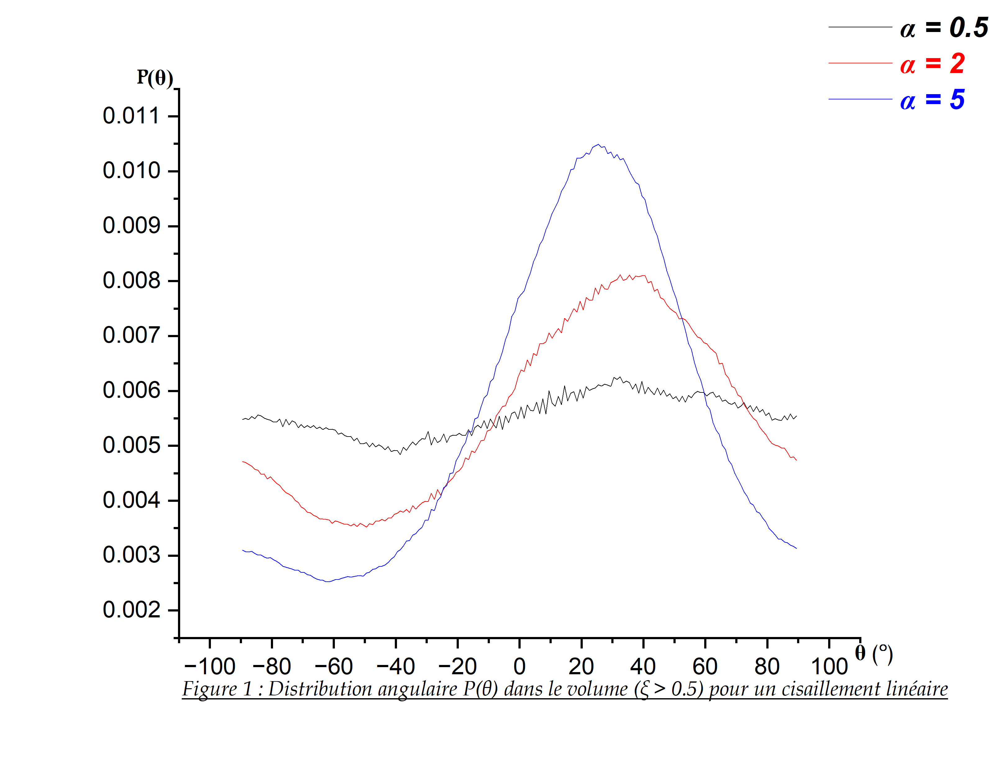
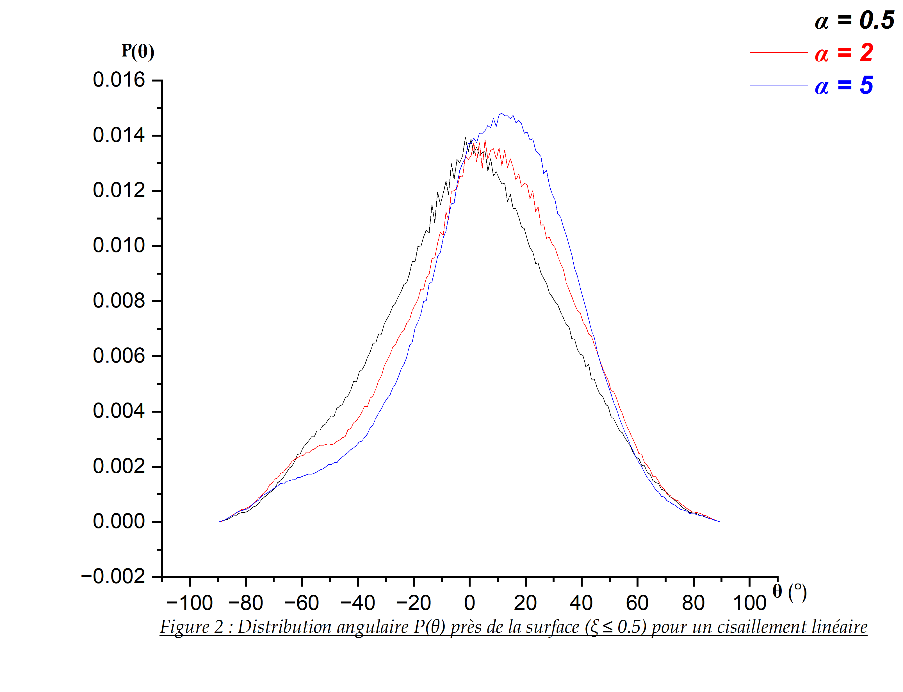
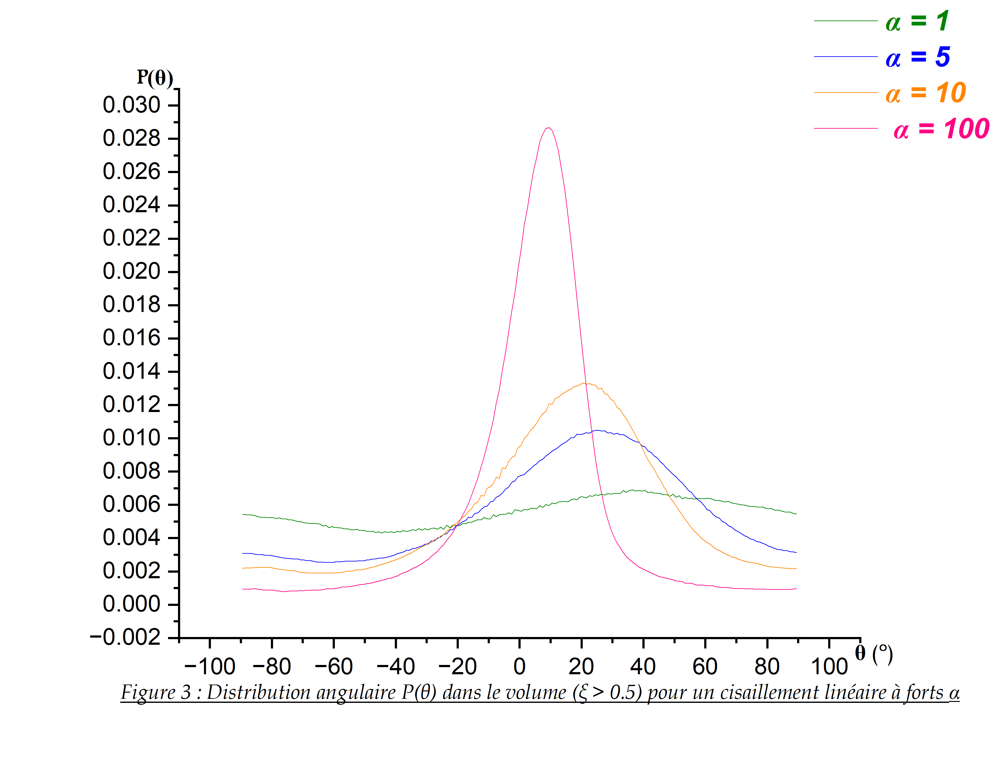
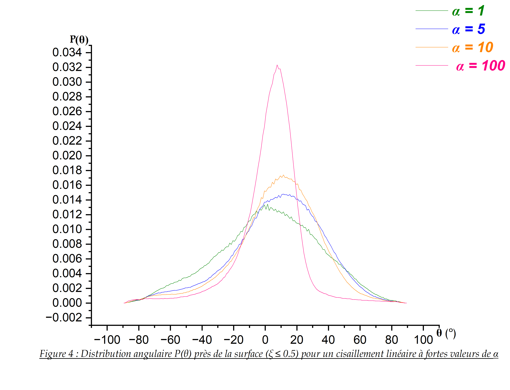
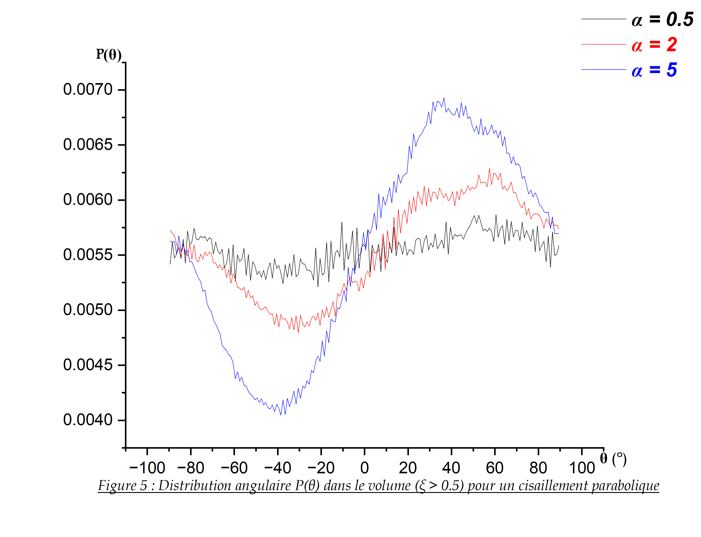
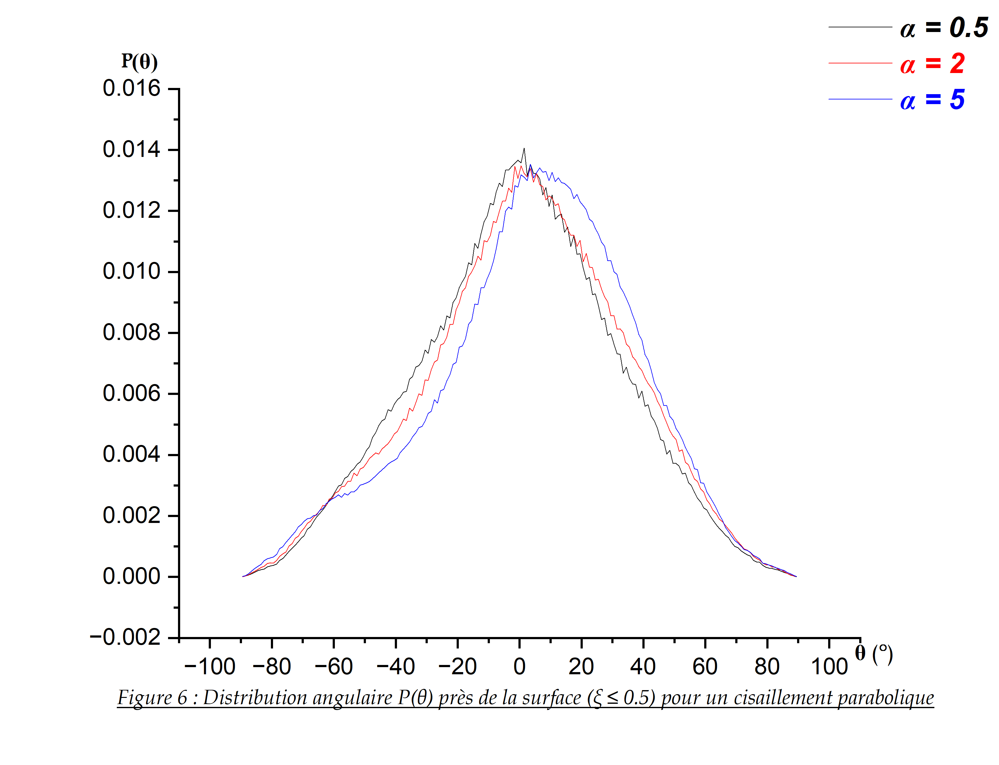
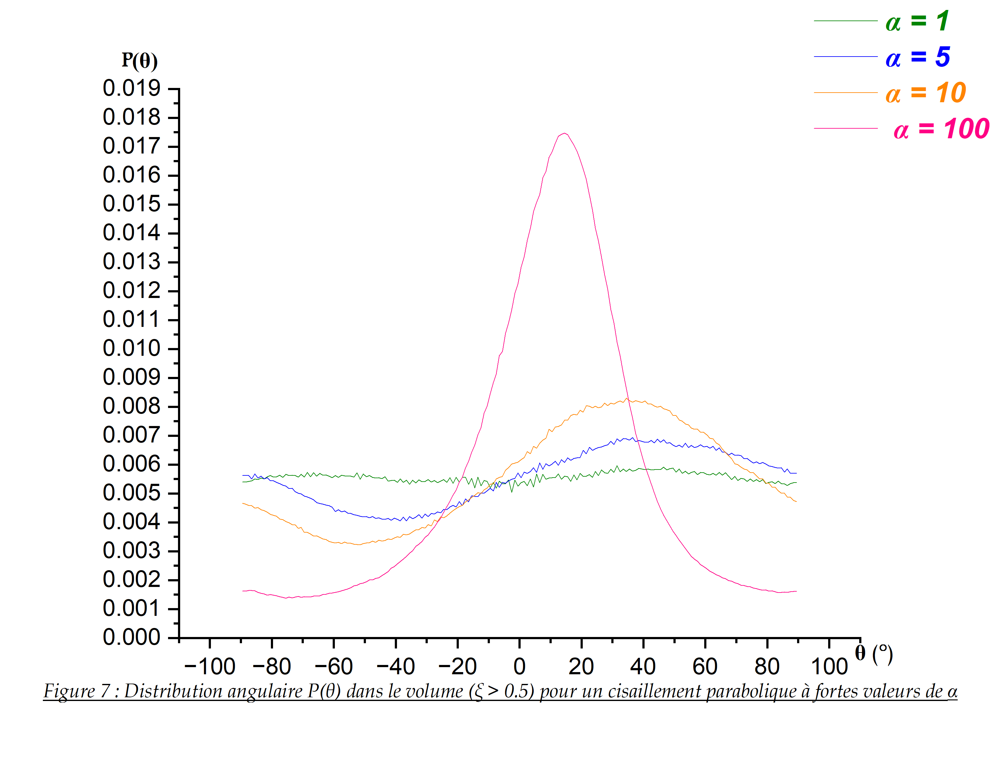
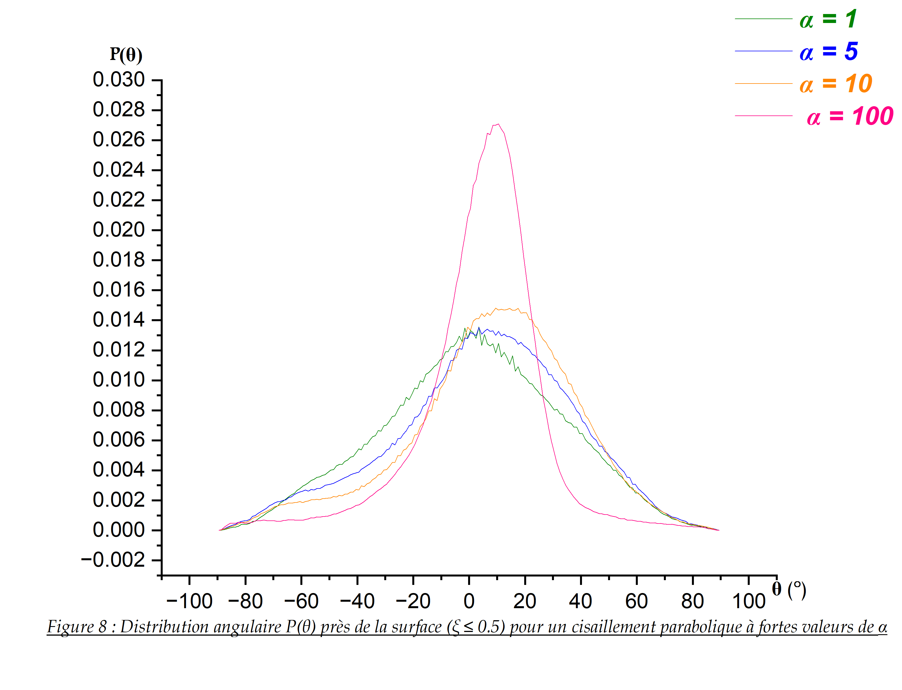
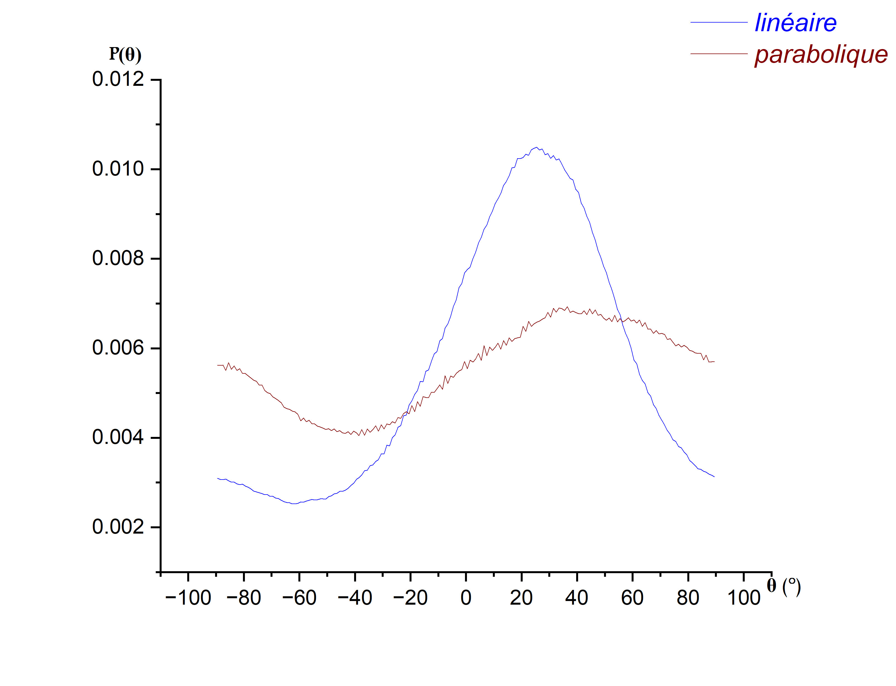

# Écoulement de Cisaillement Linéaire

## 1-1. Distribution Angulaire sous Écoulement Linéaire (Volume)

### Interprétation Physique détaillée

La **Figure 1** représente la distribution angulaire $P(\theta)$ d’un bâtonnet brownien dans le volume, défini ici par la condition $\xi > 0.5$, pour un cisaillement linéaire et pour trois valeurs du paramètre adimensionnel $\alpha$ : $\alpha = 0.5$, $\alpha = 2$ et $\alpha = 5$.

Le paramètre $\alpha$ mesure l’importance relative du cisaillement hydrodynamique par rapport à la diffusion rotationnelle brownienne. Il peut donc être interprété comme un nombre de Péclet rotationnel : lorsque $\alpha$ est faible, l’agitation brownienne domine ; lorsque $\alpha$ augmente, l’effet du cisaillement devient de plus en plus important dans la dynamique d’orientation du bâtonnet.

* **Pour $\alpha = 0.5$ :** La distribution angulaire est presque uniforme sur l’intervalle étudié. Cela signifie que le cisaillement est encore trop faible pour imposer une orientation préférentielle nette au bâtonnet. Dans ce régime, la diffusion rotationnelle brownienne domine la dynamique : le bâtonnet explore un large domaine d’angles sous l’effet des fluctuations thermiques. Les faibles ondulations visibles sur la courbe ne doivent pas être interprétées comme des maxima physiques significatifs, mais plutôt comme des fluctuations statistiques liées à la simulation numérique. Ainsi, pour $\alpha = 0.5$, aucun maximum physique bien défini ne peut être identifié.

* **Pour $\alpha = 2$ :** Lorsque $\alpha$ augmente à $\alpha = 2$, la distribution devient clairement anisotrope. Un maximum plus marqué apparaît autour de $\theta \approx 32.5^\circ$. Cette apparition d’une orientation préférentielle traduit la compétition entre deux mechanisms physiques : d’une part, la diffusion rotationnelle brownienne, qui tend à désordonner l’orientation du bâtonnet, et d’autre part, le couple hydrodynamique induit par le cisaillement, qui favorise certaines orientations par rapport à l’écoulement. Le système n’est donc plus isotrope : le bâtonnet passe davantage de temps dans une zone angulaire privilégiée.

* **Pour $\alpha = 5$ :** Pour $\alpha = 5$, l’effet du cisaillement devient encore plus dominant. La distribution présente un pic plus élevé et plus étroit, avec un maximum situé autour de $\theta \approx 25.5^\circ$. La diminution de la largeur du pic montre que les orientations du bâtonnet sont davantage concentrations autour d’un domaine angulaire restreint. Physiquement, cela signifie que le cisaillement contrôle plus fortement la dynamique rotationnelle et réduit l’effet désordonnant de l’agitation brownienne. Le déplacement du maximum vers des angles plus proches de la direction de l’écoulement traduit une tendance progressive à l’alignement du bâtonnet sous l’action du cisaillement.

---

> 📌 **Analyse de l'Asymétrie et Conclusion :**
> On observe également que les probabilités associées aux angles négatifs diminuent lorsque $\alpha$ augmente. Cette asymétrie est cohérente avec la dynamique hydrodynamique du modèle : le cisaillement entraîne une rotation orientée du bâtonnet, de sorte que certaines orientations sont traversées rapidement tandis que d’autres sont occupées plus longtemps. La distribution $P(\theta)$ reflète donc le temps moyen passé par le bâtonnet dans chaque intervalle angulaire.
>
> En conclusion, cette figure met en évidence la transition progressive entre un régime dominé par le mouvement brownien rotationnel, pour faible $\alpha$, et un régime dominé par le cisaillement hydrodynamique, pour des valeurs plus grandes de $\alpha$. 
> Les maxima physiquement significatifs sont observés autour de $\theta_{\max} \approx 32.5^\circ$ pour $\alpha = 2$ et $\theta_{\max} \approx 25.5^\circ$ pour $\alpha = 5$. Pour $\alpha = 0.5$, la distribution reste quasi uniforme et ne présente pas de maximum physique bien défini.
>
> ## 1-2. Distribution angulaire près de la surface pour un cisaillement linéaire

### Interprétation physique

La **Figure 2** représente la distribution angulaire $P(\theta)$ du bâtonnet près de la surface, définie par la condition $\xi \leq 0.5$, pour un cisaillement linéaire et pour trois valeurs du paramètre $\alpha$ : $\alpha = 0.5$, $\alpha = 2$ et $\alpha = 5$.

Contrairement au cas du volume ($\xi > 0.5$), la distribution angulaire près de la surface n’est pas uniforme, même pour une faible valeur de $\alpha = 0.5$. Cela montre que la présence de la paroi joue un rôle physique essentiel dans l’orientation du bâtonnet. Lorsque le centre du bâtonnet est proche de la surface, certaines orientations deviennent géométriquement défavorables, car une inclinaison trop grande pourrait conduire à une intersection du bâtonnet avec la paroi. La surface impose donc une contrainte stérique qui favorise les orientations presque parallèles à la paroi, c’est-à-dire des angles proches de $\theta = 0^\circ$.

* **Pour $\alpha = 0.5$ :** La distribution presents déjà un maximum net au voisinage de $\theta \approx 0^\circ$. Ce maximum ne provient pas principalement du cisaillement, qui reste faible dans ce régime, mais de l’effet de confinement géométrique près de la surface. Le mouvement brownien permet encore au bâtonnet d’explorer un intervalle d’angles relativement large, mais les grandes inclinaisons, proches de $\pm 90^\circ$, sont fortement réduites par l’interaction stérique avec la paroi. Les très faibles différences entre les bins voisins autour de $\theta = 0^\circ$ ne doivent pas être interprétées comme un déplacement physique significatif du maximum, mais comme des fluctuations statistiques liées à l’échantillonnage numérique.

* **Pour $\alpha = 2$ :** Le maximum de la distribution se décale vers des angles positifs, autour de $\theta_{\max} \approx 5.5^\circ$. Ce déplacement indique que le cisaillement commence à influencer plus nettement l’orientation du bâtonnet près de la surface. La distribution résulte alors de la combinaison de deux effets : la contrainte géométrique imposée par la paroi, qui tend à maintenir le bâtonnet presque parallèle à la surface, et le couple hydrodynamique dû au cisaillement, qui introduit une orientation préférentielle positive.

* **Pour $\alpha = 5$ :** Le maximum devient plus marqué et se déplace davantage vers les angles positifs, autour de $\theta_{\max} \approx 11.5^\circ$. Cela montre que l’effet hydrodynamique devient plus important lorsque $\alpha$ augmente. Cependant, la distribution reste concentrée dans une zone angulaire proche de $\theta = 0^\circ$, ce qui indique que l’effet de la surface demeure dominant dans cette région. La paroi limite fortement les orientations accessibles et empêche le bâtonnet d’adopter librement de grandes inclinaisons.

Les faibles probabilités observées près de $\theta = \pm 90^\circ$ sont cohérentes avec la physique du problème. Près de la surface, une orientation presque perpendiculaire à la paroi est très défavorable, car elle augmente fortement le risque de contact géométrique avec la paroi. Le bâtonnet passe donc très peu de temps dans ces orientations extrêmes.

---

> 💡 **Comparaison Physique Majeure (Volume vs Surface) :**
> En volume ($\xi > 0.5$), le régime à $\alpha = 0.5$ est dominé par l'isotropie brownienne (courbe quasi-uniforme). Près de la surface ($\xi \leq 0.5$), un pic d'orientation très net apparaît immédiatement à $\alpha = 0.5$. Cela démontre l'impact crucial du confinement : la paroi brise la symétrie rotationnelle du système en imposant un alignement géométrique du bâtonnet parallèlement à elle.
> 
> En conclusion, près de la surface, l’orientation du bâtonnet est contrôlée conjointement par le confinement géométrique et par le cisaillement hydrodynamique. À faible $\alpha$, la paroi impose principalement un alignement quasi parallèle à la surface. Lorsque $\alpha$ augmente, le cisaillement déplace progressivement l’orientation préférentielle vers des angles positifs. Les positions des maxima physiques sont approximativement $\theta_{\max} \approx 0^\circ$ pour $\alpha = 0.5$, $\theta_{\max} \approx 5.5^\circ$ pour $\alpha = 2$, et $\theta_{\max} \approx 11.5^\circ$ pour $\alpha = 5$.
>
> ## 1-3. Comparaison et Synthèse Physique : Volume vs Région Proche de la Surface

Les **Figures 1 et 2** permettent de comparer la distribution angulaire $P(\theta)$ du bâtonnet dans deux régions physiquement distinctes : le volume, défini par $\xi > 0.5$, et la région proche de la surface, définie par $\xi \leq 0.5$. Cette comparaison met en évidence le rôle fondamental de la paroi dans la dynamique d’orientation du bâtonnet.

* **À faible cisaillement ($\alpha = 0.5$) :** Dans le volume, la distribution $P(\theta)$ est presque uniforme. Cela signifie que, loin de la surface, le mouvement brownien rotationnel domine la dynamique et permet au bâtonnet d’explorer presque librement les différentes orientations. Le cisaillement linéaire est alors trop faible pour imposer une orientation préférentielle claire. En revanche, près de la surface, pour la même valeur $\alpha = 0.5$, la distribution présente déjà un maximum marqué autour de $\theta \approx 0^\circ$. Cette différence majeure montre que la paroi brise l’isotropie rotationnelle du système. Même lorsque le cisaillement est faible, la contrainte géométrique imposée par la surface limite les grandes inclinaisons et favorise les orientations presque parallèles à la paroi.

* **Réponse à l'augmentation du paramètre $\alpha$ :** Lorsque $\alpha$ augmente, les deux régions réagissent selon des mécanismes différents. Dans le volume, l’augmentation de $\alpha$ transforme progressivement une distribution quasi uniforme en une distribution anisotrope, avec l’apparition d’un maximum significatif. Cela traduit la transition entre un régime dominé par la diffusion rotationnelle brownienne et un régime davantage contrôlé par le cisaillement hydrodynamique. Près de la surface, la distribution est déjà anisotrope même à faible $\alpha$. L’augmentation de $\alpha$ ne crée donc pas l’anisotropie à partir d’un état isotrope ; elle déplace plutôt l’orientation préférentielle vers des angles positifs et renforce légèrement l’effet du cisaillement. Autrement dit, dans cette région, le confinement géométrique fixe d’abord la structure générale de $P(\theta)$, tandis que le cisaillement modifie progressivement la position du maximum.

### Conclusion Générale
Cette comparaison démontre que le volume et la surface correspondent à deux régimes physiques différents. Dans le volume, l’orientation du bâtonnet est principalement gouvernée par la compétition entre diffusion rotationnelle brownienne et cisaillement. Près de la surface, cette compétition est fortement modifiée par les interactions stériques avec la paroi. La surface impose une sélection géométrique des orientations accessibles, ce qui réduit fortement la probabilité des angles proches de $\pm 90^\circ$ et favorise l’alignement parallèle à la paroi.

Le confinement près de la surface joue donc un rôle aussi important que le cisaillement dans la dynamique d’orientation. Le paramètre $\alpha$ contrôle l’intensité relative du cisaillement, mais la position du bâtonnet dans le pore, représentée par $\xi$, détermine également la forme de la distribution angulaire. Il est donc indispensable de séparer les statistiques en volume et près de la surface pour interpréter correctement la physique du système.

## 2-1. Distribution angulaire dans le volume à forts cisaillements ($\alpha$ élevés)

### Interprétation physique

La **Figure 3** représente la distribution angulaire $P(\theta)$ du bâtonnet dans le volume, défini par la condition $\xi > 0.5$, pour un cisaillement linéaire et pour des valeurs plus élevées du paramètre $\alpha$ : $\alpha = 1$, $\alpha = 5$, $\alpha = 10$ et $\alpha = 100$.

Cette figure prolonge l’analyse effectuée dans le cas du volume pour des valeurs modérées de $\alpha$. Elle permet d’observer plus clairement l’effet de l’augmentation du cisaillement hydrodynamique sur l’orientation du bâtonnet. Le paramètre $\alpha$ représente l’importance relative du cisaillement par rapport à la diffusion rotationnelle brownienne. Ainsi, lorsque $\alpha$ augmente, la dynamique devient de moins en moins dominée par l’agitation brownienne et de plus en plus contrôlée par le couple hydrodynamique.

* **Pour $\alpha = 1$ :** La distribution reste encore relativement large. Le maximum est peu marqué ($\theta_{\max} \approx 36.5^\circ$), ce qui indique que le bâtonnet conserve une liberté rotationnelle importante sous l’effet du mouvement brownien. On observe néanmoins une légère anisotropie par rapport au cas quasi uniforme, ce qui montre que le cisaillement commence déjà à influencer l’orientation.
* **Pour $\alpha = 5$ :** La distribution devient plus concentrée et présente un maximum plus clair autour de $\theta_{\max} \approx 25.5^\circ$. Cela montre que le cisaillement impose progressivement une orientation préférentielle au bâtonnet. La diffusion rotationnelle brownienne reste présente, mais elle ne suffit plus à rendre la distribution uniforme.
* **Pour $\alpha = 10$ :** Le pic devient plus élevé et plus étroit, avec un maximum autour de $\theta_{\max} \approx 20.5^\circ$. Cette évolution indique que le bâtonnet passe davantage de temps dans un domaine angulaire restreint. Le déplacement du maximum vers des angles plus faibles traduit une tendance progressive à l’alignement avec la direction de l’écoulement.
* **Pour $\alpha = 100$ :** La distribution est fortement concentrée, avec un maximum très marqué autour de $\theta_{\max} \approx 9.5^\circ$. Ce régime correspond à une domination nette du cisaillement hydrodynamique sur la diffusion rotationnelle brownienne. Le bâtonnet est alors fortement orienté par l’écoulement et explore beaucoup moins les orientations angulaires éloignées. La largeur réduite du pic traduit une diminution importante du désordre rotationnel.

---

> 💡 **Synthèse de l'effet de l'augmentation de $\alpha$ :**
> L’évolution observée montre que l’augmentation de $\alpha$ produit deux effets principaux : l’augmentation de la hauteur du pic de $P(\theta)$ et la diminution progressive de sa largeur. Ces deux signatures indiquent une orientation de plus en plus forte du bâtonnet sous l’action du cisaillement. En parallèle, la position du maximum se déplace vers des angles plus proches de $\theta = 0^\circ$, ce qui correspond à une tendance à l’alignement parfait avec l’écoulement.

Les positions des maxima physiques obtenus à partir des fichiers de simulation sont :
* $\theta_{\max} \approx 36.5^\circ$ pour $\alpha = 1$
* $\theta_{\max} \approx 25.5^\circ$ pour $\alpha = 5$
* $\theta_{\max} \approx 20.5^\circ$ pour $\alpha = 10$
* $\theta_{\max} \approx 9.5^\circ$ pour $\alpha = 100$

Il faut cependant noter que, pour $\alpha = 1$, la distribution reste encore assez large ; la position exacte du maximum doit donc être interprétée avec prudence. Pour les grandes valeurs de $\alpha$, en particulier $\alpha = 10$ et $\alpha = 100$, le maximum devient beaucoup plus significatif physiquement.

En conclusion, la Figure 3 met clairement en évidence le passage vers un régime fortement orienté par le cisaillement. Dans le volume, lorsque $\alpha$ augmente, le bâtonnet passe d’une dynamique largement brownienne à une dynamique dominée par le cisaillement hydrodynamique, ce qui se traduit par une distribution angulaire plus étroite, plus élevée et déplacée vers les faibles angles.

## 2-2. Distribution angulaire près de la surface à fortes valeurs de $\alpha$

### Interprétation physique

La Figure 4 représente la distribution angulaire $P(\theta)$ du bâtonnet près de la surface, définie par la condition $\xi \leq 0.5$, pour un cisaillement linéaire et pour des valeurs élevées du paramètre $\alpha$ : $\alpha = 1$, $\alpha = 5$, $\alpha = 10$ et $\alpha = 100$.

Dans cette région proche de la paroi, l’orientation du bâtonnet ést fortement influencée par le confinement géométrique. La présence de la surface limite les orientations accessibles, en particulier les grandes inclinaisons proches de $\pm 90^\circ$, car celles-ci augmentent le risque de contact avec la paroi. Ainsi, même lorsque le cisaillement n’est pas extrêmement élevé, la distribution reste centrée autour de faibles angles, correspondant à une orientation presque parallèle à la surface.

Pour $\alpha = 1$, la distribution reste relativement large. Cela indique que la diffusion rotationnelle brownienne conserve encore une influence importante sur la dynamique d’orientation. Cependant, contrairement au cas du volume, la distribution n’est pas uniforme : la paroi impose déjà une sélection géométrique des orientations et favorise les angles proches de $\theta = 0^\circ$.

Pour $\alpha = 5$ et $\alpha = 10$, le pic devient plus marqué et la distribution se concentre davantage autour d’angles positifs. Cette évolution montre que le couple hydrodynamique dû au cisaillement devient plus important par rapport aux fluctuations browniennes. Le bâtonnet passe alors plus de temps dans une région angulaire préférentielle, résultant de l’effet combiné du cisaillement et de la contrainte imposée par la surface.

Pour $\alpha = 100$, la distribution devient beaucoup plus étroite et présente un pic très élevé autour de $\theta_{\max} \approx 7.5^\circ$. Ce comportement traduit une domination hydrodynamique très marquée. Dans ce régime, le bâtonnet ést fortement orienté par l’écoulement, tandis que la paroi empêche l’exploration de grandes inclinaisons. L’effet combiné du cisaillement intense et du confinement conduit donc à une orientation très préférentielle.

### Remarque sur le comportement non monotone de $\theta_{\max}$

L’augmentation de $\alpha$ ne déplace pas simplement le maximum de manière monotone. Pour les valeurs intermédiaires, $\alpha = 5$ et $\alpha = 10$, le maximum se situe autour de $\theta_{\max} \approx 11.5^\circ$. En revanche, à très fort cisaillement, pour $\alpha = 100$, le maximum revient vers un angle plus faible, autour de $\theta_{\max} \approx 7.5^\circ$.

Ce comportement peut être interprété comme une tendance plus forte à l’alignement avec l’écoulement lorsque le cisaillement hydrodynamique devient largement dominant. Aux valeurs intermédiaires de $\alpha$, l’orientation préférentielle résulte encore d’un compromis entre le cisaillement, le confinement près de la paroi et les fluctuations browniennes. À très grand $\alpha$, le cisaillement impose plus fortement l’orientation du bâtonnet, ce qui ramène le maximum vers un angle plus proche de la direction de l’écoulement.

### Positions des maxima physiques de la simulation

$$\theta_{\max} \approx 1.5^\circ \quad \text{pour } \alpha = 1$$

$$\theta_{\max} \approx 11.5^\circ \quad \text{pour } \alpha = 5$$

$$\theta_{\max} \approx 11.5^\circ \quad \text{pour } \alpha = 10$$

$$\theta_{\max} \approx 7.5^\circ \quad \text{pour } \alpha = 100$$

En conclusion, la Figure 4 montre que près de la surface, la dynamique angulaire ést gouvernée par deux mécanismes complémentaires : le confinement stérique imposé par la paroi et le couple hydrodynamique induit par le cisaillement linéaire. Lorsque $\alpha$ augmente, la distribution devient globalement plus étroite et plus élevée, ce qui indique une orientation de plus en plus forte du bâtonnet. À très grand $\alpha$, le système atteint un régime fortement orienté, où le bâtonnet reste confiné dans un domaine angulaire réduit proche de la direction de l’écoulement.

## 2-3. Comparaison entre la distribution dans le volume et près de la surface à fortes valeurs de $\alpha$

Les **Figures 3 et 4** permettent de comparer l’effet du cisaillement linéaire sur l’orientation du bâtonnet dans deux régions distinctes : le volume, défini par $\xi > 0.5$, et la région proche de la surface, définie par $\xi \leq 0.5$. Cette comparaison est essentielle, car elle met en évidence le rôle spécifique de la paroi dans la dynamique d’orientation.

Dans le volume, le bâtonnet n’est pas directement soumis à la contrainte géométrique de la paroi. Son orientation résulte principalement de la compétition entre la diffusion rotationnelle brownienne et le couple hydrodynamique dû au cisaillement. Lorsque $\alpha$ augmente, la distribution $P(\theta)$ devient progressivement plus étroite et plus élevée, ce qui traduit une orientation de plus en plus marquée par l’écoulement.

Près de la surface, la situation est différente. La paroi limite fortement les orientations accessibles, en particulier les grandes inclinaisons proches de $\pm 90^\circ$. Même lorsque le cisaillement n’est pas très fort, la distribution est déjà structurée autour de faibles angles. Ainsi, la surface introduit une sélection géométrique supplémentaire qui s’ajoute à l’effet du cisaillement.

Pour les grandes valeurs de $\alpha$, les deux régions montrent une concentration progressive de la distribution angulaire autour d’un domaine restreint. Cependant, cette concentration est plus fortement contrainte près de la surface, car le bâtonnet ne peut pas explorer librement les grandes orientations. Dans le volume, l’alignement est principalement imposé par le cisaillement ; près de la surface, il résulte de l’effet combiné du cisaillement et du confinement stérique.

Une différence importante concerne la position du maximum. Dans le volume, lorsque $\alpha$ augmente fortement, le maximum se déplace progressivement vers des angles plus faibles, traduisant une tendance à l’alignement avec l’écoulement. Près de la surface, le maximum reste également situé dans une région de faibles angles, mais son évolution n’est pas strictement monotone. Cela indique que la paroi modifie la réponse angulaire du bâtonnet au cisaillement.

Ainsi, les Figures 3 et 4 montrent que l’augmentation de $\alpha$ favorise l’orientation du bâtonnet dans les deux régions, mais selon des mécanismes légèrement différents. Dans le volume, l’effet dominant est hydrodynamique. Près de la surface, l’orientation est gouvernée par une combinaison entre hydrodynamique et confinement géométrique.

En conclusion, cette comparaison confirme qu’il est nécessaire de séparer les statistiques en deux domaines, $\xi > 0.5$ et $\xi \leq 0.5$. Sans cette séparation, l’effet propre de la surface serait mélangé avec le comportement du volume, ce qui rendrait l’interprétation physique de $P(\theta)$ moins précise.

# Écoulement Parabolique

## 1-1. Distribution angulaire $P(\theta)$ dans le volume ($\xi > 0.5$) pour un cisaillement parabolique

La **Figure 5** présente la distribution angulaire $P(\theta)$ du bâtonnet dans la région du volume, définie par $\xi > 0.5$, pour un cisaillement parabolique et pour trois valeurs du paramètre $\alpha$ : $\alpha = 0.5$, $\alpha = 2$ et $\alpha = 5$.

Dans cette simulation, le cisaillement parabolique est introduit à travers un taux de cisaillement local dépendant de la position transverse du bâtonnet. Contrairement au cisaillement linéaire, où $\alpha$ reste constant, le cisaillement effectif varie avec $\xi$. Dans le code utilisé ici, cette dépendance est de la forme :
$$\alpha_{\text{local}} = \alpha(1-\xi)$$

Ainsi, dans la région du volume ($\xi > 0.5$), le bâtonnet ressent un cisaillement effectif plus faible et spatialement variable.

* **Pour $\alpha = 0.5$ :** La distribution reste presque uniforme. Le mouvement brownien rotationnel domine largement la dynamique d’orientation, et le cisaillement effectif est trop faible pour imposer une orientation préférentielle nette. Les faibles variations observées doivent donc être interprétées avec prudence, car elles sont principalement liées aux fluctuations statistiques de la simulation.
* **Pour $\alpha = 2$ :** Une anisotropie commence à apparaître. La distribution devient légèrement asymétrique, avec une augmentation de la probabilité dans la région des angles positifs et une diminution relative dans certaines régions d’angles négatifs. Cela traduit le début de l’influence du couple hydrodynamique sur l’orientation du bâtonnet.
* **Pour $\alpha = 5$ :** L’effet du cisaillement devient plus visible. La distribution présente un maximum plus marqué autour de $\theta_{\max} \approx 36.5^\circ$. Cette évolution montre que le cisaillement parabolique commence à orienter préférentiellement le bâtonnet, même si la distribution reste moins concentrée que dans le cas du cisaillement linéaire.

Cette différence avec le cisaillement linéaire est importante. Dans le cas linéaire, le bâtonnet subit un taux de cisaillement constant, ce qui conduit à une orientation plus nette lorsque $\alpha$ augmente. Dans le cas parabolique, le cisaillement ressenti dépend de la position du bâtonnet. La distribution finale $P(\theta)$ résulte donc d’une moyenne sur plusieurs valeurs locales du cisaillement, ce qui élargit le profil angulaire et rend les pics moins marqués.

Les maxima numériques obtenus sont approximativement :
$$\theta_{\max} \approx 60.5^\circ \quad \text{pour } \alpha = 0.5$$
$$\theta_{\max} \approx 57.5^\circ \quad \text{pour } \alpha = 2$$
$$\theta_{\max} \approx 36.5^\circ \quad \text{pour } \alpha = 5$$

Cependant, pour $\alpha = 0.5$ et $\alpha = 2$, les distributions restent faiblement contrastées. Les maxima numériques ne doivent donc pas être considérés comme des orientations physiques fortement définies. Le maximum observé pour $\alpha = 5$ est plus significatif, car l’anisotropie de la distribution devient plus visible.

En conclusion, la Figure 5 montre que le cisaillement parabolique induit progressivement une anisotropie de la distribution angulaire dans le volume lorsque $\alpha$ augmente. Toutefois, cette anisotropie reste moins marquée que dans le cas du cisaillement linéaire, car le cisaillement local ressenti par le bâtonnet dépend de sa position. Cette figure met donc en évidence l’importance de la dépendance spatiale du cisaillement dans la dynamique d’orientation.

## 1-2. Distribution angulaire $P(\theta)$ près de la surface ($\xi \leq 0.5$) pour un cisaillement parabolique

*Figure 6 : Distribution angulaire $P(\theta)$ près de la surface ($\xi \leq 0.5$) pour un cisaillement parabolique*

La **Figure 6** représente la distribution angulaire $P(\theta)$ du bâtonnet près de la surface, définie par la condition $\xi \leq 0.5$, pour un cisaillement parabolique et pour trois valeurs du paramètre $\alpha$ : $\alpha = 0.5$, $\alpha = 2$ et $\alpha = 5$.

Dans cette région proche de la paroi, l’orientation du bâtonnet est fortement influencée par le confinement géométrique. La surface limite drastiquement les orientations accessibles, en particulier les grandes inclinaisons proches de $\pm 90^\circ$, car celles-ci provoqueraient une intersection stérique interdite avec la paroi. Ainsi, même dans le cas d’un cisaillement parabolique, la distribution reste étroitement structurée et centrée autour de faibles angles, correspondant à une orientation préférentiellement parallèle à la surface.

* **Pour $\alpha = 0.5$ :** La distribution présente déjà un maximum très net au voisinage de $\theta \approx 0^\circ$. Ce pic ne provient pas principalement du cisaillement, qui reste ici très faible, mais de l’effet stérique exclusif de la paroi. Le mouvement brownien permet encore une exploration thermique des orientations intermédiaires, mais les angles extrêmes sont totalement coupés par la présence de la surface.
* **Pour $\alpha = 2$ :** La forme globale de la distribution reste très proche de celle observée à $\alpha = 0.5$, avec un maximum toujours situé près de $\theta = 0^\circ$. On observe cependant un très léger biais asymétrique vers les angles positifs, ce qui indique que le couple hydrodynamique du cisaillement parabolique commence à rivaliser avec le confinement, bien que l'effet de la paroi reste largement dominant.
* **Pour $\alpha = 5$ :** Le déplacement vers les angles positifs devient un peu plus visible, traduisant l'action cumulative de l'écoulement. Le maximum numérique migrate légèrement vers $\theta_{\max} \approx 3.5^\circ$, tandis que la base de la distribution reste contrainte par la géométrie du canal. Cela montre que le cisaillement parabolique modifie l’orientation préférentielle sans pour autant détruire la symétrie imposée par le confinement stérique.

Les maxima numériques obtenus à partir des données de simulation sont approximativement :
$$\theta_{\max} \approx 1.5^\circ \quad \text{pour } \alpha = 0.5$$
$$\theta_{\max} \approx 0.5^\circ \quad \text{pour } \alpha = 2$$
$$\theta_{\max} \approx 3.5^\circ \quad \text{pour } \alpha = 5$$

Les écarts entre ces positions étant extrêmement faibles, il convient d'interpréter ces profils comme une distribution globalement ancrée autour de $\theta \approx 0^\circ$. Les légères fluctuations au sommet du pic reflètent la largeur importante de la distribution et le bruit statistique inhérent à la méthode numérique.

En conclusion, la Figure 6 confirme que près de la surface, le confinement géométrique joue un rôle de sélection dominant sous cisaillement parabolique. La paroi impose un alignement parallèlement aux frontières stériques, tandis que l’augmentation de $\alpha$ n'introduit qu'une perturbation modérée (un léger décalage vers les angles positifs). L'effet de l'écoulement parabolique est donc présent, mais sa signature reste secondaire par rapport à l'effet d'exclusion de la surface.

## 1-3. Comparaison entre la distribution dans le volume et près de la surface pour un cisaillement parabolique

Les **Figures 5 et 6** permettent de comparer la distribution angulaire $P(\theta)$ du bâtonnet dans deux régions différentes du système, dans le cas d’un cisaillement parabolique : le volume, défini par $\xi > 0.5$, et la région proche de la surface, définie par $\xi \leq 0.5$.

Dans le volume, la distribution angulaire est relativement peu contrainte par la paroi. Le bâtonnet peut explorer un domaine angulaire plus large sous l’effet du mouvement brownien rotationnel. Lorsque $\alpha$ augmente, le cisaillement parabolique introduit progressivement une anisotropie dans la distribution. Cette anisotropie se manifeste par une augmentation de la probabilité dans la région des angles positifs et par une diminution relative dans certaines régions d’angles négatifs.

Près de la surface, la situation est différente. La distribution est fortement influencée par la contrainte géométrique imposée par la paroi. Même pour une faible valeur de $\alpha$, la distribution présente un maximum autour de $\theta \approx 0^\circ$, ce qui traduit une orientation préférentielle presque parallèle à la surface. Les grandes inclinaisons sont fortement défavorisées, car elles augmentent le risque de contact du bâtonnet avec la paroi.

Ainsi, dans le volume, l’évolution de $P(\theta)$ reflète principalement l’effet progressif du cisaillement parabolique sur une dynamique encore largement brownienne. En revanche, près de la surface, la forme de $P(\theta)$ est d’abord imposée par le confinement stérique. Le cisaillement parabolique ne fait que déplacer légèrement la distribution vers les angles positifs lorsque $\alpha$ augmente.

Une différence importante concerne la position du maximum. Dans le volume, les maxima numériques apparaissent à des angles relativement élevés pour les faibles et moyennes valeurs de $\alpha$, bien que ces maxima doivent être interprétés avec prudence lorsque la distribution est peu contrastée. Près de la surface, les maxima restent proches de $\theta = 0^\circ$, ce qui montre que la paroi impose fortement une orientation quasi parallèle à la surface.

Cette comparaison montre que le cisaillement parabolique n’agit pas de la même manière dans les deux régions. Dans le volume, son effet dépend fortement de la position du bâtonnet et conduit à une anisotropie plus diffuse. Près de la surface, la paroi réduit fortement l’espace angulaire accessible, ce qui domine la forme générale de la distribution.

En conclusion, les Figures 5 et 6 montrent que, pour un cisaillement parabolique, l’orientation du bâtonnet résulte d’un équilibre entre trois effets : la diffusion rotationnelle brownienne, le cisaillement hydrodynamique local et le confinement géométrique. Dans le volume, la diffusion brownienne et la variation spatiale du cisaillement élargissent la distribution. Près de la surface, le confinement stérique impose une orientation proche de $\theta = 0^\circ$, tandis que l’augmentation de $\alpha$ introduit seulement un biais modéré vers les angles positifs.

## 2. Distributions angulaires à fortes valeurs de $\alpha$ ($\alpha = 1, 5, 10, 100$)

Maintenant, nous passons aux distributions angulaires pour le cisaillement parabolique à fortes valeurs de $\alpha$ : $\alpha = 1, 5, 10$ et $100$.

### 2-1. Distribution angulaire $P(\theta)$ dans le volume ($\xi > 0.5$) pour un cisaillement parabolique à fortes valeurs de $\alpha$

La **Figure 7** représente la distribution angulaire $P(\theta)$ du bâtonnet dans le volume, défini par $\xi > 0.5$, pour un cisaillement parabolique et pour des valeurs élevées du paramètre de Peclet rotationnel : $\alpha = 1$, $\alpha = 5$, $\alpha = 10$ et $\alpha = 100$.

Dans le cas du cisaillement parabolique utilisé dans cette simulation, le cisaillement local dépend de la position transverse du bâtonnet selon la loi $\alpha_{\text{local}} = \alpha(1-\xi)$. Ainsi, contrairement au cisaillement linéaire, le bâtonnet ne subit pas une intensité de cisaillement constante. Dans le volume, la distribution $P(\theta)$ résulte d’une moyenne sur différentes valeurs locales du cisaillement, ce qui tend à élargir les profils angulaires par rapport au cas linéaire.

* **Pour $\alpha = 1$ :** La distribution reste presque uniforme. Cela indique que la diffusion rotationnelle brownienne domine encore largement la dynamique d’orientation. Le cisaillement effectif ressenti par le bâtonnet dans le volume reste trop faible pour imposer une orientation préférentielle marquée.
* **Pour $\alpha = 5$ :** Une anisotropie devient plus visible. La distribution présente une augmentation de probabilité dans la région des angles positifs et une diminution relative dans la région des angles négatifs. Cela traduit le début d’un alignement préférentiel induit par le couplage hydrodynamique.
* **Pour $\alpha = 10$ :** Le pic devient plus marqué, avec un maximum autour de $\theta_{\max} \approx 34.5^\circ$. Le couple hydrodynamique prend ici une importance croissante face à l’agitation thermique. Toutefois, la distribution demeure étalée en raison de la dépendance spatiale du taux de cisaillement.
* **Pour $\alpha = 100$ :** La distribution change clairement de régime : elle devient plus concentrée, plus étroite et présente un maximum élevé au voisinage de $\theta_{\max} \approx 14.5^\circ$. Ce comportement traduit une domination très marquée du couplage hydrodynamique, correspondant à un régime de grand Peclet rotationnel. Le déplacement du pic vers des angles plus faibles montre une tendance forte à l’alignement avec l’écoulement.

Les maxima numériques obtenus à partir des fichiers de simulation sont approximativement :
$$\theta_{\max} \approx 31.5^\circ \quad \text{pour } \alpha = 1$$
$$\theta_{\max} \approx 36.5^\circ \quad \text{pour } \alpha = 5$$
$$\theta_{\max} \approx 34.5^\circ \quad \text{pour } \alpha = 10$$
$$\theta_{\max} \approx 14.5^\circ \quad \text{pour } \alpha = 100$$

Il faut cependant interpréter les maxima pour $\alpha = 1$ et $\alpha = 5$ avec prudence, car les distributions restent larges et faiblement contrastées. Le maximum devient beaucoup plus significatif pour $\alpha = 10$ et surtout pour $\alpha = 100$, où l’anisotropie est clairement marquée.

En conclusion, la Figure 7 montre que, dans le volume, le cisaillement parabolique NY produit une orientation progressive du bâtonnet lorsque $\alpha$ augmente. Cependant, en raison de la dépendance spatiale du cisaillement local, l’orientation reste plus diffuse que dans le cas du cisaillement linéaire. À très grand $\alpha$, le couplage hydrodynamique devient dominant et la distribution se resserre autour d’un angle plus proche de la direction de l’écoulement.

### 2-2. Distribution angulaire $P(\theta)$ près de la surface ($\xi \leq 0.5$) pour un cisaillement parabolique à fortes valeurs de $\alpha$

La Figure 8 représente la distribution angulaire $P(\theta)$ du bâtonnet près de la surface, définie par la condition $\xi \leq 0.5$, pour un cisaillement parabolique et pour des valeurs élevées du paramètre de Peclet rotationnel : $\alpha = 1$, $\alpha = 5$, $\alpha = 10$ et $\alpha = 100$.

Dans cette région proche de la paroi, la distribution angulaire est fortement influencée par le confinement géométrique. La surface limite fortement les orientations accessibles, en particulier les grandes inclinaisons proches de $\pm 90^\circ$, car celles-ci augmenteraient le risque de contact stérique avec la paroi. Ainsi, même dans le cas d’un cisaillement parabolique intense, les distributions restent centrées autour de faibles angles, proches d’une orientation parallèle à la surface.

Pour $\alpha = 1$, la distribution est encore relativement large et présente un maximum autour de $\theta_{\max} \approx 3.5^\circ$. Cela indique que le mouvement brownien rotationnel conserve une influence importante, tandis que la paroi impose déjà une sélection géométrique des orientations accessibles.

Pour $\alpha = 5$, la forme générale de la distribution reste proche de celle observée pour $\alpha = 1$, avec un maximum également situé autour de $\theta_{\max} \approx 3.5^\circ$. Cependant, le centre moyen de la distribution commence à se décaler plus nettement vers les angles positifs, ce qui montre que le couplage hydrodynamique commence à influencer l’orientation globale du bâtonnet.

Pour $\alpha = 10$, le maximum se déplace vers $\theta_{\max} \approx 9.5^\circ$ et le pic devient plus marqué. Cette évolution montre que le couplage hydrodynamique devient plus important par rapport aux fluctuations browniennes, tout en restant modulé par la contrainte géométrique de la surface.

Pour $\alpha = 100$, la distribution change nettement de régime : elle devient beaucoup plus étroite et présente un maximum élevé proche de $0.027$ au voisinage de $\theta_{\max} \approx 10.5^\circ$. Ce comportement traduit une domination hydrodynamique très marquée, correspondant à un régime de grand Peclet rotationnel. Le bâtonnet passe alors une grande partie de son temps dans un domaine angulaire restreint, ce qui démontre une orientation préférentielle forte sous l’effet combiné du cisaillement intense et du confinement pariétal.

Les maxima numériques obtenus à partir des fichiers de simulation sont approximativement :

$$\theta_{\max} \approx 3.5^\circ \quad \text{pour } \alpha = 1$$

$$\theta_{\max} \approx 3.5^\circ \quad \text{pour } \alpha = 5$$

$$\theta_{\max} \approx 9.5^\circ \quad \text{pour } \alpha = 10$$

$$\theta_{\max} \approx 10.5^\circ \quad \text{pour } \alpha = 100$$

Il faut noter que, pour $\alpha = 1$ et $\alpha = 5$, les distributions restent larges et les positions exactes des maxima doivent être interprétées avec prudence. En revanche, pour $\alpha = 10$ et surtout pour $\alpha = 100$, la concentration du profil rend le maximum beaucoup plus significatif d’un point de vue physique.

En conclusion, la Figure 8 montre que près de la surface, le cisaillement parabolique renforce progressivement l’orientation préférentielle du bâtonnet lorsque $\alpha$ augmente. Toutefois, la paroi conserve un rôle essentiel : elle réduit les fortes inclinaisons et maintient la distribution dans une région de faibles angles. À très grand $\alpha$, l’effet hydrodynamique devient dominant et la distribution se resserre fortement autour d’une orientation proche de la direction de l’écoulement, tout en restant guidée par le confinement stérique.

### 2-3. Comparaison entre le volume et la région proche de la surface pour le cisaillement parabolique à fortes valeurs de $\alpha$

Les **Figures 7 et 8** permettent de comparer la distribution angulaire $P(\theta)$ du bâtonnet dans deux régions différentes du système, dans le cas d’un cisaillement parabolique à fortes valeurs de $\alpha$ : le volume, défini par $\xi > 0.5$, et la région proche de la surface, définie par $\xi \leq 0.5$.

Dans le volume, le bâtonnet peut explorer un domaine angulaire plus large, car il est moins directement contraint par la paroi. La distribution $P(\theta)$ reflète alors principalement la compétition entre la diffusion rotationnelle brownienne et le cisaillement hydrodynamique local. Comme le cisaillement parabolique dépend de la position, la distribution résulte d’une moyenne sur plusieurs intensités locales du cisaillement, ce qui rend les profils angulaires relativement larges, surtout pour les valeurs intermédiaires de $\alpha$.

Près de la surface, la situation est différente. La paroi impose une contrainte géométrique supplémentaire qui limite les grandes inclinaisons et favorise les orientations proches de la direction parallèle à la surface. Ainsi, même lorsque le cisaillement est parabolique, la distribution près de la surface est fortement influencée par le confinement stérique.

Pour les valeurs modérées, comme $\alpha = 1$ et $\alpha = 5$, les distributions restent relativement larges dans les deux régions, mais leur signification physique diffère :
* **Dans le volume :** cette largeur traduit principalement la persistance du mouvement brownien et la variation spatiale du taux de cisaillement.
* **Près de la surface :** elle traduit également l’effet de la paroi, qui impose une sélection géométrique sans supprimer totalement les fluctuations angulaires.

Lorsque $\alpha$ augmente vers $\alpha = 10$ puis $\alpha = 100$, les deux régions montrent une concentration plus nette de la distribution angulaire. Toutefois, cette concentration est plus fortement structurée près de la surface, car l’effet hydrodynamique s’ajoute au confinement géométrique. Dans le volume, la distribution pour $\alpha = 100$ présente un maximum autour de $\theta_{\max} \approx 14.5^\circ$, tandis que près de la surface le maximum se situe autour de $\theta_{\max} \approx 10.5^\circ$. Ce déplacement vers un angle plus faible près de la surface indique une orientation plus proche de la direction de l’écoulement, renforcée par la contrainte pariétale.

Cette comparaison montre donc que le cisaillement parabolique oriente progressivement le bâtonnet dans les deux régions lorsque $\alpha$ augmente, mais que la surface modifie fortement la réponse angulaire. Dans le volume, l’orientation est principalement contrôlée par le cisaillement hydrodynamique local et par la diffusion brownienne. Près de la surface, l’orientation résulte d’un effet combiné : le cisaillement tend à aligner le bâtonnet avec l’écoulement, tandis que la paroi limite les orientations accessibles.

**En conclusion**, les Figures 7 et 8 montrent que, pour un cisaillement parabolique à fortes valeurs de $\alpha$, l’orientation du bâtonnet devient de plus en plus marquée, mais selon des mécanismes différents dans le volume et près de la surface. Dans le volume, la dépendance spatiale du cisaillement élargit encore la distribution. Près de la surface, le confinement stérique renforce la sélection angulaire et conduit à une distribution plus fortement localisée autour de faibles angles.

## 3. Étude comparative entre le cisaillement linéaire et le cisaillement parabolique

### 3-1.1 Comparaison de $P(\theta)$ dans le volume entre cisaillement linéaire et parabolique pour $\alpha = 1$

*Figure 11 : Comparaison de $P(\theta)$ dans le volume ($\xi > 0.5$) entre cisaillement linéaire et parabolique pour $\alpha = 1$*

La **Figure 11** compare la distribution angulaire $P(\theta)$ du bâtonnet dans le volume, défini par $\xi > 0.5$, pour deux profils de cisaillement : un cisaillement linéaire et un cisaillement parabolique, à la même valeur du paramètre $\alpha = 1$.

Pour cette valeur modérée de $\alpha$, la diffusion rotationnelle brownienne joue encore un rôle dominant dans la dynamique d’orientation. Les deux distributions restent donc relativement larges et faiblement contrastées. Cela signifie que le bâtonnet continue à explorer un grand domaine d’angles sous l’effet des fluctuations browniennes.

Dans le cas du cisaillement linéaire, la distribution présente une anisotropie légèrement plus visible. Le maximum numérique se situe autour de $\theta_{\max} \approx 36.5^\circ$, avec une probabilité maximale d’environ $P_{\max} \approx 0.0069$. Cette légère structuration indique que le cisaillement constant commence à influencer l’orientation du bâtonnet, mais sans imposer encore une orientation fortement définie.

Dans le cas du cisaillement parabolique, la distribution est plus proche d’un profil uniforme. Le maximum numérique est plus faible, autour de $P_{\max} \approx 0.0060$, et se situe vers $\theta_{\max} \approx 31.5^\circ$. Cependant, comme le contraste de la courbe reste faible, ce maximum doit être interprété avec prudence. Il traduit davantage une anisotropie faible qu’une orientation préférentielle fortement établie.

La différence entre les deux profils d’écoulement vient du fait que, dans le cas linéaire, le bâtonnet ressent un cisaillement constant, tandis que dans le cas parabolique le cisaillement local dépend de la position selon $\alpha_{\text{local}} = \alpha(1-\xi)$. Dans le volume, cette dépendance spatiale réduit l’effet moyen du cisaillement par rapport au cas linéaire et conduit à une distribution plus diffuse.

Les maxima numériques sont approximativement :
$$\theta_{\max} \approx 36.5^\circ \quad \text{pour le cisaillement linéaire}$$
$$\theta_{\max} \approx 31.5^\circ \quad \text{pour le cisaillement parabolique}$$

**En conclusion**, pour $\alpha = 1$ dans le volume, les deux profils de cisaillement produisent encore des distributions larges, proches d’un régime dominé par le mouvement brownien. Le cisaillement linéaire introduit une anisotropie légèrement plus marquée, tandis que le cisaillement parabolique donne une réponse plus diffuse en raison de la variation spatiale du cisaillement local.

### 3-2.1 Comparaison de $P(\theta)$ dans le volume entre cisaillement linéaire et parabolique pour $\alpha = 5$

La **Figure 9** compare la distribution angulaire $P(\theta)$ du bâtonnet dans le volume, défini par $\xi > 0.5$, pour deux profils de cisaillement : un cisaillement linéaire et un cisaillement parabolique, à la même valeur du paramètre $\alpha = 5$.

Dans le cas du cisaillement linéaire, le bâtonnet subit un taux de cisaillement constant. L’effet hydrodynamique agit donc de manière plus homogène sur la dynamique rotationnelle. La distribution présente un pic plus élevé et plus marqué, avec un maximum situé autour de $\theta_{\max} \approx 25.5^\circ$. Cela indique que le cisaillement linéaire impose une orientation préférentielle plus nette au bâtonnet.

Dans le cas du cisaillement parabolique, le cisaillement local dépend de la position transverse du bâtonnet. Dans la simulation utilisée ici, cette dépendance est décrite par $\alpha_{\text{local}} = \alpha(1-\xi)$. Le bâtonnet ne ressent donc pas une intensité de cisaillement constante dans le volume. La distribution obtenue est plus large et moins élevée, avec un maximum autour de $\theta_{\max} \approx 36.5^\circ$. Cela signifie que l’orientation préférentielle est moins fortement sélectionnée que dans le cas linéaire.

La différence entre les deux courbes montre que le profil spatial du cisaillement influence directement l’orientation du bâtonnet. Le cisaillement linéaire concentre davantage la probabilité autour d’un domaine angulaire restreint, tandis que le cisaillement parabolique produit une distribution plus diffuse. Cette diffusion provient du fait que les bâtonnets situés à différentes positions ressentent des intensités locales de cisaillement différentes.

Les maxima numériques sont approximativement :
$$\theta_{\max} \approx 25.5^\circ \quad \text{pour le cisaillement linéaire}$$
$$\theta_{\max} \approx 36.5^\circ \quad \text{pour le cisaillement parabolique}$$

**En conclusion**, pour $\alpha = 5$ dans le volume, le cisaillement linéaire produit une orientation plus forte et plus concentrée du bâtonnet, tandis que le cisaillement parabolique conduit à une distribution plus large en raison de la variation spatiale du cisaillement local. Cette comparaison montre que la forme du profil d’écoulement joue un rôle essentiel dans la dynamique d’orientation.

### 3-2.2 Comparaison de $P(\theta)$ près de la surface entre cisaillement linéaire et parabolique pour $\alpha = 5$

La Figure 10 compare la distribution angulaire $P(\theta)$ du bâtonnet près de la surface, définie par $\xi \leq 0.5$, pour deux profils d’écoulement : le cisaillement linéaire et le cisaillement parabolique, à la même valeur du paramètre $\alpha = 5$.

Dans les deux cas, les distributions sont fortement concentrées autour des faibles angles. Cela traduit l’effet dominant de la paroi, qui limite les grandes inclinaisons du bâtonnet et favorise les orientations presque parallèles à la surface. Ainsi, contrairement au cas du volume, la présence de la paroi impose déjà une structure angulaire très marquée.

Pour le cisaillement linéaire, la distribution presents un maximum plus élevé et situé autour de $\theta_{\max} \approx 11.5^\circ$. Cela montre que le cisaillement constant exerce un effet hydrodynamique mais plus homogène et plus marqué sur l’orientation du bâtonnet. Le profil linéaire tend donc à déplacer davantage l’orientation préférentielle vers des angles positifs.

Pour le cisaillement parabolique, le maximum est situé plus près de $\theta = 0^\circ$, autour de $\theta_{\max} \approx 3.5^\circ$, et la distribution est légèrement plus large. Cette différence s’explique par le fait que, dans le modèle utilisé, le cisaillement local dépend de la position selon $\alpha_{\text{local}} = \alpha(1-\xi)$. Le bâtonnet ne ressent donc pas une intensité de cisaillement constante, ce qui réduit l’effet d’orientation hydrodynamique par rapport au cas linéaire.

Les maxima numériques sont approximativement :
$$\theta_{\max} \approx 11.5^\circ \quad \text{pour le cisaillement linéaire}$$
$$\theta_{\max} \approx 3.5^\circ \quad \text{pour le cisaillement parabolique}$$

Cette comparaison montre que, près de la surface, le confinement géométrique reste le factor principal qui structure la distribution angulaire. Cependant, la forme du profil de cisaillement modifie la position du maximum et la largeur de la distribution. Le cisaillement linéaire produit une orientation plus décalée vers les angles positifs, tandis que le cisaillement parabolique maintient davantage la distribution autour de l’orientation parallèle à la surface.

En conclusion, pour $\alpha = 5$ près de la surface, les deux profils d’écoulement conduisent à une orientation préférentielle du bâtonnet. Toutefois, cette orientation est plus fortement décalée dans le cas linéaire, alors qu’elle reste plus proche de $\theta = 0^\circ$ dans le cas parabolique. Cela confirme que la dépendance spatiale du cisaillement joue un rôle important dans la réponse angulaire du bâtonnet, même en présence de la contrainte imposée par la paroi.

### 3-2.3 Comparaison entre les Figures 9 et 10 : effet du profil de cisaillement dans le volume et près de la surface

Les **Figures 9 et 10** permettent de comparer l’effet du profil de cisaillement sur la distribution angulaire $P(\theta)$ pour une même valeur du paramètre $\alpha = 5$. La Figure 9 correspond au volume, défini par $\xi > 0.5$, tandis que la Figure 10 correspond à la région proche de la surface, définie par $\xi \leq 0.5$.

Dans le volume, la différence entre le cisaillement linéaire et le cisaillement parabolique est très visible. Le cisaillement linéaire produit une distribution plus concentrée, avec un maximum plus élevé autour de $\theta_{\max} \approx 25.5^\circ$. En revanche, le cisaillement parabolique conduit à une distribution plus large et moins élevée, avec un maximum autour de $\theta_{\max} \approx 36.5^\circ$. Cette différence montre que, dans le volume, la forme du profil d’écoulement influence fortement la dynamique d’orientation du bâtonnet.

Près de la surface, les deux distributions sont plus proches l’une de l’autre en forme générale, car la paroi impose une contrainte géométrique forte. Les grandes inclinaisons sont fortement défavorisées, ce qui concentre les distributions autour des faibles angles. Cependant, le profil de cisaillement conserve un effet important sur la position du maximum : pour le cisaillement linéaire, le maximum se situe autour de $\theta_{\max} \approx 11.5^\circ$, tandis que pour le cisaillement parabolique, il reste plus proche de $\theta = 0^\circ$, autour de $\theta_{\max} \approx 3.5^\circ$.

Cette comparaison montre que l’effet du profil de cisaillement dépend fortement de la position du bâtonnet dans le pore. Dans le volume, où la contrainte de surface est faible, la différence entre les deux profils d’écoulement apparaît surtout dans la largeur et la hauteur du pic. Près de la surface, la paroi domine la forme générale de la distribution, mais le type de cisaillement continue à influencer la position de l’orientation préférentielle.

**En conclusion**, les Figures 9 et 10 montrent que la dynamique angulaire ne dépend pas uniquement de la valeur de $\alpha$, mais aussi du profil spatial du cisaillement et de la position du bâtonnet par rapport à la surface. Le cisaillement linéaire tend à produire une orientation plus nette et plus décalée vers les angles positifs, tandis que le cisaillement parabolique donne une réponse plus diffuse dans le volume et plus proche de l’alignement parallèle à la surface près de la paroi.

