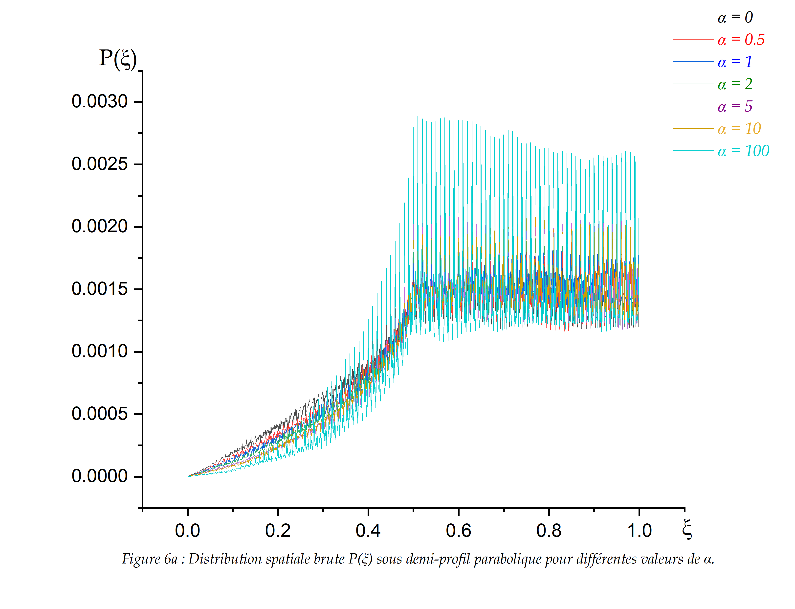
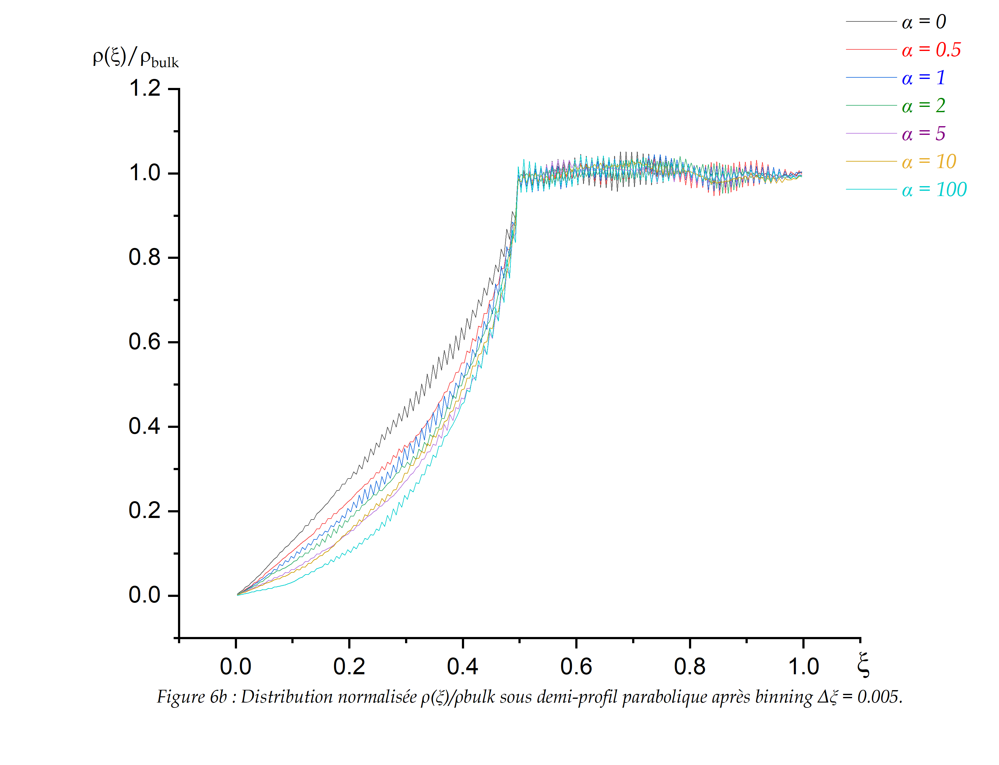
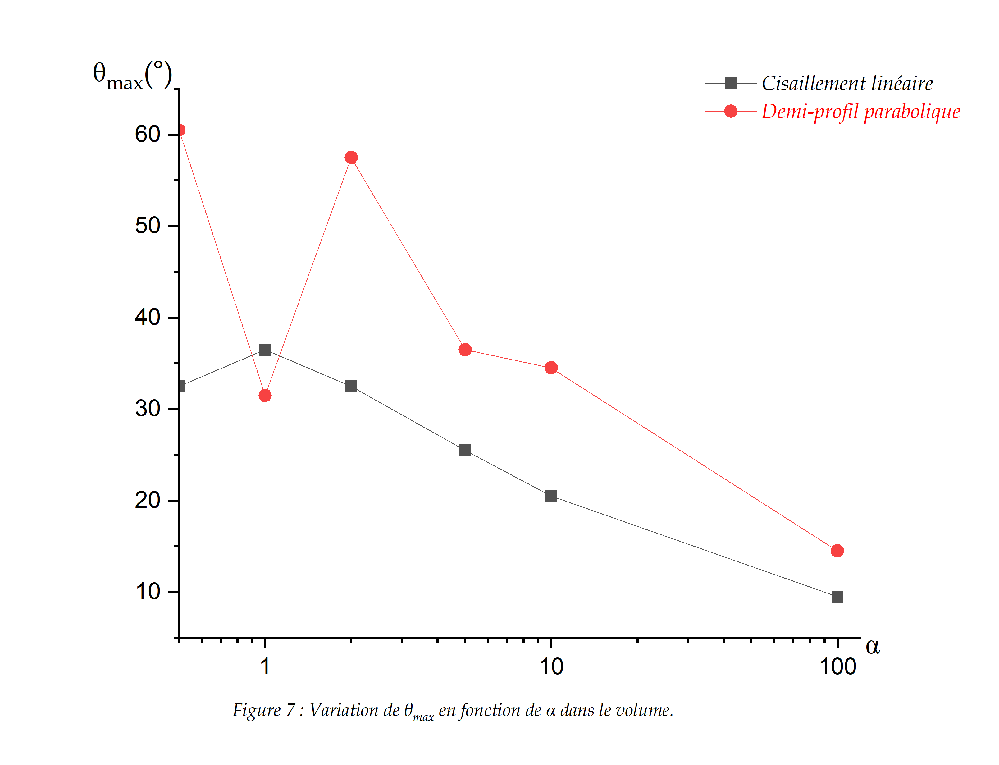
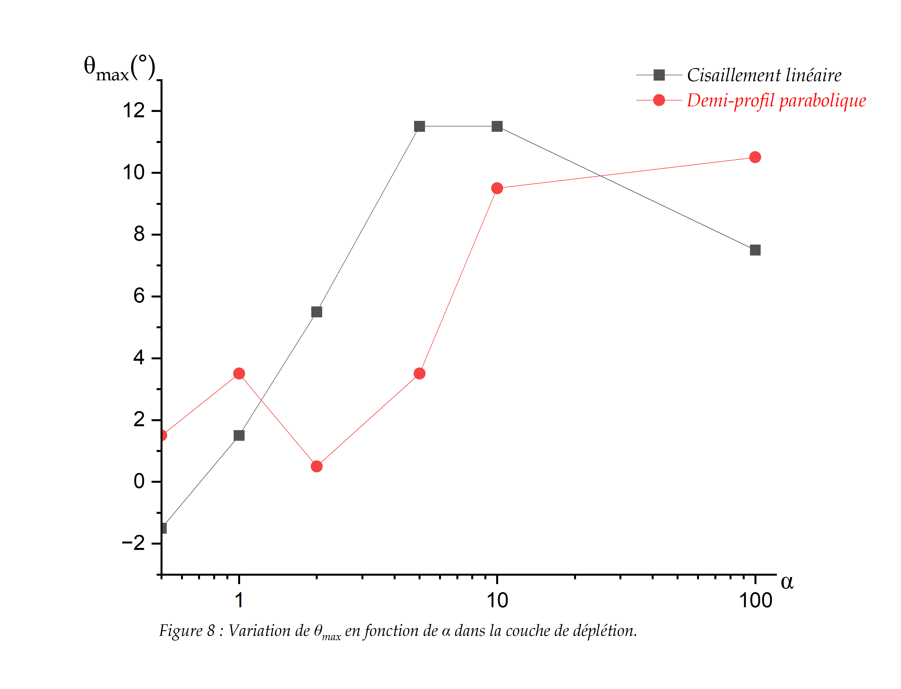

# Section I - Modèle de référence

## Objectif scientifique

Cette section contient le modèle de référence du projet : un bâtonnet brownien rigide confiné dans un mésopore avec \(D=L_B\), soumis soit à un cisaillement linéaire uniforme, soit à un demi-profil parabolique de Poiseuille.

Le but est d'étudier comment la compétition entre diffusion rotationnelle brownienne, entraînement hydrodynamique et confinement stérique modifie les distributions \(P(\theta)\) et \(P(\xi)\).

## Paramètres principaux

- Longueur du bâtonnet : \(L_B=880\,\mathrm{nm}\).
- Diamètre de référence du mésopore : \(D=L_B\).
- Pas brownien : \(\Delta_B=0.03\).
- Valeurs de \(\alpha\) : \(0\), \(0.5\), \(1\), \(2\), \(5\), \(10\), \(100\).
- Région proche de la surface : \(\xi \leq 0.5\).
- Volume : \(\xi > 0.5\).

## Contenu du dossier

- `code/main.cpp` : version principale du code publiée à la racine.
- `code/main_original_before_alpha0.cpp` : version conservée avant l'ajout de \(\alpha=0\).
- `code/main_alpha0_full_xi_corrected.cpp` : version complète avec \(\alpha=0\) et \(P(\xi)\) prolongé jusqu'à \(\xi=1\).
- `figures/` : figures historiques et figures corrigées de la Section I.

## Figures principales

### Distributions angulaires \(P(\theta)\)

**Figure I-1.** Distribution angulaire \(P(\theta)\) dans le volume sous cisaillement linéaire pour différentes valeurs de \(\alpha\).

**Figure I-2.** Distribution angulaire \(P(\theta)\) dans la couche de déplétion sous cisaillement linéaire.

**Figure I-3.** Distribution angulaire \(P(\theta)\) dans le volume sous demi-profil parabolique de Poiseuille.

**Figure I-4.** Distribution angulaire \(P(\theta)\) dans la couche de déplétion sous demi-profil parabolique de Poiseuille.

### Distributions spatiales \(P(\xi)\)

**Figure I-5a.** Distribution spatiale brute \(P(\xi)\) sous cisaillement linéaire.

**Figure I-5b.** Distribution spatiale normalisée \(\rho(\xi)/\rho_{\mathrm{bulk}}\) après regroupement statistique avec \(\Delta \xi=0.005\).

**Figure I-6a.** Distribution spatiale brute \(P(\xi)\) sous demi-profil parabolique de Poiseuille.

**Figure I-6b.** Distribution spatiale normalisée \(\rho(\xi)/\rho_{\mathrm{bulk}}\) après regroupement statistique pour le cas de Poiseuille.

### Angles les plus probables

**Figure I-7.** Variation de \(\theta_{\max}\) en fonction de \(\alpha\) dans le volume.

**Figure I-8.** Variation de \(\theta_{\max}\) en fonction de \(\alpha\) dans la couche de déplétion.

## Lecture physique des résultats

Lorsque \(\alpha=0\), le cisaillement hydrodynamique est absent. La dynamique est donc dominée par la diffusion brownienne et par la contrainte stérique imposée par les parois.

Lorsque \(\alpha\) augmente, le couple hydrodynamique devient de plus en plus important devant la diffusion rotationnelle brownienne. Le bâtonnet passe alors davantage de temps près d'une orientation privilégiée, ce qui se traduit par un pic plus marqué dans \(P(\theta)\).

Dans le volume, \(P(\theta)\) reflète principalement la compétition entre bruit brownien et cisaillement. Près de la surface, la forme de \(P(\theta)\) est plus fortement dominée par la géométrie : les grandes inclinaisons sont défavorisées car elles rapprochent une extrémité du bâtonnet de la paroi.

La distribution \(P(\xi)\) décrit la probabilité de présence du centre de masse à une distance réduite \(\xi=z_c/L_B\). Elle ne représente pas une trajectoire individuelle mais une occupation statistique de l'espace transverse.

## Correction statistique de \(P(\xi)\)

Les figures brutes de \(P(\xi)\) conservent les oscillations statistiques visibles dans le comptage direct. Les figures binnées regroupent les données avec \(\Delta \xi=0.005\), ce qui réduit les fluctuations sans modifier la dynamique simulée.

Cette correction est un post-traitement statistique : elle ne change ni le mouvement brownien, ni le cisaillement, ni les collisions avec la paroi.

## Lien avec les références

Le cadre stochastique général s'inscrit dans la dynamique de Langevin et la physique statistique hors équilibre discutées par Balakrishnan.

Les distributions \(P(\theta)\), l'interprétation de \(\alpha\) comme nombre de Péclet rotationnel et l'orientation de macromolécules allongées sous écoulement laminaire sont directement reliées aux travaux de Hijazi, Khater, Tannous et Boeder.

La distinction entre volume, couche proche de surface et effets de mésopore est cohérente avec les travaux d'Atwi sur les macromolécules confinées en mésopores et les interactions avec les parois.
