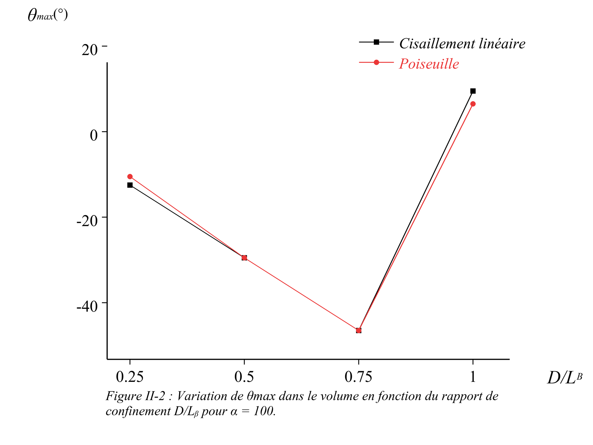
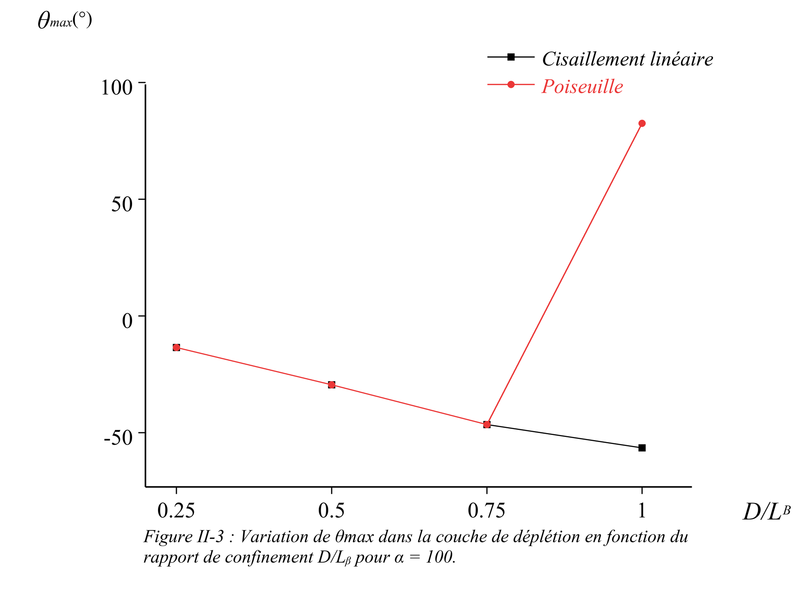
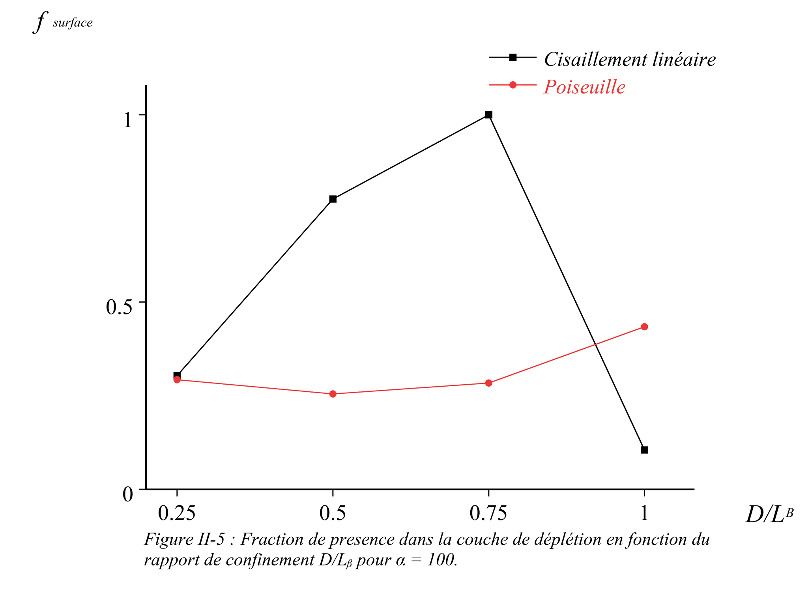
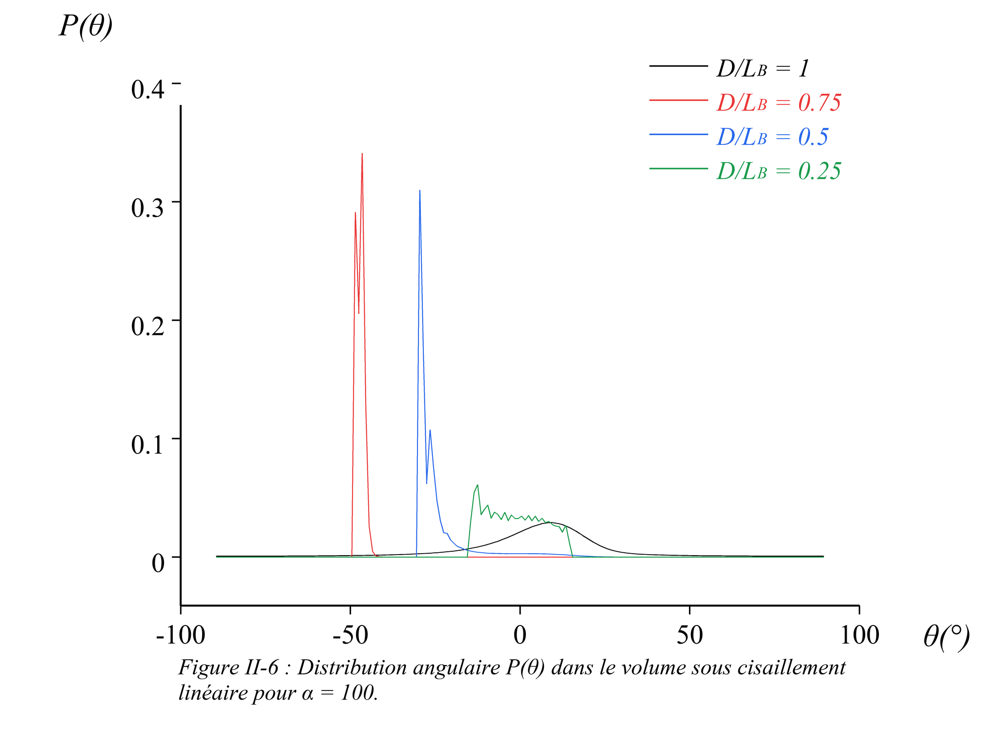
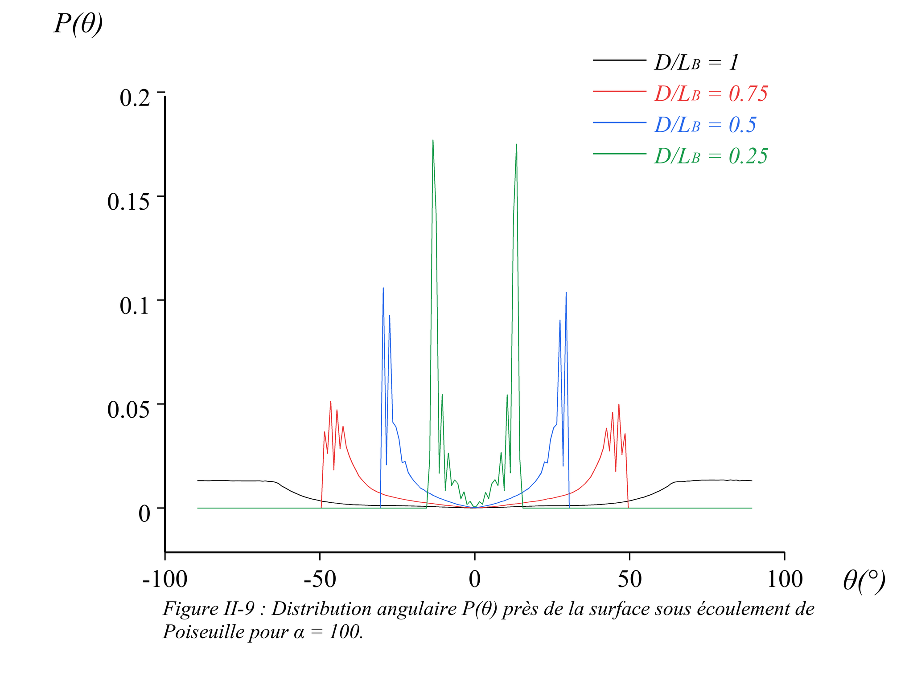

# Section II - Influence du confinement \(D/L_B\)

## Objectif scientifique

Cette section étudie l'effet du rapport de confinement \(D/L_B\), c'est-à-dire le rapport entre le diamètre disponible du mésopore et la longueur du bâtonnet.

La question physique centrale est la suivante : que devient la dynamique d'orientation lorsque le diamètre du pore devient inférieur ou comparable à la longueur du bâtonnet ?

Pour une lecture physique complète des figures de cette section, voir : [Interprétation détaillée de la Section II](INTERPRETATION_DETAILLEE.md).

## Paramètres étudiés

- \(D/L_B=1\)
- \(D/L_B=0.75\)
- \(D/L_B=0.5\)
- \(D/L_B=0.25\)

Les simulations de cette section utilisent un régime d'entraînement fort, \(\alpha=100\), afin de rendre visible la compétition entre alignement hydrodynamique et contrainte géométrique.

Deux profils d'écoulement sont comparés :

- cisaillement linéaire ;
- profil de Poiseuille complet.

## Contenu du dossier

- `code/main_section2_confinement.cpp` : code C++ utilisé pour générer les résultats de confinement.
- `figures/SectionII_Fig01_angle_limite_vs_DoverLB.png` : angle limite géométrique.
- `figures/SectionII_Fig02_theta_max_volume_alpha100.png` à `SectionII_Fig04_theta_max_centre_alpha100.png` : évolution de \(\theta_{\max}\) dans différentes régions.
- `figures/SectionII_Fig05_fraction_surface_alpha100.png` : fraction statistique dans la couche proche de la surface.
- `figures/SectionII_Fig06...` à `SectionII_Fig09...` : distributions \(P(\theta)\).
- `figures/SectionII_Fig10...` et `SectionII_Fig11...` : distributions \(P(\xi)\).

## Figures de la Section II

**Figure II-1.** Variation de l'angle limite géométrique en fonction du rapport de confinement \(D/L_B\).

**Figure II-2.** Variation de \(\theta_{\max}\) dans le volume pour \(\alpha=100\).

**Figure II-3.** Variation de \(\theta_{\max}\) dans la couche proche de la surface pour \(\alpha=100\).

**Figure II-4.** Variation de \(\theta_{\max}\) dans la région centrale du pore pour \(\alpha=100\).

**Figure II-5.** Fraction statistique de présence dans la couche proche de la surface.

**Figure II-6.** Distribution \(P(\theta)\) dans le volume sous cisaillement linéaire pour différents rapports \(D/L_B\).

**Figure II-7.** Distribution \(P(\theta)\) dans le volume sous écoulement de Poiseuille pour différents rapports \(D/L_B\).

**Figure II-8.** Distribution \(P(\theta)\) près de la surface sous cisaillement linéaire.

**Figure II-9.** Distribution \(P(\theta)\) près de la surface sous écoulement de Poiseuille.

**Figure II-10.** Distribution spatiale \(P(\xi)\) sous cisaillement linéaire.

**Figure II-11.** Distribution spatiale \(P(\xi)\) sous écoulement de Poiseuille.

## Angle limite géométrique

Lorsque \(D<L_B\), le bâtonnet ne peut plus adopter toutes les orientations possibles. Une inclinaison trop grande le ferait intersecter la paroi.

L'angle limite géométrique est donc un repère théorique :

\[
\theta_{\mathrm{limite}}=\arcsin\left(\frac{D}{L_B}\right),
\]

avec \(\theta_{\mathrm{limite}}=90^\circ\) lorsque \(D/L_B=1\).

Cette courbe n'est pas une trajectoire simulée. Elle sert de contrainte géométrique maximale pour interpréter les distributions numériques.

## Lecture physique

Quand \(D/L_B\) diminue, l'espace angulaire accessible diminue également. Le confinement impose une sélection géométrique des orientations avant même que le cisaillement n'agisse.

Pour \(D/L_B=1\), le bâtonnet dispose encore d'un espace angulaire large. Les distributions peuvent donc refléter fortement l'effet du cisaillement.

Pour \(D/L_B=0.5\) ou \(0.25\), le mouvement rotationnel devient fortement limité. Les pics de \(P(\theta)\) ne doivent plus être interprétés seulement comme un alignement hydrodynamique : ils traduisent aussi la restriction mécanique imposée par le pore.

La fraction de présence près de la surface mesure combien de temps le centre de masse se trouve dans la zone influencée par les parois. Elle augmente ou se concentre selon la façon dont le confinement réduit l'espace transverse disponible.

## Lien avec les références

Cette section prolonge les idées des travaux de Hijazi et Atwi sur les macromolécules confinées sous écoulement laminaire.

Les thèses et articles d'Atwi sont particulièrement pertinents pour interpréter la transition entre comportement de volume et comportement dominé par les parois dans un mésopore.

Le cadre de Balakrishnan reste utile pour comprendre pourquoi les distributions obtenues sont des états stationnaires hors équilibre : elles résultent d'une dynamique forcée, dissipative et fluctuante.
