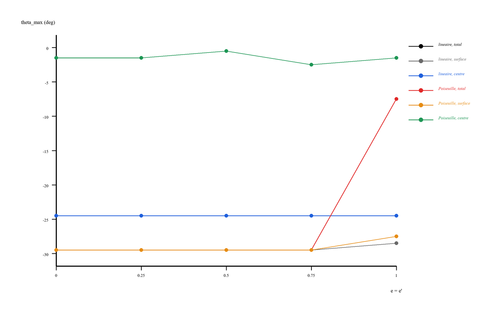
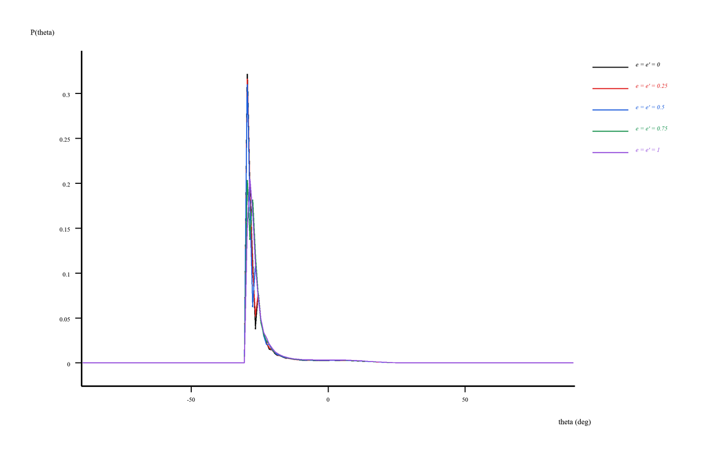
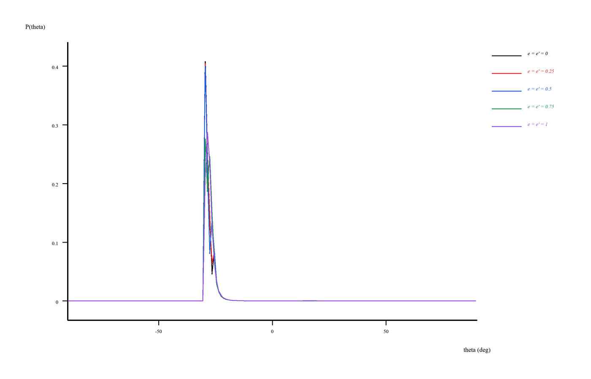
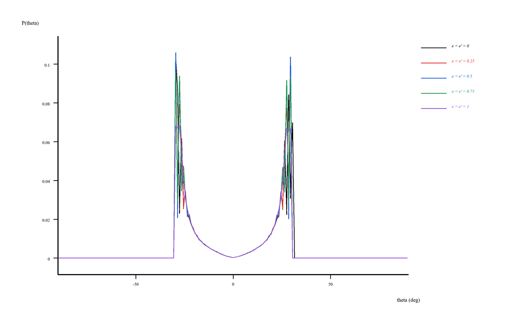
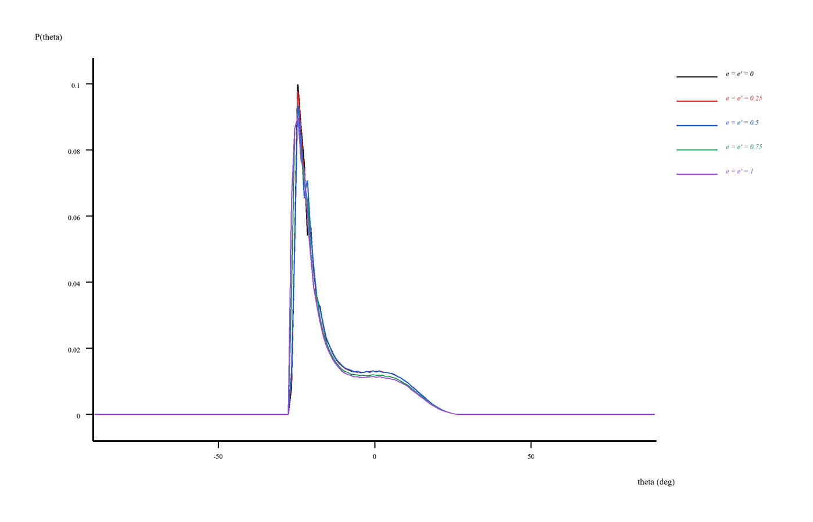
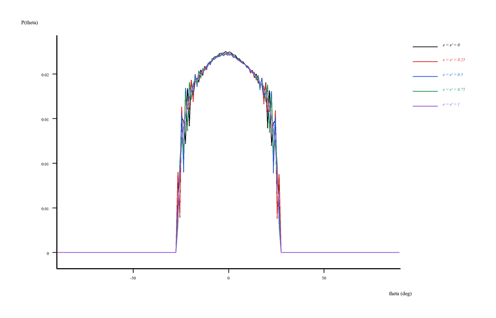
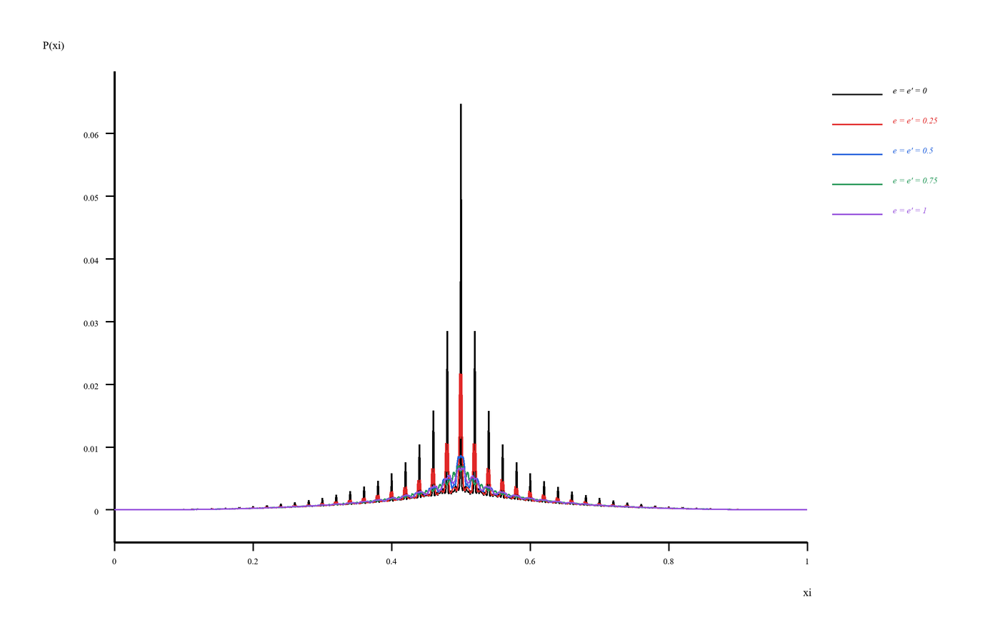

# Section III - Effet des coefficients de restitution

## Objectif scientifique

Cette section étudie l'effet des coefficients de restitution associés aux interactions avec les parois.

Dans le modèle numérique, la restitution modifie la manière dont le bâtonnet réagit lorsqu'il rencontre une frontière. Elle agit donc comme une condition de bord effective.

## Idée physique

Un coefficient de restitution élevé correspond à une interaction plus élastique avec la paroi. Le bâtonnet conserve davantage sa dynamique après l'interaction.

Un coefficient plus faible correspond à une interaction plus dissipative. La paroi joue alors un rôle plus marqué dans la réorientation et dans la distribution spatiale.

L'objectif est d'observer comment cette modification des interactions de surface affecte :

- l'angle le plus probable \(\theta_{\max}\) ;
- la fraction statistique dans la couche proche de la surface ;
- les distributions angulaires \(P(\theta)\) ;
- les distributions spatiales \(P(\xi)\).

## Contenu du dossier

- `code/main_section3_restitution.cpp` : code C++ utilisé pour la simulation de restitution.
- `figures/SectionIII_Fig01_theta_max_restitution.png` : évolution de \(\theta_{\max}\).
- `figures/SectionIII_Fig02_surface_fraction_restitution.png` : fraction de présence près de la surface.
- `figures/SectionIII_Fig03...` à `SectionIII_Fig08...` : distributions \(P(\theta)\) dans les régions étudiées.
- `figures/SectionIII_Fig09_Pxi_linear_restitution.png` et `SectionIII_Fig10_Pxi_poiseuille_restitution.png` : distributions \(P(\xi)\).

## Figures de la Section III

**Figure III-1.** Variation de \(\theta_{\max}\) en fonction des coefficients de restitution.

**Figure III-2.** Fraction statistique de présence près de la surface en fonction des coefficients de restitution.

**Figure III-3.** Distribution totale \(P(\theta)\) sous cisaillement linéaire pour différentes restitutions.

**Figure III-4.** Distribution totale \(P(\theta)\) sous écoulement de Poiseuille pour différentes restitutions.

**Figure III-5.** Distribution \(P(\theta)\) près de la surface sous cisaillement linéaire.

**Figure III-6.** Distribution \(P(\theta)\) près de la surface sous écoulement de Poiseuille.

**Figure III-7.** Distribution \(P(\theta)\) dans la région centrale sous cisaillement linéaire.

**Figure III-8.** Distribution \(P(\theta)\) dans la région centrale sous écoulement de Poiseuille.

**Figure III-9.** Distribution spatiale \(P(\xi)\) sous cisaillement linéaire.

**Figure III-10.** Distribution spatiale \(P(\xi)\) sous écoulement de Poiseuille.

## Lecture physique

La restitution n'agit pas comme un nouveau cisaillement. Elle agit sur la manière dont la paroi transforme le mouvement après contact.

Ainsi, deux simulations ayant le même \(\alpha\), le même \(D/L_B\) et le même profil d'écoulement peuvent présenter des distributions différentes si les coefficients de restitution changent.

Près de la surface, cet effet est plus visible, car les collisions ou quasi-collisions avec la paroi sont fréquentes. Dans le volume, l'effet de la restitution est plus indirect.

Une variation de \(\theta_{\max}\) avec la restitution indique que la paroi ne se contente pas d'exclure certaines positions : elle influence aussi la statistique orientationnelle.

## Lien avec les références

Cette section est reliée aux travaux d'Atwi sur les interactions de macromolécules confinées avec les surfaces et sur le rôle des conditions de bord dans les mésopores.

Elle complète l'interprétation de Hijazi, Khater et Tannous sur les distributions d'orientation sous écoulement, en ajoutant une analyse spécifique de l'effet de surface.

Le cadre de Langevin et de physique hors équilibre discuté par Balakrishnan permet de comprendre que les distributions finales résultent d'un équilibre dynamique entre forçage hydrodynamique, fluctuations browniennes, dissipation et conditions aux limites.
